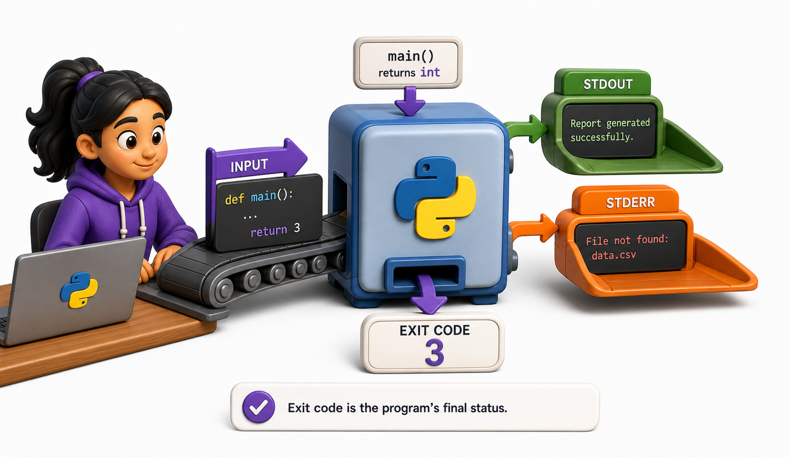
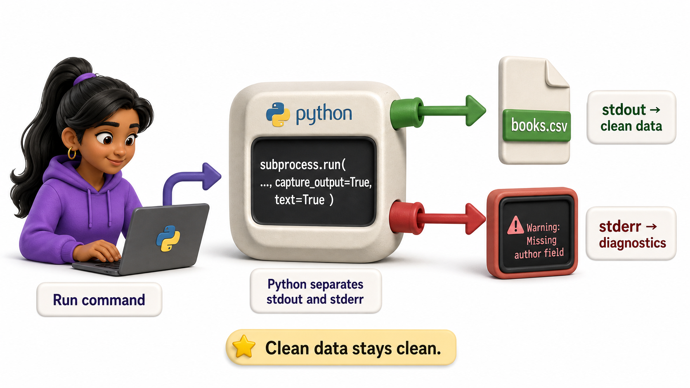
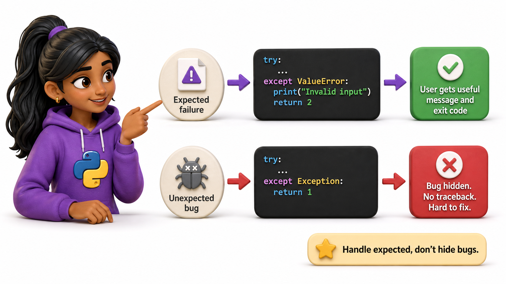

## Introduction

Priya's validation messages are now clear to a librarian, but the nightly automation still cannot tell a successful report from a failed one. Both runs print text and then finish. A person can read the words; a shell needs a number.

Every process returns an exit status. A CLI uses that small integer as a machine-readable contract, while stderr carries the human-readable explanation.

**Definition:** An `exit code` is the integer a command returns to its caller: zero means success, while a non-zero value means the requested operation did not complete successfully.



## Returning a Status from `main`

Keep domain logic separate from process termination. Let `main()` return a number, then convert it to a process status at the outer boundary:

```python
import sys
from pathlib import Path

def main(path_text: str) -> int:
    path = Path(path_text)
    if not path.exists():
        print(f"Error: {path} does not exist", file=sys.stderr)
        return 2

    print(path.read_text(encoding="utf-8"))
    return 0

if __name__ == "__main__":
    raise SystemExit(main(sys.argv[1]))
```

Returning makes `main()` easy to test without terminating the test runner. `SystemExit` is raised only when the module is acting as the real command.

## stdout and stderr Have Different Jobs



stdout is the command's useful data. stderr is diagnostics:

```python
print("isbn,title")                     # stdout
print("Warning: skipped row 17", file=sys.stderr)
```

This separation allows a user to redirect clean data while still seeing warnings:

```console
library-cli export > books.csv
```

If errors were printed to stdout, they would be written into `books.csv` and corrupt the data pipeline.

## Choosing Exit Codes

Most small applications need only a modest policy:

| Code | Meaning |
|---|---|
| 0 | The requested operation succeeded |
| 1 | An unexpected runtime or domain failure |
| 2 | Invalid arguments or input |
| 3 | Required data was not found |

Do not invent a different number for every exception. Codes are useful only when documented and stable. `argparse` already uses code 2 for parsing errors, so following that convention is sensible.

## Shell Composition

Shells branch on status:

```console
library-cli import books.csv && echo "Import complete"
library-cli import books.csv || echo "Import failed"
```

In a script:

```bash
if library-cli report --date 2026-07-15 > report.csv; then
  echo "Report ready"
else
  echo "Report failed" >&2
  exit 1
fi
```

This is why printing the word "failed" while returning zero is a serious bug. Automation trusts the status, not the prose.

## Handling Expected and Unexpected Failures



Catch errors you can translate into a useful message. Let genuinely unexpected errors remain visible during development:

```python
def run_import(path: Path) -> int:
    try:
        rows = path.read_text(encoding="utf-8").splitlines()
    except FileNotFoundError:
        print(f"Error: file not found: {path}", file=sys.stderr)
        return 3
    except PermissionError:
        print(f"Error: cannot read: {path}", file=sys.stderr)
        return 1

    print(f"Imported {len(rows)} rows")
    return 0
```

Avoid `except Exception: return 1` around the entire program. It hides programming defects and removes the traceback needed to fix them.

## Typer Commands

Typer can produce an explicit status:

```python
import typer

def fail(message: str, code: int = 1) -> None:
    typer.echo(f"Error: {message}", err=True)
    raise typer.Exit(code=code)
```

Use `typer.BadParameter` for an invalid option and `typer.Exit` for a command-level result.

## From Example to Production

Exit Codes And Error Handling becomes dependable only when its boundaries are as deliberate as its main example. A CLI is a public interface even when it is used only inside one team. Preserve stable command names and option meanings, validate at the boundary, and keep business logic in ordinary functions that can be tested without starting a subprocess. Send machine-readable results to stdout and diagnostics to stderr. Document exit codes, avoid prompts in automation-oriented commands, and test quoting, paths, and Unicode on every supported platform. A good command is predictable in a terminal, a shell script, and continuous integration.

## Common Mistakes and Engineering Checks

- Mixing parsing, business logic, and printing in one large function. This makes validation and unit testing unnecessarily difficult.
- Writing warnings or progress messages to stdout. Redirected CSV or JSON output then becomes invalid.
- Designing only for the successful interactive run. Scripts also depend on stable help text, exit status, and non-interactive behavior.

Before treating the implementation as complete, answer these checks:

- Can the core logic be tested without a subprocess?
- Are stdout, stderr, and exit status intentional?
- Does --help show one copyable example?

## Check Your Understanding

Explain exit codes and error handling to a teammate without using framework vocabulary. Then change one success condition in the lesson's example into a failure: invalid input, unavailable resource, timeout, or worker exception. Predict the visible output and program state before running it. Finally, write one automated test that proves cleanup or rollback still happens. This exercise distinguishes code that demonstrates syntax from code that preserves a contract under pressure.
## Your Turn

Write a `main()` function for a catalog export. Return 2 for an unsupported format, 3 when the input file is absent, 1 for an output permission error, and 0 on success. Ensure CSV data goes only to stdout and every diagnostic goes to stderr.

## Conclusion

Exit codes are the CLI's machine-readable contract. Return zero only after success, use a small documented set of non-zero codes, send data to stdout, and send diagnostics to stderr. Keep termination at the command boundary so the program remains easy to test and reuse.
