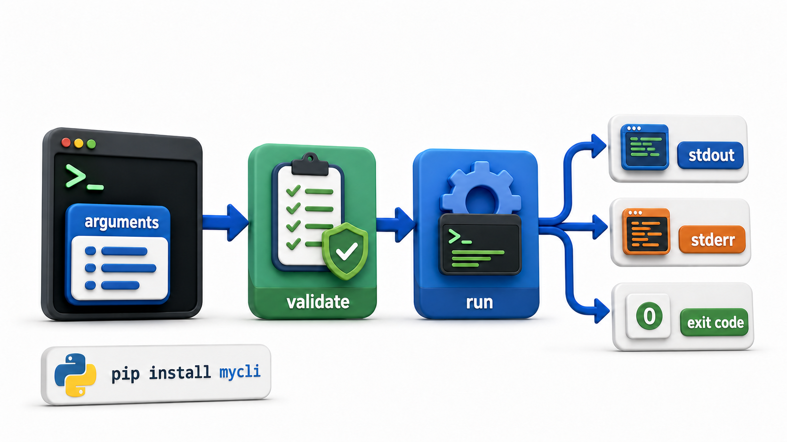

# Unit 12: CLI Application Development

**Semester 2: Advanced Python Concepts**

Turn Python scripts into real command-line tools anyone can install and run.

**Character thread:** Priya (returning from Semester 1), now building a command-line interface for the library management system so librarians can run maintenance tasks without touching the source code.

## Lessons

| # | File | Topic |
|---|---|---|
| 01 | [01_why_clis.md](01_why_clis.md) | Why CLIs: Real Tools Users Run |
| 02 | [02_sys_argv.md](02_sys_argv.md) | Reading Arguments with sys.argv |
| 03 | [03_argparse.md](03_argparse.md) | argparse: Arguments, Options, and Subcommands |
| 04 | [04_typer.md](04_typer.md) | Building a CLI with typer |
| 05 | [05_input_validation_and_help_text.md](05_input_validation_and_help_text.md) | Input Validation and Helpful Help Text |
| 06 | [06_exit_codes_and_error_handling.md](06_exit_codes_and_error_handling.md) | Exit Codes and Error Handling |
| 07 | [07_entry_points.md](07_entry_points.md) | Entry Points and Installable Commands |
| 08 | [08_ux_best_practices.md](08_ux_best_practices.md) | UX Best Practices for CLIs |

_Status: all 8 lessons authored._
