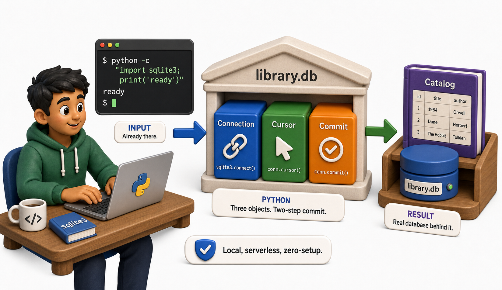
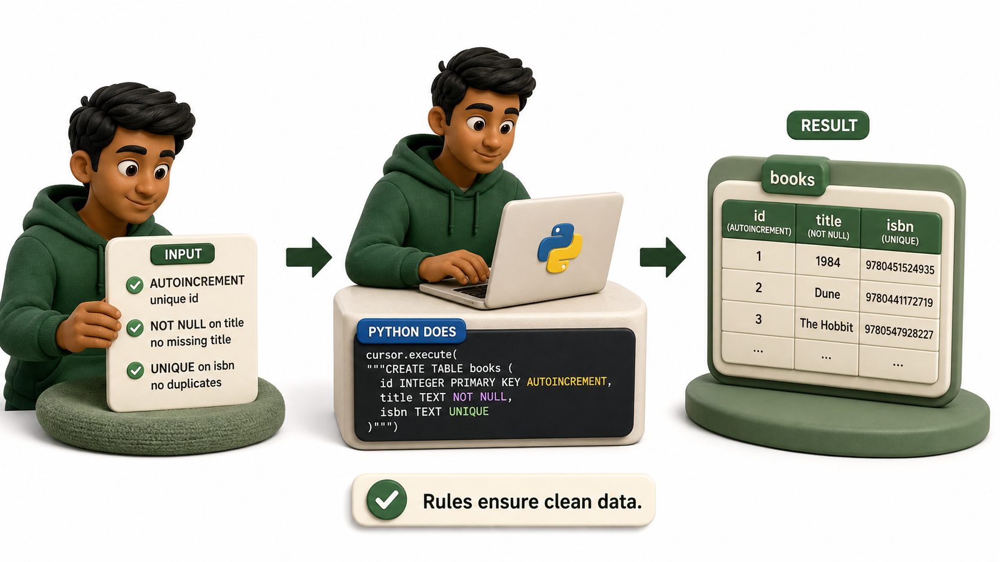

## Introduction

Dev opens a terminal and types `python -c "import sqlite3; print('ready')"`. The module is already there. No pip install, no server config, no password to remember. In the next fifteen minutes, the library catalog will have a real database behind it.

This lesson covers the three objects that every `sqlite3` program uses: `Connection`, `Cursor`, and the two-step commit model.

**Definition:** Python's `sqlite3` module connects code to a lightweight SQLite database, where a connection manages the database and a cursor executes SQL statements.



## Connecting to a Database

```python
import sqlite3

# Connect to a file-based database (creates the file if it does not exist)
conn = sqlite3.connect(":memory:")   # using :memory: so this runs anywhere

print(type(conn))
print("Isolation level:", conn.isolation_level)
print("Row factory:", conn.row_factory)

conn.close()
print("Done -- connection closed")
```

In production Dev uses `sqlite3.connect("library.db")`. Here we use `":memory:"` so the code runs self-contained without creating files.

## Creating a Table



```python
import sqlite3

conn = sqlite3.connect(":memory:")
cursor = conn.cursor()

cursor.execute("""
    CREATE TABLE IF NOT EXISTS books (
        id      INTEGER PRIMARY KEY AUTOINCREMENT,
        isbn    TEXT    UNIQUE NOT NULL,
        title   TEXT    NOT NULL,
        author  TEXT    NOT NULL,
        year    INTEGER,
        copies  INTEGER DEFAULT 1
    )
""")

conn.commit()
print("Table created successfully")

# Verify the table exists by querying sqlite_master
cursor.execute("SELECT name FROM sqlite_master WHERE type='table'")
tables = cursor.fetchall()
print("Tables in database:", [t[0] for t in tables])

conn.close()
```

`AUTOINCREMENT` generates a unique `id` for each row. `NOT NULL` prevents inserting a book without a title. `UNIQUE` on `isbn` prevents duplicate entries.

## Inserting Rows

```python
import sqlite3

conn = sqlite3.connect(":memory:")
cursor = conn.cursor()

cursor.execute("""
    CREATE TABLE IF NOT EXISTS books (
        id INTEGER PRIMARY KEY AUTOINCREMENT,
        isbn TEXT UNIQUE NOT NULL,
        title TEXT NOT NULL,
        author TEXT NOT NULL,
        year INTEGER,
        copies INTEGER DEFAULT 1
    )
""")

# Insert a single row
cursor.execute(
    "INSERT INTO books (isbn, title, author, year) VALUES (?, ?, ?, ?)",
    ("978-0-13-468599-1", "The Pragmatic Programmer", "Thomas & Hunt", 2019),
)
print("Rows inserted:", cursor.rowcount)
print("Last row id:", cursor.lastrowid)

conn.commit()
conn.close()
print("Committed and closed")
```

The `?` placeholders are critical. They prevent SQL injection by letting the database driver handle escaping. Never use string formatting to build SQL queries.

## Inserting Multiple Rows

```python
import sqlite3

conn = sqlite3.connect(":memory:")
cursor = conn.cursor()

cursor.execute("""
    CREATE TABLE IF NOT EXISTS books (
        id INTEGER PRIMARY KEY AUTOINCREMENT,
        isbn TEXT UNIQUE NOT NULL,
        title TEXT NOT NULL,
        author TEXT NOT NULL,
        year INTEGER,
        copies INTEGER DEFAULT 1
    )
""")

books = [
    ("978-0-13-468599-1", "The Pragmatic Programmer",     "Thomas & Hunt", 2019),
    ("978-0-20-163361-0", "Design Patterns",              "Gang of Four",  1994),
    ("978-0-13-235088-4", "Clean Code",                   "Robert Martin", 2008),
    ("978-0-59-651798-1", "Python Cookbook",              "Beazley & Jones", 2013),
]

cursor.executemany(
    "INSERT INTO books (isbn, title, author, year) VALUES (?, ?, ?, ?)",
    books,
)
print(f"Inserted {cursor.rowcount} books")
conn.commit()
conn.close()
```

`executemany` runs the same SQL once per row in the list. It is faster than calling `execute` in a loop because the database can optimize the batch.

## Querying Rows

```python
import sqlite3

conn = sqlite3.connect(":memory:")
cursor = conn.cursor()

cursor.execute("""
    CREATE TABLE books (
        id INTEGER PRIMARY KEY AUTOINCREMENT,
        isbn TEXT UNIQUE NOT NULL,
        title TEXT NOT NULL,
        author TEXT NOT NULL,
        year INTEGER,
        copies INTEGER DEFAULT 1
    )
""")

books = [
    ("978-0-13-468599-1", "The Pragmatic Programmer",  "Thomas & Hunt",   2019),
    ("978-0-20-163361-0", "Design Patterns",           "Gang of Four",    1994),
    ("978-0-13-235088-4", "Clean Code",                "Robert Martin",   2008),
]
cursor.executemany("INSERT INTO books (isbn, title, author, year) VALUES (?, ?, ?, ?)", books)
conn.commit()

# Fetch all rows
cursor.execute("SELECT id, title, author, year FROM books ORDER BY year")
rows = cursor.fetchall()

print(f"{'ID':<4} {'Title':<30} {'Author':<20} {'Year'}")
print("-" * 65)
for row in rows:
    print(f"{row[0]:<4} {row[1]:<30} {row[2]:<20} {row[3]}")

conn.close()
```

`fetchall()` returns a list of tuples. `fetchone()` returns the next single row. `fetchmany(n)` returns up to n rows.

## sqlite3 Basics at a Glance

| Object / method | Purpose |
|---|---|
| `sqlite3.connect(path)` | Open or create a database file |
| `conn.cursor()` | Create a cursor to execute SQL |
| `cursor.execute(sql, params)` | Run one SQL statement |
| `cursor.executemany(sql, data)` | Run one SQL statement for each item |
| `cursor.fetchall()` | Get all result rows as a list of tuples |
| `conn.commit()` | Write pending changes to disk |
| `conn.close()` | Release the database file |

## From Example to Production

Sqlite3 Basics becomes dependable only when its boundaries are as deliberate as its main example. Database code is reliable when transaction boundaries and data contracts are explicit. Use parameters for every value, keep connections short-lived, and commit only after the complete operation succeeds. Let database constraints protect invariants even when application validation exists. Decide what a returned row represents, translate it at one boundary, and test rollback paths as carefully as successful writes. For SQLite, also remember that concurrency, types, and migration behavior differ from larger server databases, so avoid presenting a local demonstration as a universal deployment model.

## Common Mistakes and Engineering Checks

- Building SQL with string formatting. This creates injection risk and breaks on quoting and type conversion.
- Committing each statement independently when several statements form one business action. Partial updates then become possible.
- Testing only with a fresh empty database. Real systems contain old rows, failed migrations, duplicates, and concurrent access.

Before treating the implementation as complete, answer these checks:

- Where does the transaction begin and end?
- Which constraints enforce valid data?
- What happens when the second operation fails?

## Check Your Understanding

Explain sqlite3 basics to a teammate without using framework vocabulary. Then change one success condition in the lesson's example into a failure: invalid input, unavailable resource, timeout, or worker exception. Predict the visible output and program state before running it. Finally, write one automated test that proves cleanup or rollback still happens. This exercise distinguishes code that demonstrates syntax from code that preserves a contract under pressure.
## Your Turn

Extend the code above to add a `WHERE` clause that fetches only books published after 2000:

```python
import sqlite3

conn = sqlite3.connect(":memory:")
cursor = conn.cursor()
cursor.execute("CREATE TABLE books (id INTEGER PRIMARY KEY, isbn TEXT, title TEXT, author TEXT, year INTEGER)")
cursor.executemany(
    "INSERT INTO books (isbn, title, author, year) VALUES (?, ?, ?, ?)",
    [
        ("978-001", "Dune", "Frank Herbert", 1965),
        ("978-002", "Foundation", "Isaac Asimov", 1951),
        ("978-003", "Neuromancer", "William Gibson", 2003),
    ]
)
conn.commit()

cursor.execute("SELECT title, year FROM books WHERE year > ?", (2000,))
results = cursor.fetchall()
for title, year in results:
    print(f"{year}: {title}")

conn.close()
```

Then add one more book with `cursor.execute("INSERT ...")` and re-run the query to confirm the new book appears if its year is after 2000.

## Conclusion

Three objects do everything: `Connection` owns the file, `Cursor` executes SQL and returns rows, and `commit()` flushes changes to disk. Use `?` placeholders, never string formatting. The next lesson covers parameterized queries in depth and explains why they are the single most important security practice when working with databases.
