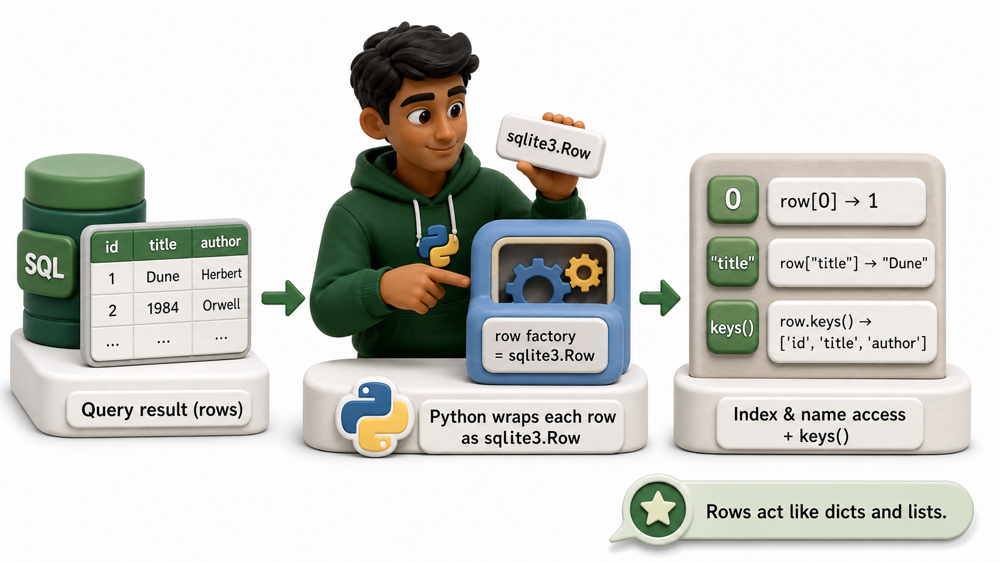
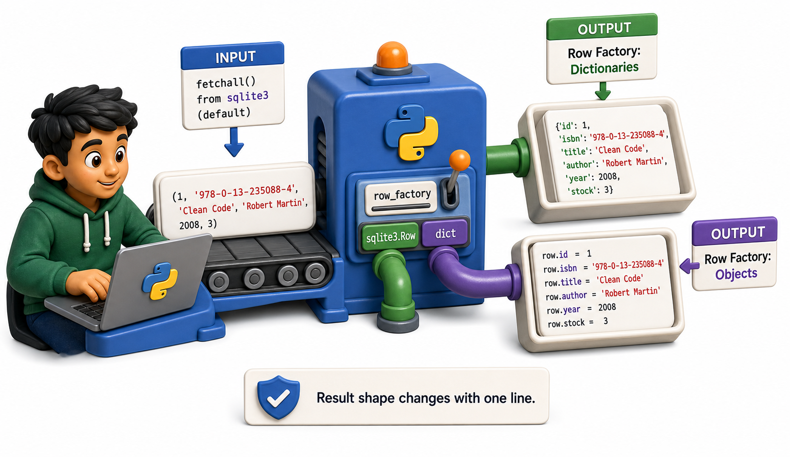

## Introduction

Dev's query results look like this: `(1, '978-0-13-235088-4', 'Clean Code', 'Robert Martin', 2008, 3)`. To get the title, he writes `row[2]`. Two weeks later he adds a column between `isbn` and `title` and has to track down every `row[2]` in the codebase.

The `row_factory` setting changes what `fetchall` returns. With one line, tuples become dictionaries. With another line, they become custom objects. Database code stops depending on column order.

**Definition:** A custom `factory` function converts rows to dataclasses, which carry type information and IDE completion.

![A fetchall result transforming from tuple (row[2]) to dictionary (row["title"]) to dataclass (row.title) as the row_factory changes](images/05_row_factory_and_data_models.png)

## The Default: Tuples

```python
import sqlite3

conn = sqlite3.connect(":memory:")
cursor = conn.cursor()
cursor.execute("CREATE TABLE books (id INTEGER PRIMARY KEY, title TEXT, author TEXT, year INTEGER)")
cursor.execute("INSERT INTO books (title, author, year) VALUES ('Clean Code', 'Robert Martin', 2008)")
cursor.execute("INSERT INTO books (title, author, year) VALUES ('Fluent Python', 'Luciano Ramalho', 2022)")
conn.commit()

cursor.execute("SELECT id, title, author, year FROM books")
rows = cursor.fetchall()

print("Default row type:", type(rows[0]))
for row in rows:
    # Must know column order: 0=id, 1=title, 2=author, 3=year
    print(f"  id={row[0]}, title='{row[1]}', author={row[2]}, year={row[3]}")

conn.close()
```

The tuple `row[2]` works but is fragile. If the SELECT changes column order, every index breaks silently.

## Row Factory: Dictionaries



```python
import sqlite3

conn = sqlite3.connect(":memory:")
conn.row_factory = sqlite3.Row   # built-in factory -- returns Row objects

cursor = conn.cursor()
cursor.execute("CREATE TABLE books (id INTEGER PRIMARY KEY, title TEXT, author TEXT, year INTEGER)")
books = [
    ("Clean Code",       "Robert Martin",   2008),
    ("Fluent Python",    "Luciano Ramalho", 2022),
    ("Design Patterns",  "Gang of Four",    1994),
]
cursor.executemany("INSERT INTO books (title, author, year) VALUES (?, ?, ?)", books)
conn.commit()

cursor.execute("SELECT id, title, author, year FROM books ORDER BY year")
rows = cursor.fetchall()

print("Row type:", type(rows[0]))
print()
for row in rows:
    # Access by name -- column order no longer matters
    print(f"  [{row['id']}] '{row['title']}' by {row['author']} ({row['year']})")

print()
# sqlite3.Row also supports index access and keys()
print("Column names:", rows[0].keys())

conn.close()
```

`sqlite3.Row` objects support both index access (`row[0]`) and name access (`row["title"]`). The `keys()` method returns column names.

## Custom Row Factory: Dataclasses

For larger codebases, returning domain objects directly from queries removes the need to convert rows manually:

```python
import sqlite3
from dataclasses import dataclass

@dataclass
class Book:
    id: int
    title: str
    author: str
    year: int

def book_factory(cursor, row):
    fields = [col[0] for col in cursor.description]
    return Book(**dict(zip(fields, row)))

conn = sqlite3.connect(":memory:")
conn.row_factory = book_factory

cursor = conn.cursor()
cursor.execute("CREATE TABLE books (id INTEGER PRIMARY KEY AUTOINCREMENT, title TEXT, author TEXT, year INTEGER)")
books_data = [
    ("The Pragmatic Programmer", "Thomas & Hunt",  2019),
    ("Clean Code",               "Robert Martin",  2008),
    ("Fluent Python",            "Luciano Ramalho", 2022),
]
cursor.executemany("INSERT INTO books (title, author, year) VALUES (?, ?, ?)", books_data)
conn.commit()

cursor.execute("SELECT id, title, author, year FROM books ORDER BY year")
books = cursor.fetchall()

print("Row type:", type(books[0]))
print()
for book in books:
    print(f"  Book(id={book.id}, title='{book.title}', year={book.year})")

# Dataclass attributes work -- no index guessing
recent = [b for b in books if b.year >= 2019]
print(f"\nRecent books (2019+): {[b.title for b in recent]}")

conn.close()
```

The factory function receives the cursor (which has column names in `cursor.description`) and the raw row tuple, and returns whatever object you want.

## Mapping to a Repository Class

A common pattern wraps the database access in a repository class that encapsulates all queries:

```python
import sqlite3
from dataclasses import dataclass

@dataclass
class Book:
    id: int
    title: str
    author: str
    year: int

class BookRepository:
    def __init__(self, conn):
        self.conn = conn
        self.conn.row_factory = self._book_factory
        self._create_table()

    @staticmethod
    def _book_factory(cursor, row):
        fields = [col[0] for col in cursor.description]
        return Book(**dict(zip(fields, row)))

    def _create_table(self):
        self.conn.execute("""
            CREATE TABLE IF NOT EXISTS books (
                id INTEGER PRIMARY KEY AUTOINCREMENT,
                title TEXT NOT NULL,
                author TEXT NOT NULL,
                year INTEGER
            )
        """)
        self.conn.commit()

    def add(self, title, author, year):
        cursor = self.conn.execute(
            "INSERT INTO books (title, author, year) VALUES (?, ?, ?)",
            (title, author, year),
        )
        self.conn.commit()
        return cursor.lastrowid

    def find_by_author(self, author_fragment):
        cursor = self.conn.execute(
            "SELECT id, title, author, year FROM books WHERE author LIKE ?",
            (f"%{author_fragment}%",),
        )
        return cursor.fetchall()

    def all(self):
        cursor = self.conn.execute("SELECT id, title, author, year FROM books ORDER BY year")
        return cursor.fetchall()


conn = sqlite3.connect(":memory:")
repo = BookRepository(conn)

repo.add("Clean Code",       "Robert Martin",   2008)
repo.add("Design Patterns",  "Gang of Four",    1994)
repo.add("Fluent Python",    "Luciano Ramalho", 2022)

print("All books:")
for book in repo.all():
    print(f"  {book.year}  {book.title}")

print("\nBooks by 'Martin':")
for book in repo.find_by_author("Martin"):
    print(f"  {book.title} ({book.year})")

conn.close()
```

## Row Factory and Data Models at a Glance

| Approach | How to get it | Use when |
|---|---|---|
| Tuple (default) | No change needed | Quick scripts, one-off queries |
| `sqlite3.Row` | `conn.row_factory = sqlite3.Row` | Column name access, no custom class needed |
| Custom dataclass | `conn.row_factory = my_factory` | Domain model, type checking, IDE completion |
| Repository pattern | Wrapper class | Shared codebase, testable data access |

## From Example to Production

Row Factory And Data Models becomes dependable only when its boundaries are as deliberate as its main example. Database code is reliable when transaction boundaries and data contracts are explicit. Use parameters for every value, keep connections short-lived, and commit only after the complete operation succeeds. Let database constraints protect invariants even when application validation exists. Decide what a returned row represents, translate it at one boundary, and test rollback paths as carefully as successful writes. For SQLite, also remember that concurrency, types, and migration behavior differ from larger server databases, so avoid presenting a local demonstration as a universal deployment model.

## Common Mistakes and Engineering Checks

- Building SQL with string formatting. This creates injection risk and breaks on quoting and type conversion.
- Committing each statement independently when several statements form one business action. Partial updates then become possible.
- Testing only with a fresh empty database. Real systems contain old rows, failed migrations, duplicates, and concurrent access.

Before treating the implementation as complete, answer these checks:

- Where does the transaction begin and end?
- Which constraints enforce valid data?
- What happens when the second operation fails?

## Check Your Understanding

Explain row factory and data models to a teammate without using framework vocabulary. Then change one success condition in the lesson's example into a failure: invalid input, unavailable resource, timeout, or worker exception. Predict the visible output and program state before running it. Finally, write one automated test that proves cleanup or rollback still happens. This exercise distinguishes code that demonstrates syntax from code that preserves a contract under pressure.


## Your Turn

Change the `BookRepository` class to add a `find_by_year_range(start, end)` method that returns all books where `year BETWEEN start AND end`. Call it with `(2000, 2023)` and print the results. Confirm that each result is a `Book` dataclass instance, not a plain tuple.

## Conclusion

The `row_factory` setting controls what `fetchall` returns. `sqlite3.Row` gives column-name access without any extra code. A custom factory function converts rows to dataclasses, which carry type information and IDE completion. Wrapping queries in a repository class keeps database access testable and separate from business logic. The next lesson looks at schema migrations: how to change the database structure after it already contains data.
