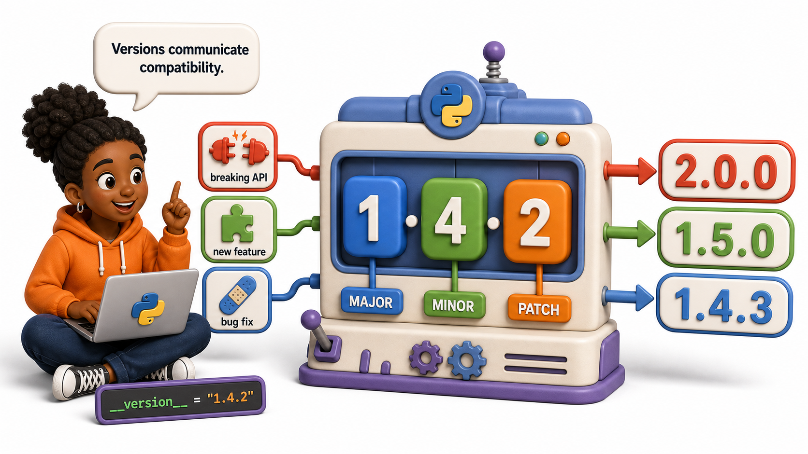
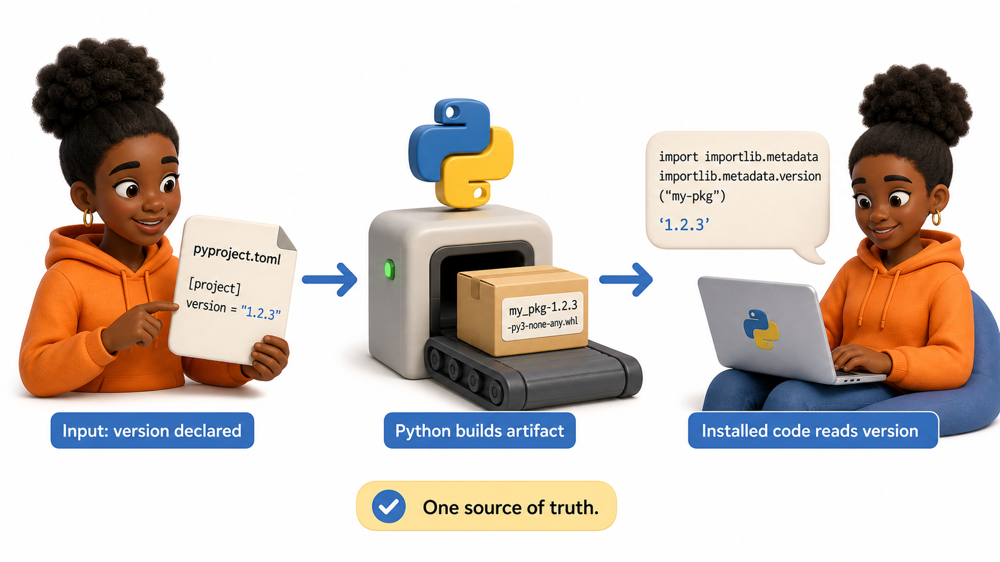

## Introduction

Nia has built `metric-utils` and shared version `0.1.0` with another team. A week later she changes the name of a public function, rebuilds the wheel, and sends it under the same version number. One colleague receives the old behavior, another receives the new behavior, and neither can tell which package is installed from the filename. The code works, but the release process does not communicate change.

Versions are part of a package's public interface. They let users compare releases, reproduce an environment, and decide whether an update is likely to be safe.

**Definition:** `Semantic Versioning` represents a release as `MAJOR.MINOR.PATCH`, where each number communicates the kind of compatibility change.



## Reading a Semantic Version

Given version `2.4.1`:

| Part | Increase it when | Example |
|---|---|---|
| MAJOR | A public interface changes incompatibly | `2.4.1` to `3.0.0` |
| MINOR | Backward-compatible functionality is added | `2.4.1` to `2.5.0` |
| PATCH | A backward-compatible bug is fixed | `2.4.1` to `2.4.2` |

The rule is about what users experience, not how many lines changed. A one-line rename can require a major release if existing programs stop working. A large internal refactor can be only a patch if the public behavior remains identical.

## Declaring the Version



For a small project, keep the version in `pyproject.toml`:

```toml
[project]
name = "metric-utils"
version = "0.2.0"
```

The built artifact includes that version:

```console
dist/metric_utils-0.2.0-py3-none-any.whl
dist/metric_utils-0.2.0.tar.gz
```

Installed code can read its distribution version without duplicating the value:

```python
from importlib.metadata import version

print(version("metric-utils"))
```

Avoid manually maintaining the same version in several files. Two sources of truth eventually disagree.

## Versions Before 1.0

Versions such as `0.3.0` usually signal that the public API is still developing. Teams often treat minor releases before `1.0.0` as potentially breaking, but they should document that policy clearly. Reaching `1.0.0` means the package has a stable public interface that users can rely on.

Pre-release labels help teams test upcoming releases:

```text
1.3.0a1   alpha
1.3.0b1   beta
1.3.0rc1  release candidate
1.3.0     final release
```

## A Release Decision

Suppose `metric-utils` is currently `1.4.2`.

- Fixing an incorrect percentile calculation becomes `1.4.3`.
- Adding a new `median_absolute_deviation()` function becomes `1.5.0`.
- Removing the documented `rolling_mean()` function becomes `2.0.0`.
- Refactoring internal helper functions with no visible change remains a patch release if a release is needed.

The version should be chosen after reviewing user-visible change, tests, and documentation, not from the size of the commit.

## Common Mistakes

- Reusing a published version makes environments impossible to audit. Every release must have a new version.
- Treating every feature as a major release creates noisy version numbers. Compatibility is the deciding factor.
- Changing public behavior without a changelog surprises users even when the number is technically correct.
- Tagging a release before tests pass connects the version to code that should not be shipped.

## Your Turn

Classify each change to a package currently at `1.7.3`: a corrected error message, a new optional command, a removed function parameter, and a private helper refactor. Choose the next version for each and justify the decision in one sentence.

## Conclusion

Semantic Versioning turns a release number into a compatibility promise. Increase PATCH for compatible fixes, MINOR for compatible features, and MAJOR for breaking public changes. Keep one authoritative version, never reuse a published version, and connect every release to tested code and clear release notes.
