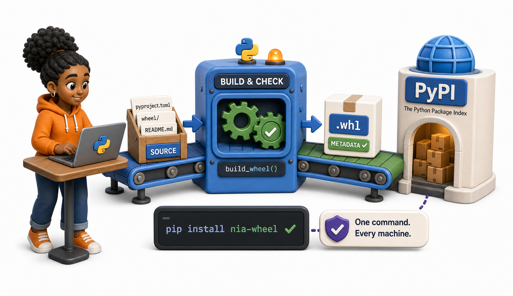
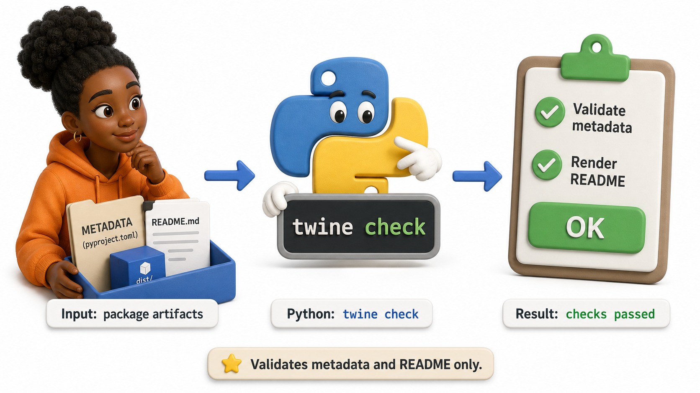
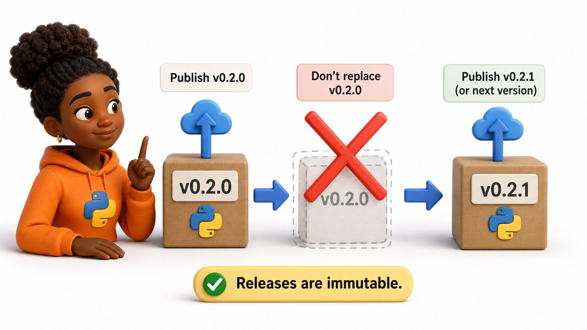

## Introduction

Nia's wheel installs correctly when she sends it through chat, but that approach does not scale. Users need to discover the package, verify its version, and install it with the same command on every machine. The Python Package Index, or PyPI, is the public registry that makes this possible.

Publishing is the final boundary between a private build and a release other people can depend on. It must therefore be deliberate, authenticated, and tested.

**Definition:** `PyPI` is the package registry used by pip and other Python installers to find and download published distributions.



## The Publishing Pipeline

A safe release has distinct gates:

1. Run tests, linting, and type checks.
2. Build a wheel and source distribution.
3. Inspect the contents and metadata.
4. Upload to TestPyPI.
5. Install the TestPyPI release in a clean environment.
6. Upload the exact same artifacts to PyPI.
7. Tag the source commit and write release notes.

TestPyPI is a separate registry intended for rehearsal. It catches packaging and metadata problems without consuming a real public version.

## Building and Checking Artifacts



```console
uv run pytest
uv run ruff check .
uv run python -m build
uv run twine check dist/*
```

`twine check` validates the package metadata and verifies that the README can be rendered. It cannot prove that the code works, which is why the test suite and a clean installation remain necessary.

## Uploading Securely

Create an account and API token in the registry, then upload with Twine:

```console
uv run twine upload --repository testpypi dist/*
```

For the final registry:

```console
uv run twine upload dist/*
```

An API token is a secret. Do not put it in source code, `pyproject.toml`, shell history, screenshots, or a repository. Local publishing tools can read credentials from protected configuration, while CI systems should use encrypted secrets or PyPI's trusted publishing workflow.

## Testing the Published Package

Create a new environment that has no access to the project checkout:

```console
uv venv .release-check
uv pip install --python .release-check/bin/python \
  --index-url https://test.pypi.org/simple/ \
  --extra-index-url https://pypi.org/simple/ \
  metric-utils==0.2.0
```

Then run a small smoke test:

```console
.release-check/bin/python -c "from metric_utils import rolling_mean; print(rolling_mean([1, 2, 3], 2))"
```

The extra index is sometimes needed because a package's dependencies may exist on PyPI but not TestPyPI. Use the test registry only for release rehearsal, not as an everyday dependency source.

## Releases Are Immutable



Once version `0.2.0` is published, do not replace it with different files. Package indexes and caches assume a version identifies fixed artifacts. If a mistake is discovered, publish `0.2.1` or the next appropriate version.

You may be able to remove a release, but deletion breaks users and does not guarantee every cached copy disappears. A corrective release is usually safer.

## Common Mistakes

- Uploading before testing a clean install misses absent package data and undeclared dependencies.
- Publishing from a dirty working tree makes it hard to reproduce the artifact.
- Using an account password in automation increases the damage of a leaked credential.
- Rebuilding between TestPyPI and PyPI means the final artifacts were not actually tested.

## Your Turn

Write a release checklist for `metric-utils` version `0.2.0`. Include the exact quality commands, build check, TestPyPI smoke test, credential rule, final upload, source tag, and rollback plan.

## Conclusion

Publishing is a controlled pipeline, not a single upload command. Test the code, build once, validate the artifacts, rehearse on TestPyPI, install into a clean environment, and then publish those same files securely. A released version is immutable, so careful gates are cheaper than repairing a broken public package.
