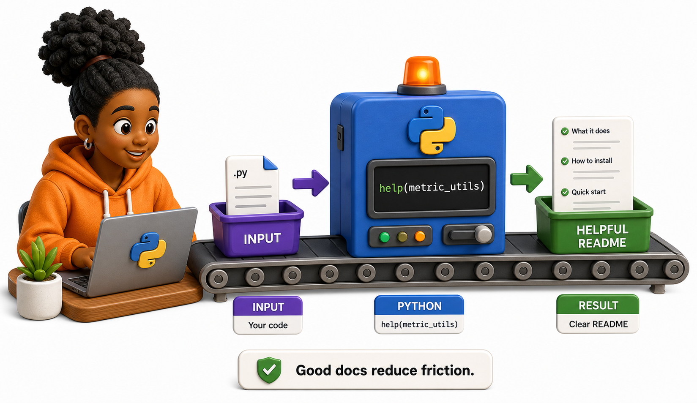
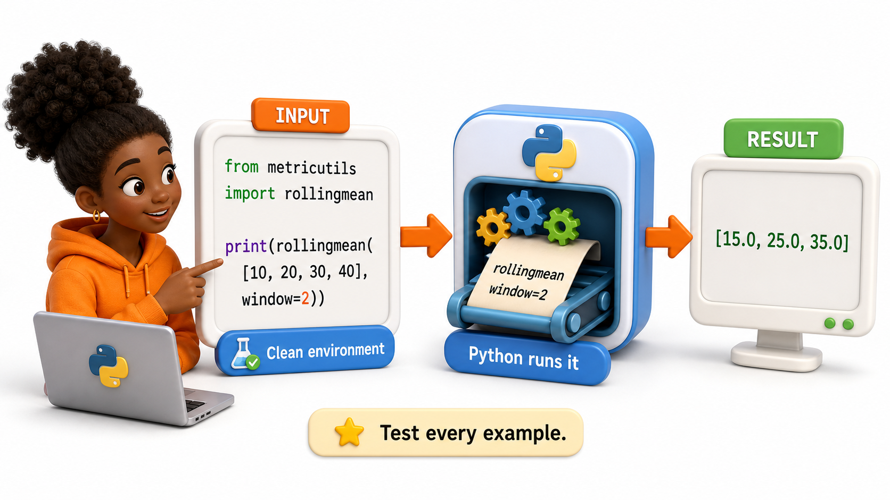

## Introduction

Nia publishes `metric-utils`, but its project page shows only a name and a short sentence. The package may be correct, yet a new user cannot tell what problem it solves, how to install it, or which function to call first. From the user's perspective, undocumented software is unfinished software.

Documentation is part of the interface. It helps a learner succeed before they need to inspect source code or ask the maintainer for help.

**Definition:** A package `README` is the shortest complete path from discovering a project to installing it and completing one useful task.



## The README's Job

A strong README answers these questions in order:

1. What does this project do?
2. Who is it for?
3. How do I install it?
4. What is the smallest working example?
5. Where is the detailed reference?
6. How do I report a problem or contribute?
7. What license and Python versions apply?

The opening should describe an outcome rather than repeat the package name.

```markdown
# metric-utils

Small, dependency-light helpers for rolling statistics in Python data pipelines.

## Installation

    pip install metric-utils

## Quick start



    from metric_utils import rolling_mean

    print(rolling_mean([10, 20, 30, 40], window=2))
```

Every command in the README should be copied into a clean environment and tested. A beautiful example that fails is worse than no example because it spends the user's trust.

## Docstrings Explain the API

The README teaches the first success. Docstrings explain individual public objects:

```python
def rolling_mean(values: list[float], window: int) -> list[float]:
    \"\"\"Return means for each complete rolling window.

    Args:
        values: Ordered numeric observations.
        window: Positive number of observations per result.

    Returns:
        One mean for every complete window.

    Raises:
        ValueError: If window is less than one or larger than values.
    \"\"\"
```

A useful docstring states the contract, not a translation of the function name. It documents inputs, output shape, failure conditions, side effects, and any non-obvious performance cost.

## Documentation Has Layers

| Layer | Purpose | Typical location |
|---|---|---|
| README | First successful use | Repository root and PyPI page |
| Tutorials | Guided learning | `docs/tutorials/` |
| How-to guides | Complete a specific task | `docs/how-to/` |
| Reference | Exact API behavior | Generated from docstrings |
| Explanation | Design and concepts | `docs/explanation/` |

Not every small package needs a documentation site, but every public package needs an accurate README, public API docstrings, and release notes.

## Keeping Documentation Correct

Documentation decays when code changes without it. Treat docs as part of the same pull request:

- Run examples as tests or doctests where practical.
- Link to stable public names, not private implementation details.
- State supported Python versions and operating-system limits.
- Update installation commands when dependencies or entry points change.
- Add migration notes before removing or renaming public behavior.

## Common Mistakes

- Beginning with architecture instead of the user's problem delays the first success.
- Omitting expected output leaves learners unsure whether their run was correct.
- Documenting only the happy path hides important errors and constraints.
- Copying stale commands across releases makes the package appear broken.

## Your Turn

Draft the README outline for `metric-utils`. Write its one-sentence purpose, installation command, a six-line quick start with expected output, supported Python version, documentation link, issue-reporting link, and license line. Then run the quick start in a clean environment.

## Conclusion

Documentation is a tested user interface. The README should move from purpose to installation to one verified success, while docstrings define the public API contract. Layer deeper tutorials and reference material only where they help, and update documentation in the same change as the code it describes.
