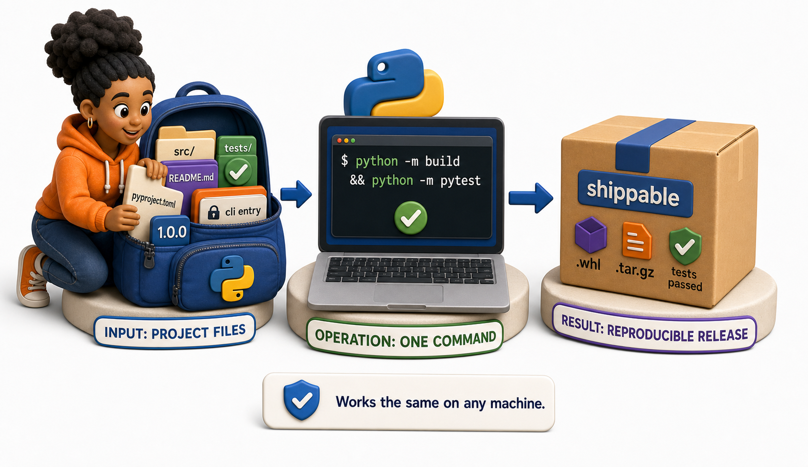
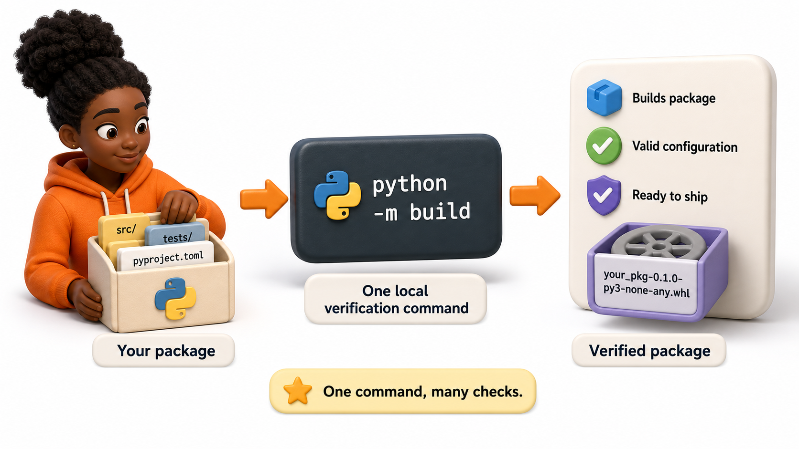

## Introduction

Nia now has every individual ingredient: a `src` layout, `pyproject.toml`, locked dependencies, tests, a CLI entry point, build artifacts, a version, and documentation. The last challenge is proving that these pieces form one reproducible release. A project is not shippable because each file looks correct in isolation. It is shippable when a new machine can check out the source, verify it, build it, install it, and use it without hidden knowledge.

This lesson turns the semester's tools into one release pipeline.

**Definition:** A `shippable package` is a versioned project that can be built, tested, installed, documented, and reproduced from its declared source and configuration.



## The Finished Project

```text
metric-utils/
├── src/
│   └── metric_utils/
│       ├── __init__.py
│       ├── rolling.py
│       └── cli.py
├── tests/
│   ├── test_rolling.py
│   └── test_cli.py
├── docs/
├── pyproject.toml
├── uv.lock
├── README.md
├── CHANGELOG.md
├── LICENSE
└── .pre-commit-config.yaml
```

Each item has a distinct responsibility. Source code implements behavior. Tests protect the contract. `pyproject.toml` declares metadata and tools. `uv.lock` reproduces the environment. Documentation teaches usage. The changelog explains releases.

## One Local Verification Command



Teams should make the correct checks easy to run:

```console
uv sync --all-extras
uv run ruff check .
uv run ruff format --check .
uv run mypy src
uv run pytest --cov=metric_utils --cov-report=term-missing
uv run python -m build
uv run twine check dist/*
```

These gates answer different questions. Linting finds suspicious code, formatting enforces consistency, type checking checks declared contracts, tests check behavior, coverage reveals untested paths, and the build proves packaging configuration.

## Test the Artifact, Not Only the Source Tree

Tests commonly import code directly from the checkout. That can hide a broken wheel. After building, install the wheel in a clean environment:

```console
uv venv .smoke-test
uv pip install --python .smoke-test/bin/python dist/*.whl
.smoke-test/bin/python -c "import metric_utils; print(metric_utils.__version__)"
.smoke-test/bin/metric-utils --help
```

This catches missing files, incorrect entry points, undeclared runtime dependencies, and import paths that worked only inside the repository.

## A Minimal Continuous Integration Gate

```yaml
name: quality
on: [push, pull_request]

jobs:
  test:
    runs-on: ubuntu-latest
    steps:
      - uses: actions/checkout@v4
      - uses: astral-sh/setup-uv@v5
      - run: uv sync --all-extras
      - run: uv run ruff check .
      - run: uv run mypy src
      - run: uv run pytest
      - run: uv run python -m build
```

CI does not replace local checks. It provides an independent, repeatable environment and prevents a release from depending on files or packages that happen to exist on one developer's computer.

## Release Checklist

- Working tree is clean and the target commit is reviewed.
- Version and changelog describe the same release.
- Quality gates pass locally and in CI.
- Wheel and source distribution contain the expected files.
- The wheel installs and the CLI runs in a clean environment.
- README examples match the released API.
- TestPyPI rehearsal succeeds.
- The source commit is tagged after the final artifacts are approved.

## Common Mistakes

- Testing only editable installs can hide packaging errors.
- Building from an uncommitted tree makes the artifact hard to reproduce.
- Allowing CI and local commands to differ creates avoidable surprises.
- Publishing before documentation and version updates produces an ambiguous release.

## Your Turn

Take one project from this semester and write its release evidence: the exact commit, Python versions tested, quality commands, coverage result, artifact filenames, clean-install smoke test, and the next semantic version. A classmate should be able to repeat the release using only that record.

## Conclusion

Shipping joins the entire semester into one reproducible path: structure the project, declare and lock dependencies, enforce quality, test behavior, build distributions, install the artifact in isolation, document the public interface, version the change, and publish only after every gate passes. The result is not merely code that works on one laptop, but a package other people can trust.
