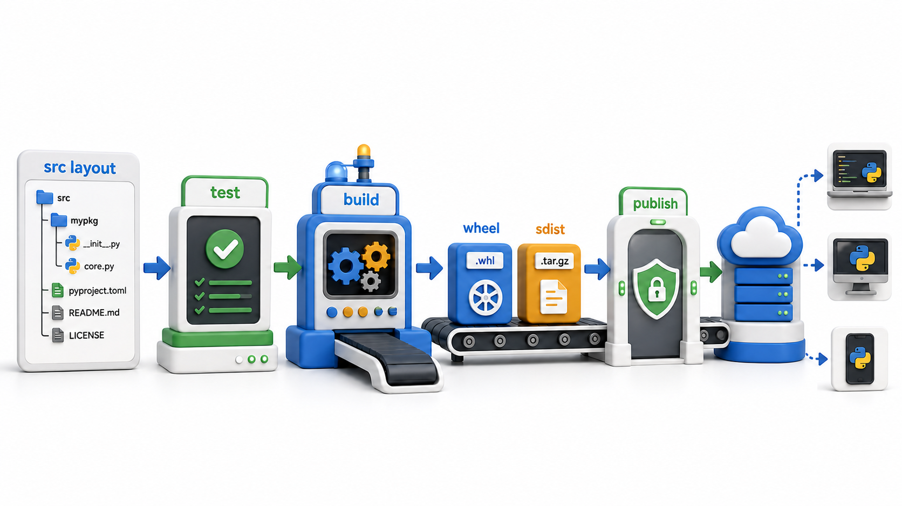

# Unit 14: Packaging and Distribution

Turn a tested Python project into a reproducible, installable, documented release.

## Topics

1. [Professional Project Layout](01_professional_project_layout.md)
2. [`pyproject.toml` and Build Backends](02_pyprojecttoml_and_build_backends.md)
3. [Managing Dependencies and Environments with `uv`](03_managing_dependencies_and_environments_with_uv.md)
4. [Building Wheels and Source Distributions](04_building_wheels_and_source_distributions.md)
5. [Versioning and Semantic Versioning](05_versioning_and_semantic_versioning.md)
6. [Publishing to PyPI](06_publishing_to_pypi.md)
7. [Documentation and README Essentials](07_documentation_and_readme_essentials.md)
8. [Bringing It Together: A Shippable, Tested Package](08_bringing_it_together_a_shippable_tested_package.md)

Each lesson follows the Semester 1 house standard: a story-led introduction, precise definition, labelled visual, runnable examples, common mistakes, guided practice, and a concise conclusion.
