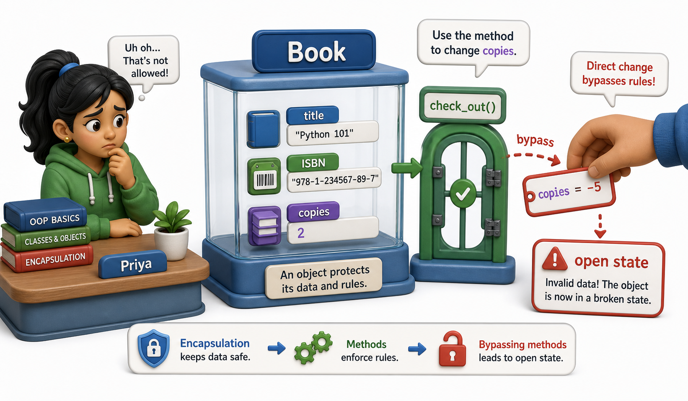

## Introduction

Priya is proud of the `Book` class she wrote last semester. It stores a title, an ISBN, and a copy count. It even has a `__repr__`. But two weeks after she joined the library management team, a colleague edits a book's `copies` attribute directly and sets it to `-5`. There is no error. The system merrily reports that there are negative copies of a book on the shelf, and a reservation made against that "stock" sends an automated email to a patron telling them a book is available when it is not.

The class works. The objects are wrong. Priya realizes the problem: her class is a container with no guard on the door. This unit is about building the guard. Before doing that, a brief review of what you already know about classes is worth taking, because everything in this unit grows directly from that foundation.



## A Class Is a Blueprint; an Object Is a Built Thing

A class definition describes what data an object will hold (attributes) and what operations it supports (methods). Every time you call the class like a function, Python creates a new independent object from that blueprint.

```python
class Book:
    def __init__(self, title, isbn, copies):
        self.title = title
        self.isbn = isbn
        self.copies = copies

    def is_available(self):
        return self.copies > 0

    def __repr__(self):
        return f"Book({self.title!r}, copies={self.copies})"

b1 = Book("Dune", "978-0441013593", 3)
b2 = Book("Shogun", "978-0385291675", 1)

print(b1.is_available())   # True
print(b2)                  # Book('Shogun', copies=1)
```

`b1` and `b2` are independent objects. Changing `b1.copies` does not affect `b2`. Each holds its own data, and both share the same method definitions.

## Instance Attributes, Class Attributes, and the Difference

Attributes set on `self` in `__init__` are **instance attributes**: each object gets its own copy. Attributes set directly on the class body are **class attributes**: all instances share one copy.

```python
class Book:
    library_name = "City Central Library"   # class attribute: shared

    def __init__(self, title, copies):
        self.title = title       # instance attribute: per-object
        self.copies = copies     # instance attribute: per-object

b = Book("Dune", 3)
print(b.library_name)          # City Central Library (read from the class)
print(Book.library_name)       # City Central Library (direct class access)

Book.library_name = "Westside Branch"   # change affects all instances
print(b.library_name)          # Westside Branch
```

Class attributes are useful for constants and counters shared across all instances, but be careful: mutating a class attribute changes it for every object, which is either exactly what you want or a very confusing bug.

## Methods Are Just Functions That Receive the Object

Every method receives `self` as its first argument, which is the instance the method was called on. Python passes it automatically; you never provide it when calling.

```python
class Book:
    def __init__(self, title, copies):
        self.title = title
        self.copies = copies

    def check_out(self):
        if self.copies < 1:
            print("No copies available")
            return
        self.copies -= 1
        print(f"Checked out '{self.title}'. Remaining: {self.copies}")

b = Book("Dune", 2)
b.check_out()   # Checked out 'Dune'. Remaining: 1
b.check_out()   # Checked out 'Dune'. Remaining: 0
b.check_out()   # No copies available
```

`check_out` modifies `self.copies`, so each call on the same object sees the updated state. This is the core of what makes objects useful: state that persists between calls.

## The Problem with Open State

The `Book` class above has a subtle weakness: nothing prevents code outside the class from writing directly to `self.copies`:

```python
class Book:
    def __init__(self, title, copies):
        self.title = title
        self.copies = copies

    def check_out(self):
        if self.copies < 1:
            print("No copies available")
            return
        self.copies -= 1

b = Book("Dune", 2)
b.check_out()
b.copies = -5   # no error, no warning
print(b.copies) # -5
```

The `check_out` method has logic to prevent negative copies, but that logic can be bypassed completely by anyone who knows the attribute name. In a small codebase with one developer, this is manageable. In a team or a system with thousands of calls, it is a ticking bug.

## Classes and Objects at a Glance

| Concept | Syntax | What it does |
|---|---|---|
| Class attribute | Defined in class body, outside `__init__` | Shared across all instances |
| Instance attribute | Set on `self` in `__init__` | Unique to each object |
| Method | Function defined in class body, takes `self` | Operates on the instance's data |
| `__init__` | Called automatically by Python when you create an object | Sets up initial state |
| `__repr__` | Called by `repr()` and the REPL | Returns a developer-readable string |

## Your Turn

```python
class LibraryCard:
    total_issued = 0   # track across all cards

    def __init__(self, holder_name):
        self.holder_name = holder_name
        self.books_borrowed = []
        LibraryCard.total_issued += 1

    def borrow(self, book_title):
        self.books_borrowed.append(book_title)

    def __repr__(self):
        return f"LibraryCard({self.holder_name!r}, borrowed={len(self.books_borrowed)})"

# Demo:
obj = LibraryCard("librarycard_1")
print(obj)
```

Create two `LibraryCard` objects, borrow one book on each, then print `LibraryCard.total_issued`. Confirm it is `2`. Now explain why `total_issued` counts correctly across both instances even though neither instance sets it on `self`.

## Conclusion

A class defines attributes and methods; an object holds its own copy of the instance attributes and shares method definitions with all other instances of the same class. The `check_out` method illustrated a real problem: an object's internal state can be modified from outside the class, bypassing any logic the class has in place to keep it valid. The next lesson gives this problem a name, **encapsulation**, and shows the techniques Python provides to address it.
