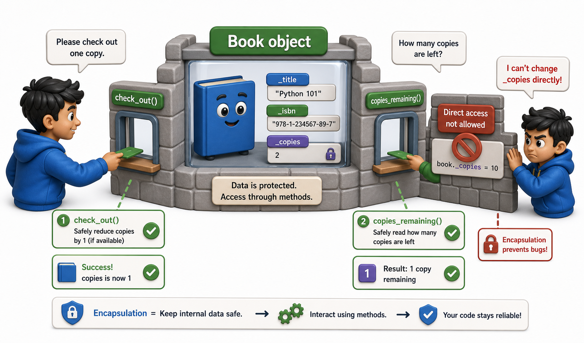

## Introduction

After the negative-copies incident, Priya explains the problem to her tech lead. He listens, nods, and says one word: "Encapsulation." He means the idea that a class should own its data completely: the only way to read or change an object's internal state should be through the methods the class deliberately provides. Anyone using the `Book` class should not need to know how it stores the copy count internally, and more importantly, should not be able to reach in and set it to whatever they like.

This is the first and most fundamental principle of object-oriented design in production code, and this lesson makes it concrete.



## What Encapsulation Actually Means

Encapsulation has two parts:

**Bundling**: the data (attributes) and the operations that work on that data (methods) live together in one class. A `Book` knows how to check itself out rather than requiring an external function to manipulate its attributes.

**Protection**: the internal representation is hidden from the outside world. Code that uses `Book` objects should not know or care whether copies are stored as an `int`, a list, or a dictionary. The class makes that decision and exposes only a clean interface.

```python
class Book:
    def __init__(self, title, isbn, copies):
        self.title = title
        self.isbn = isbn
        self._copies = copies      # internal; callers should not touch directly

    def check_out(self):
        if self._copies < 1:
            raise ValueError(f"No copies of '{self.title}' available")
        self._copies -= 1

    def return_copy(self):
        self._copies += 1

    def copies_available(self):
        return self._copies

# Demo:
obj = Book("book_1", 2024, "example")
print(obj)
```

The single underscore on `_copies` is a Python convention meaning "this is an internal implementation detail; please do not touch it from outside this class." Python does not enforce this (unlike Java or C++), but it is a clear signal that respecting it is part of using the class correctly.

## Why the Interface Matters More Than the Implementation

Once Priya wraps `_copies` in methods, something interesting happens: she can change the internal representation without breaking any code that uses `Book`.

```python
# Version 1: copies is a plain integer
class Book:
    def __init__(self, title, copies):
        self._copies = copies

    def copies_available(self):
        return self._copies

# Version 2: copies is stored per-branch (different internal representation)
class Book:
    def __init__(self, title, copies_by_branch):
        self._copies_by_branch = copies_by_branch   # {"main": 2, "west": 1}

    def copies_available(self):
        return sum(self._copies_by_branch.values())

# Demo:
obj = Book("book_1", "example")
print(obj)
```

Any code that calls `book.copies_available()` works identically in both versions. The caller never knew how copies were stored, so they are unaffected by the change. This is the practical payoff of encapsulation: it decouples the implementation from the interface, making the class's internals changeable without cascading edits throughout the codebase.

## Validation at the Point of Entry

Encapsulation also lets you validate data at the one place where it enters the object rather than trusting callers to pass valid values. If the copy count can only be set through `__init__` and `return_copy`, you can add checks in exactly those places and know they will always run.

```python
class Book:
    def __init__(self, title, copies):
        if copies < 0:
            raise ValueError(f"copies must be non-negative, got {copies}")
        self.title = title
        self._copies = copies

    def return_copy(self):
        self._copies += 1

    def check_out(self):
        if self._copies < 1:
            raise ValueError(f"No copies of '{self.title}' available")
        self._copies -= 1

    def copies_available(self):
        return self._copies

# A valid book works fine:
b = Book("Dune", 3)
b.check_out()
print(f"'{b.title}' now has {b.copies_available()} copies")

# A negative count is rejected at construction time:
try:
    bad = Book("Dune", -1)   # error!
except ValueError as e:
    print(f"ValueError: {e}")
```

The `ValueError` is raised at object creation, not somewhere later when the negative count causes a mysterious failure. The problem is caught where it is introduced, not where it first manifests.

## Encapsulation Is Not Just About Hiding

A common misconception is that encapsulation is mainly about making things private. It is actually about **keeping related things together**. The `check_out` logic belongs in `Book` because it is intimately tied to what `_copies` means. Spreading that logic across multiple files or modules means changes to the copy-counting mechanism require hunting down every place copies are manipulated.

```python
# Fragmented (not encapsulated):
def check_out_book(book, user):
    book.copies -= 1          # reaches in directly
    user.borrowed.append(book)

# Encapsulated:
def check_out_book(book, user):
    book.check_out()          # book manages its own state
    user.borrow(book)         # user manages its own state

# Demo: run both versions with mock objects
class MockBook:
    def __init__(self): self.copies = 3
    def check_out(self): self.copies -= 1

class MockUser:
    def __init__(self): self.borrowed = []
    def borrow(self, book): self.borrowed.append(book)

b, u = MockBook(), MockUser()
check_out_book(b, u)
print(f"After check_out: copies={b.copies}, borrowed_count={len(u.borrowed)}")
```

The encapsulated version lets each object change its own internal implementation without the function that coordinates them ever needing to know about it.

## Encapsulation at a Glance

| Principle | What it means in practice |
|---|---|
| Bundling | Data and the methods that operate on it live in the same class |
| Protection | Internal attributes are prefixed with `_` as a "do not touch" signal |
| Validation | Check invariants at the point data enters the object |
| Interface stability | Callers use methods, not attributes; internal representation can change freely |

## Your Turn

```python
class BankAccount:
    def __init__(self, owner, initial_balance):
        self.owner = owner
        self._balance = initial_balance

    def deposit(self, amount):
        if amount <= 0:
            raise ValueError("Deposit amount must be positive")
        self._balance += amount

    def withdraw(self, amount):
        if amount <= 0:
            raise ValueError("Withdrawal amount must be positive")
        if amount > self._balance:
            raise ValueError("Insufficient funds")
        self._balance -= amount

    def balance(self):
        return self._balance

# Demo:
obj = BankAccount(2024, 2024)
print(obj)
```

Test this by creating an account with a starting balance, depositing and withdrawing valid amounts, then try to trigger each `ValueError`. Finally, confirm that `account._balance = -9999` still "works" from outside (Python does not stop you), and explain why the single-underscore convention relies on team discipline rather than language enforcement.

## Conclusion

Encapsulation means that a class owns its state completely: callers interact only through the methods the class provides, internal attributes are marked with a leading underscore to signal they should not be touched directly, and validation lives at the point where data enters the object. This decouples the class's interface from its implementation, so the internal representation can change without affecting every piece of code that uses it. The next lesson introduces a stronger form of access control: name mangling with a double underscore, which does provide a technical barrier, not just a convention.
