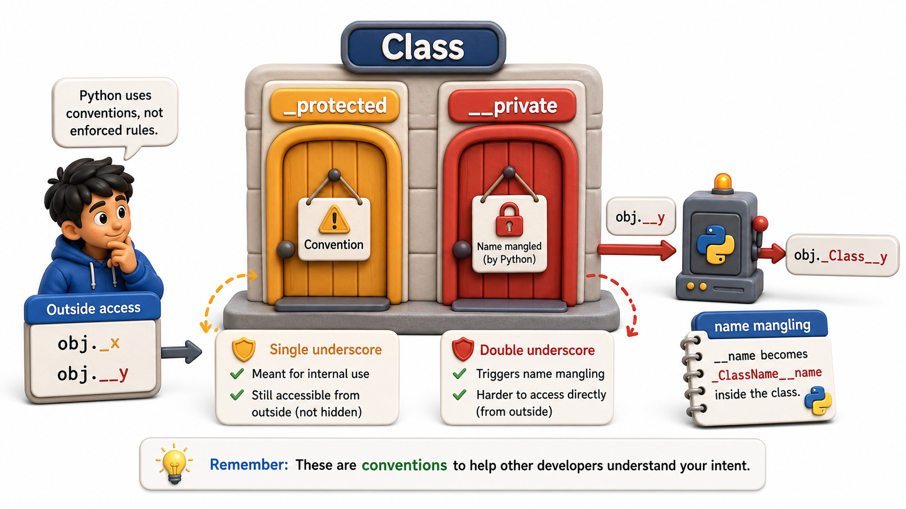

## Introduction

Priya has been using single underscores consistently, and her team has been respecting them. But a new developer joins and, not knowing the convention, reads `_copies` directly and builds a feature that caches the value in another part of the system. When Priya later refactors `_copies` to `_copies_by_branch`, his feature breaks silently. The convention worked until it did not.

She wonders: is there a stronger mechanism? There is, and it uses a double underscore. But it comes with a twist that surprises almost every developer the first time they see it. This lesson explains the difference between one underscore and two, and what name mangling actually does.



## One Underscore: Convention, Not Enforcement

A single leading underscore (`_copies`) is purely a social signal. Python never prevents you from reading or writing it from outside the class. It communicates "this is an internal detail; use the provided methods instead," and it relies entirely on the caller understanding and respecting that message.

```python
class Book:
    def __init__(self, title, copies):
        self._copies = copies   # social convention

b = Book("Dune", 3)
b._copies = -99   # Python allows this completely
print(b._copies)  # -99 -- convention broken, but no error
```

This is actually intentional in Python's design philosophy. Python prefers clarity and explicit agreements among developers over rigid technical barriers. The single underscore is that agreement. Most of the time, it is enough.

## Two Underscores: Name Mangling

A double leading underscore (`__copies`) triggers a Python feature called **name mangling**. When Python compiles a class that contains an attribute or method starting with `__`, it renames it to `_ClassName__attributename` before the class body runs. This makes it genuinely harder to access from outside the class, because the attribute's name has changed.

```python
class Book:
    def __init__(self, title, copies):
        self.__copies = copies   # stored as _Book__copies

    def copies_available(self):
        return self.__copies    # still works inside the class

b = Book("Dune", 3)
print(b.copies_available())    # 3 -- works

try:
    print(b.__copies)          # error! AttributeError: no attribute __copies
except AttributeError as e:
    print(f"AttributeError: {e}")
print(b._Book__copies)         # 3 -- name mangling exposed; accessible but discouraged
```

The last line is the important one: name mangling is not true privacy. Anyone who knows the mangled name can still access it. The barrier is technical, not cryptographic. Its real purpose is **preventing accidental name clashes in subclasses**, not providing security.

## Why Name Mangling Exists: Subclass Safety

The original motivation for `__` name mangling was not "make attributes private." It was "make sure a subclass cannot accidentally override an important attribute by using the same name."

```python
class LibraryItem:
    def __init__(self, copies):
        self.__copies = copies   # stored as _LibraryItem__copies

class EBook(LibraryItem):
    def __init__(self, copies, file_format):
        super().__init__(copies)
        self.__copies = copies   # stored as _EBook__copies -- different attribute!

item = EBook(5, "pdf")
print(item._LibraryItem__copies)   # 5 -- the parent's copies
print(item._EBook__copies)         # 5 -- the child's copies
```

Without name mangling, the subclass's `self.__copies` would overwrite the parent's, causing subtle bugs. With mangling, each class's `__` attribute lives under a unique mangled name. This is the real reason the feature exists.

## When to Use One vs. Two Underscores

In practice, most experienced Python developers use single underscores almost exclusively and reserve double underscores for specific situations.

```python
import uuid

# Single underscore: signal "internal detail, use provided methods instead"
class Book:
    def __init__(self, title, copies):
        self._copies = copies   # convention: internal, but accessible if needed

b = Book("Dune", 3)
print(f"_copies via convention: {b._copies}")     # works, but signals "private"

# Double underscore: collision-avoidance for inheritance safety
class BankAccount:
    def __init__(self, owner):
        self.__transaction_id = str(uuid.uuid4())[:8]   # name-mangled

    def get_id(self):
        return self.__transaction_id

acc = BankAccount("Priya")
print(f"get_id() works:         {acc.get_id()}")
print(f"Mangled name accessible: {acc._BankAccount__transaction_id}")
# acc.__transaction_id would raise AttributeError
```

Using `__` everywhere is actually a minor anti-pattern: it makes introspection and testing harder, and it communicates the wrong intent (collision avoidance) rather than the intended one (internal detail).

## No Trailing Double Underscore: Dunder Methods Are Different

It is easy to confuse `__name__` (double underscore on both sides) with `__name` (double underscore only at the start). They are completely different:

- `__copies`: name mangling applies, attribute renamed to `_Book__copies`
- `__repr__`: a **dunder method** (double on both sides), recognized by Python as part of the data model, no mangling

Never create your own attributes or methods with the `__name__` double-double-underscore pattern. Those names are reserved for Python's own protocols.

## Access Control at a Glance

| Convention | Example | What Python does | Who can access it |
|---|---|---|---|
| Public | `self.copies` | Nothing | Anyone |
| Protected | `self._copies` | Nothing (social only) | Anyone, but "please don't" |
| Name-mangled | `self.__copies` | Renamed to `_ClassName__copies` | Still accessible, just harder |
| Dunder method | `__repr__` | Recognized by the data model | Called by Python itself |

## Your Turn

```python
class SecureAccount:
    def __init__(self, owner, pin):
        self.owner = owner
        self.__pin = pin       # name-mangled

    def verify_pin(self, attempt):
        return attempt == self.__pin

a = SecureAccount("Priya", "1234")
print(a.verify_pin("1234"))    # True
print(a.verify_pin("0000"))    # False
```

Try to print `a.__pin` and observe the `AttributeError`. Then use Python's `dir(a)` to find the mangled name, and print it directly. Finally explain: does name mangling actually prevent someone determined from reading the pin? What does it actually prevent?

## Conclusion

A single leading underscore is a social convention signaling "internal detail." A double leading underscore triggers name mangling, which renames the attribute to prevent accidental subclass collisions, but does not create true privacy. Most Python code uses single underscores, reserving double underscores for specific inheritance-safety concerns. The next lesson introduces a more elegant solution to the "callers are setting attributes directly" problem: properties, which look like attribute access but secretly run a method.
