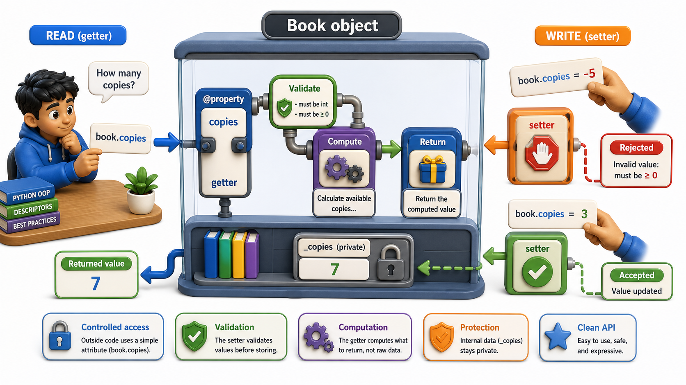

## Introduction

Priya's team has a dilemma. Half the codebase already accesses `book.copies` as a plain attribute. Renaming it to `_copies` and adding a `copies_available()` method would fix the design, but it would break every line of code that already uses `book.copies`. She needs a way to add validation logic to an attribute without changing how callers interact with it, so that `book.copies` still looks like a plain attribute from the outside but secretly runs validation code when read or written.

Python's `@property` decorator solves this exactly. It is one of the most useful tools in Python's object-oriented toolkit, and it is the reason you will almost never see explicit "getter" and "setter" methods in well-designed Python code.



## The Simplest Property: A Computed Read-Only Value

The most basic use of `@property` is turning a method into something that reads like an attribute. Rather than calling `book.is_available()`, callers can read `book.is_available` with no parentheses, and Python calls the method invisibly.

```python
class Book:
    def __init__(self, title, copies):
        self.title = title
        self._copies = copies

    @property
    def is_available(self):
        return self._copies > 0

b = Book("Dune", 3)
print(b.is_available)    # True -- called like an attribute, no parentheses
b._copies = 0
print(b.is_available)    # False
```

The `@property` decorator tells Python: "when someone reads `obj.is_available`, call this function." The result is a cleaner, more natural interface: `if book.is_available:` reads like English rather than `if book.is_available():`.

## Adding a Setter: Validation on Write

The real power of properties appears when you add a **setter**. A setter runs code whenever someone writes to the attribute, which is exactly where Priya needs to add her validation.

```python
class Book:
    def __init__(self, title, copies):
        self.title = title
        self.copies = copies    # this calls the setter immediately

    @property
    def copies(self):
        return self._copies

    @copies.setter
    def copies(self, value):
        if not isinstance(value, int):
            raise TypeError(f"copies must be an int, got {type(value).__name__}")
        if value < 0:
            raise ValueError(f"copies cannot be negative, got {value}")
        self._copies = value

b = Book("Dune", 3)
print(b.copies)     # 3 -- getter called
b.copies = 2        # setter called, validation passes
print(b.copies)     # 2

try:
    b.copies = -1       # error! ValueError
except ValueError as e:
    print(f"ValueError: {e}")

try:
    b.copies = "three"  # error! TypeError
except TypeError as e:
    print(f"TypeError: {e}")
```

Notice a detail in `__init__`: `self.copies = copies` rather than `self._copies = copies`. This is intentional: by routing through the setter from the very start, validation applies even at object creation time. Any invalid initial value is caught immediately.

## Adding a Deleter (Rarely Needed)

A third decorator, `@name.deleter`, runs code when someone calls `del obj.name`. This is rarely needed but occasionally useful, for example when deletion should trigger cleanup.

```python
class Book:
    def __init__(self, title, copies):
        self.title = title
        self._copies = copies

    @property
    def copies(self):
        return self._copies

    @copies.setter
    def copies(self, value):
        if value < 0:
            raise ValueError("copies cannot be negative")
        self._copies = value

    @copies.deleter
    def copies(self):
        print(f"Removing copy count for '{self.title}'")
        del self._copies

b = Book("Dune", 3)
del b.copies   # prints the message
```

## Why Python Does Not Use get_x() and set_x() Methods

In Java and C++, the standard pattern is to write `getCopies()` and `setCopies()` methods explicitly. Python's `@property` makes this unnecessary: you can start with a plain attribute and add a property later without changing any code that uses the object. This is the Pythonic approach: start simple, add complexity only when you need it.

```python
# Stage 1: simple attribute -- totally fine for a prototype
class Book:
    def __init__(self, title, copies):
        self.copies = copies   # plain attribute

# Stage 2: add validation without breaking callers
class Book:
    def __init__(self, title, copies):
        self.copies = copies   # still looks the same from outside

    @property
    def copies(self):
        return self._copies

    @copies.setter
    def copies(self, value):
        if value < 0:
            raise ValueError("copies cannot be negative")
        self._copies = value

# Demo: both versions expose the same interface
b = Book("Dune", 5)
print(f"{b.copies} copies available")   # 5
```

Every caller that used `book.copies = 2` before the refactor still uses `book.copies = 2` after. Nothing broke. The validation just appeared silently behind the same interface.

## Properties at a Glance

| Decorator | What it defines | When it runs |
|---|---|---|
| `@property` | The getter | When `obj.name` is read |
| `@name.setter` | The setter | When `obj.name = value` is written |
| `@name.deleter` | The deleter | When `del obj.name` is called |

## Your Turn

```python
class Temperature:
    def __init__(self, celsius):
        self.celsius = celsius   # routes through setter

    @property
    def celsius(self):
        return self._celsius

    @celsius.setter
    def celsius(self, value):
        if value < -273.15:
            raise ValueError(f"Temperature below absolute zero: {value}")
        self._celsius = value

    @property
    def fahrenheit(self):
        return self._celsius * 9 / 5 + 32

# Demo: fahrenheit is computed from celsius through the property
t = Temperature(25)
print(f"{t.celsius} C = {t.fahrenheit} F")   # 25 C = 77.0 F
```

Test this class by reading both `celsius` and `fahrenheit` (note: `fahrenheit` is read-only since it has no setter). Try to set `celsius` to `-300` and confirm the error. Then add a `fahrenheit` setter that converts the value back to Celsius and stores it, so that setting `t.fahrenheit = 32` results in `t.celsius == 0`.

## Conclusion

The `@property` decorator transforms method calls into attribute-like access, letting you add validation, computation, and cleanup behind a clean interface without changing any code that uses the object. The getter runs on read, the setter on write, and you can start with a plain attribute and add a property later without breaking anything. The next lesson moves from attribute access to a larger question: how do you design a class that hides not just its data, but the complexity of its entire implementation, presenting only what callers need to know?
