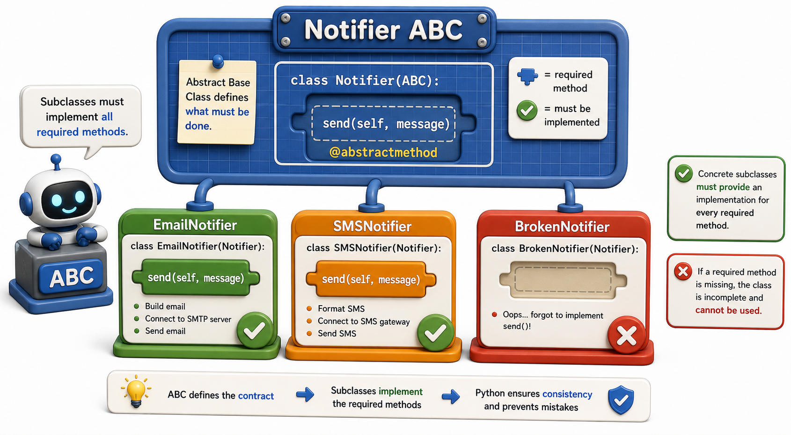

## Introduction

Three months into the project, Priya has four different notifier classes: `EmailNotifier`, `SMSNotifier`, `PushNotifier`, and a `SlackNotifier` a colleague added last week. The `SlackNotifier` works perfectly in isolation. It crashes in production because the colleague named the method `notify` instead of `send`. The bug was not caught until a patron tried to make a reservation.

Priya wants Python to tell her at class-definition time if a notifier is missing the method the rest of the system expects. She does not want to wait until runtime to discover the omission. Python's `abc` module (Abstract Base Classes) exists precisely for this situation.



## What an Abstract Base Class Is

An **Abstract Base Class** (ABC) is a class that defines an interface without providing implementations for all of it. It declares which methods every concrete subclass *must* define, and Python raises a `TypeError` if you try to instantiate a subclass that forgot one.

```python
from abc import ABC, abstractmethod

class Notifier(ABC):
    @abstractmethod
    def send(self, contact, message):
        """Send a notification to the given contact with the given message."""

# Demo: an abstract class cannot be instantiated directly
try:
    obj = Notifier()
except TypeError as e:
    print(f"TypeError: {e}")
```

`ABC` is a convenience base class from Python's `abc` module. `@abstractmethod` marks a method that every subclass must implement. The docstring in the abstract method acts as a specification: it tells future developers what any implementation must do.

## Concrete Subclasses Must Implement Every Abstract Method

A class that inherits from `Notifier` and fails to implement `send` cannot be instantiated. Python catches this at instantiation time, not at call time, which is a major improvement over duck typing.

```python
from abc import ABC, abstractmethod

class Notifier(ABC):
    @abstractmethod
    def send(self, contact, message):
        """Send a notification."""

class EmailNotifier(Notifier):
    def send(self, contact, message):
        print(f"Email to {contact}: {message}")

class BrokenNotifier(Notifier):
    pass    # forgot to implement send

email = EmailNotifier()    # fine
email.send("a@b.com", "Book available")   # Email to a@b.com: Book available

try:
    broken = BrokenNotifier()  # error! cannot instantiate without send
except TypeError as e:
    print(f"TypeError: {e}")
```

The error message names the missing method explicitly. Priya would have caught the `SlackNotifier` bug the moment it was first instantiated in a test, not in production.

## Abstract Classes Can Have Concrete Methods Too

Abstract base classes are not required to be purely abstract. They can include concrete methods that all subclasses inherit, providing default behavior alongside the required interface.

```python
from abc import ABC, abstractmethod

class Notifier(ABC):
    def send_batch(self, contacts, message):
        for contact in contacts:
            self.send(contact, message)    # delegates to the abstract method

    @abstractmethod
    def send(self, contact, message):
        """Send a single notification."""

class SMSNotifier(Notifier):
    def send(self, contact, message):
        print(f"SMS to {contact}: {message}")

sms = SMSNotifier()
sms.send_batch(["+91-999", "+91-888"], "Book available")
# SMS to +91-999: Book available
# SMS to +91-888: Book available
```

`send_batch` is a concrete method defined on the abstract class. It works correctly for every concrete subclass, regardless of how `send` is implemented, because it delegates to `self.send()`. This is the **template method pattern**: the abstract class defines the structure, concrete subclasses fill in the variable part.

## Abstract Properties

You can also mark properties as abstract, requiring subclasses to provide a value or computation for an attribute:

```python
from abc import ABC, abstractmethod

class LibraryItem(ABC):
    @property
    @abstractmethod
    def display_title(self):
        """The title as it should appear in the catalog."""

class PhysicalBook(LibraryItem):
    def __init__(self, title, edition):
        self._title = title
        self.edition = edition

    @property
    def display_title(self):
        return f"{self._title} (Ed. {self.edition})"

b = PhysicalBook("Dune", 3)
print(b.display_title)   # Dune (Ed. 3)
```

## isinstance() With Abstract Classes

A useful side effect of ABCs: `isinstance()` works correctly across the whole hierarchy, regardless of which concrete class you are holding.

```python
from abc import ABC, abstractmethod

class Notifier(ABC):
    @abstractmethod
    def send(self, contact, message):
        """Send a notification."""

class EmailNotifier(Notifier):
    def send(self, contact, message):
        print(f"Email to {contact}: {message}")

class SMSNotifier(Notifier):
    def send(self, contact, message):
        print(f"SMS to {contact}: {message}")

email = EmailNotifier()
sms = SMSNotifier()

print(isinstance(email, Notifier))   # True
print(isinstance(sms, Notifier))     # True

def notify_all(notifiers, contact, message):
    for n in notifiers:
        if not isinstance(n, Notifier):
            raise TypeError(f"Expected a Notifier, got {type(n).__name__}")
        n.send(contact, message)

notify_all([email, sms], "a@b.com", "Book available")
```

The ABC becomes a single, authoritative check: anything that claims to be a `Notifier` must have implemented `send`.

## Abstract Base Classes at a Glance

| Concept | What it does |
|---|---|
| `class X(ABC)` | Declares X as an abstract base class |
| `@abstractmethod` | Marks a method that every subclass must implement |
| Concrete subclass | A subclass that implements all abstract methods |
| Instantiation error | Python raises `TypeError` if a required method is missing |
| Concrete methods on ABC | Inherited by all subclasses; can call abstract methods via `self` |

## Your Turn

```python
from abc import ABC, abstractmethod

class Exporter(ABC):
    @abstractmethod
    def export(self, data, filename):
        """Write data to filename in the appropriate format."""

    def export_with_header(self, header, data, filename):
        self.export([header] + data, filename)

# A concrete subclass that implements export:
class CSVExporter(Exporter):
    def export(self, data, filename):
        print(f"Writing {len(data)} rows to {filename}")

CSVExporter().export_with_header("name,copies", ["Dune,3"], "out.csv")

# Exporter itself is abstract and cannot be instantiated:
try:
    obj = Exporter()
except TypeError as e:
    print(f"TypeError: {e}")
```

Write a `CSVExporter` and a `JSONExporter` that both inherit from `Exporter` and implement `export`. Then try to instantiate `Exporter` directly and observe the `TypeError`. Finally, write an `IncompleteExporter(Exporter): pass` and confirm Python refuses to let you create one.

## Conclusion

Abstract Base Classes define a formal interface that concrete subclasses are required to implement, with Python raising a `TypeError` at instantiation time rather than at call time if a method is missing. They can include concrete methods that delegate to the abstract ones, and `isinstance()` checks work cleanly across the entire hierarchy. The final lesson of this unit brings encapsulation and abstraction together into a practical design exercise, showing how clean interfaces are designed for a real system.
