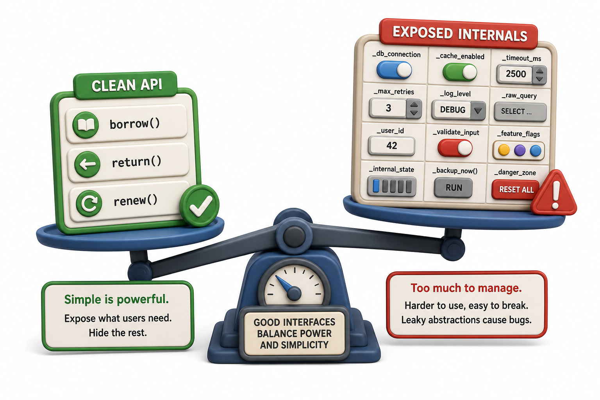

## Introduction

Priya is ready to put everything in this unit together. She has encapsulated state with properties, defined a formal interface with an ABC, and written concrete classes that implement it. But there is a final, practical question her tech lead poses: "How do you know if the interface you designed is actually clean?" He means: what is the difference between an interface that makes code easier to write and one that just adds boilerplate?

This lesson synthesizes the unit into concrete design principles, shows the full shape of a well-designed component, and highlights the most common mistakes that make interfaces harder rather than easier to use.



## Principle 1: Expose What Callers Need, Nothing More

A clean interface has no public methods or properties that callers are not supposed to use. Every public name is a commitment: once published, callers will depend on it, and changing or removing it becomes a breaking change.

```python
from abc import ABC, abstractmethod

class Notifier(ABC):
    @abstractmethod
    def send(self, contact, message):
        """Send a notification. contact and message are strings."""

    # send_batch is a convenience method callers may want
    def send_batch(self, contacts, message):
        for contact in contacts:
            self.send(contact, message)

    # _validate is internal, do not expose it
    def _validate(self, contact, message):
        if not contact:
            raise ValueError("contact cannot be empty")
        if not message:
            raise ValueError("message cannot be empty")

# Demo: the public interface is send + send_batch; Notifier itself is abstract
class EmailNotifier(Notifier):
    def send(self, contact, message):
        print(f"Email to {contact}: {message}")

EmailNotifier().send_batch(["a@b.com", "c@d.com"], "Book available")
```

The public interface is two methods: `send` and `send_batch`. The validation helper is prefixed with `_` to signal it is internal. Callers never need to call `_validate` directly; the class calls it as needed inside `send`.

## Principle 2: Make It Hard to Use Incorrectly

A well-designed interface should be harder to misuse than to use correctly. This is achieved through type checking in setters, sensible defaults, and validation at the entry point.

```python
class Book:
    def __init__(self, title, isbn, copies=1):
        if not isinstance(title, str) or not title.strip():
            raise ValueError("title must be a non-empty string")
        if not isinstance(copies, int) or copies < 0:
            raise ValueError("copies must be a non-negative integer")
        self.title = title.strip()
        self.isbn = isbn
        self._copies = copies

    @property
    def copies(self):
        return self._copies

    @copies.setter
    def copies(self, value):
        if not isinstance(value, int) or value < 0:
            raise ValueError("copies must be a non-negative integer")
        self._copies = value

# Demo: valid input builds a usable object; invalid input is refused
book = Book("Dune", "978-0441013593", copies=3)
print(f"{book.title}: {book.copies} copies")

try:
    bad = Book("", "978-000", copies=-1)
except ValueError as e:
    print(f"ValueError: {e}")
```

Validation in `__init__` and the setter means an invalid `Book` object simply cannot exist. Callers do not need to remember to validate; the class takes care of it for them.

## Principle 3: Keep Interfaces Narrow and Focused

An interface that declares 12 abstract methods is a burden: every concrete subclass must implement all 12, even if it only needs 3. Good interface design splits a large interface into smaller, more focused ones.

```python
from abc import ABC, abstractmethod

# One large interface (hard to implement):
class FullLibraryService(ABC):
    @abstractmethod
    def send_notification(self, contact, message): ...
    @abstractmethod
    def export_catalog(self, filename): ...
    @abstractmethod
    def generate_report(self, period): ...
    @abstractmethod
    def handle_payment(self, amount): ...

# Better: three focused interfaces
class Notifier(ABC):
    @abstractmethod
    def send(self, contact, message): ...

class Exporter(ABC):
    @abstractmethod
    def export(self, data, filename): ...

class PaymentHandler(ABC):
    @abstractmethod
    def charge(self, amount, account): ...

# A class can implement just the focused interfaces it actually needs:
class EmailExporter(Notifier, Exporter):
    def send(self, contact, message): print(f"Email to {contact}")
    def export(self, data, filename): print(f"Exported to {filename}")

svc = EmailExporter()
print("Implements Notifier:", isinstance(svc, Notifier))
print("Implements PaymentHandler:", isinstance(svc, PaymentHandler))
```

A class that needs to send notifications and export data can inherit from both `Notifier` and `Exporter` without being forced to implement payment handling it will never use.

## Putting It Together: A Complete Component

Here is what the full `Book`-and-`Notifier` design looks like when all the lessons of this unit are applied together:

```python
from abc import ABC, abstractmethod

class Notifier(ABC):
    @abstractmethod
    def send(self, contact, message):
        """Send one message to one contact."""

    def send_batch(self, contacts, message):
        for c in contacts:
            self.send(c, message)

class EmailNotifier(Notifier):
    def send(self, contact, message):
        print(f"[EMAIL] To: {contact} | {message}")

class Book:
    def __init__(self, title, isbn, copies=1):
        self.title = title
        self.isbn = isbn
        self._copies = copies

    @property
    def copies(self):
        return self._copies

    @copies.setter
    def copies(self, value):
        if value < 0:
            raise ValueError("copies cannot be negative")
        self._copies = value

    def check_out(self):
        if self._copies < 1:
            raise ValueError(f"No copies of '{self.title}' available")
        self._copies -= 1

    def return_copy(self):
        self._copies += 1

    def __repr__(self):
        return f"Book({self.title!r}, copies={self._copies})"
```

## Clean Interfaces at a Glance

| Principle | What it looks like in code |
|---|---|
| Expose only what callers need | Keep helpers and internals prefixed with `_` |
| Make misuse hard | Validate in `__init__` and setters, raise on invalid input |
| Keep interfaces narrow | One ABC per responsibility, not one ABC for everything |
| Separate interface from implementation | ABCs define what; concrete classes define how |
| Document the contract | Abstract method docstrings describe what callers can expect |

## Your Turn

Design a clean `PaymentProcessor` ABC and two concrete implementations: `CreditCardProcessor` and `UPIProcessor`. The interface should have one abstract method: `charge(amount, account_id)` that returns `True` on success and `False` on failure. Add a concrete `charge_with_retry(amount, account_id, attempts=3)` method on the ABC that calls `charge` in a loop up to `attempts` times, returning `True` on first success or `False` if all attempts fail. Test both implementations and confirm the retry logic works without modification to either concrete class.

## Conclusion

A clean interface exposes exactly what callers need and nothing more, validates input at every entry point so invalid objects cannot exist, and splits responsibilities into narrow, focused ABCs rather than one sprawling contract. This unit covered the full arc: from the raw `Book` class with an open attribute that anyone could set to a validated, property-controlled object, and from informal duck typing to a formal ABC that catches missing implementations at instantiation time. Unit 3 builds on this foundation by exploring what happens when one class inherits from another: how constructor chains work, how methods override each other, and how multiple classes can share and extend behavior through inheritance.
