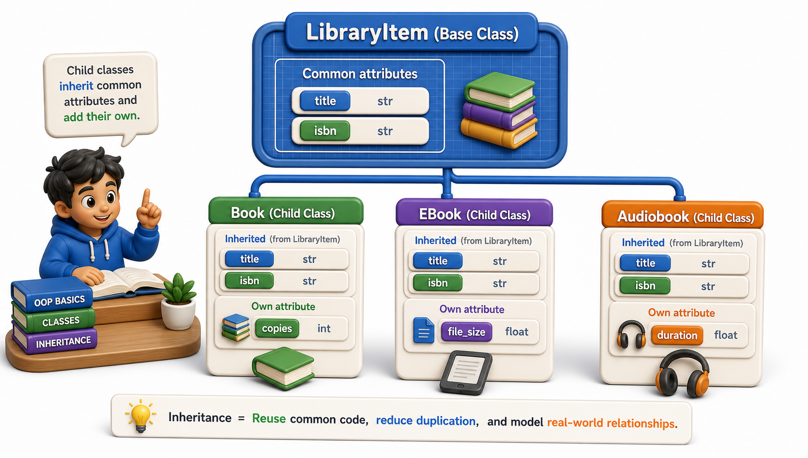

## Introduction

Dev is building the library catalog system and has written three classes: `Book`, `EBook`, and `Audiobook`. All three have a `title`, an `isbn`, and a method called `display_info()`. All three implement `is_available()` with identical logic. He is copying and pasting the same code into each class, and every time he finds a bug in `display_info()`, he has to fix it in three places.

There is a better way. If all three share common structure and behavior, that structure should live in one place and the three classes should share it. The mechanism is **inheritance**, and this lesson covers how it works and why it exists.



## What Inheritance Is

Inheritance is a relationship between two classes: a **parent class** (also called a base class or superclass) defines shared attributes and methods, and a **child class** (subclass) inherits all of them, adding or changing only what is specific to the child.

```python
class LibraryItem:
    def __init__(self, title, isbn):
        self.title = title
        self.isbn = isbn

    def display_info(self):
        return f"{self.title} (ISBN: {self.isbn})"

    def is_available(self):
        raise NotImplementedError("Subclasses must implement is_available()")

# Demo:
obj = LibraryItem("libraryitem_1", 2024)
print(obj)
```

`LibraryItem` defines what all library items have in common. It deliberately does not implement `is_available()` because the right behavior differs per item type (a physical book tracks copies; an ebook may always be available).

## Defining a Subclass

The syntax for inheritance is the parent class name in parentheses after the class name:

```python
class Book(LibraryItem):
    def __init__(self, title, isbn, copies):
        self.title = title
        self.isbn = isbn
        self.copies = copies

    def is_available(self):
        return self.copies > 0

b = Book("Dune", "978-0441013593", 3)
print(b.display_info())    # Dune (ISBN: 978-0441013593) -- inherited from LibraryItem
print(b.is_available())    # True -- defined on Book
```

`Book` inherits `display_info()` from `LibraryItem` without re-defining it. Any change to `display_info()` in the parent automatically applies to `Book`, `EBook`, and `Audiobook` simultaneously. The bug-in-three-places problem is solved.

## What Gets Inherited

A child class inherits everything that is not explicitly private (not name-mangled with `__`): all methods, all class attributes, and the `__init__` method if the child does not define its own. This includes dunder methods like `__repr__` and `__str__`.

```python
class EBook(LibraryItem):
    def __init__(self, title, isbn, file_size_mb):
        self.title = title
        self.isbn = isbn
        self.file_size_mb = file_size_mb

    def is_available(self):
        return True    # ebooks are always available; no physical copies

class Audiobook(LibraryItem):
    def __init__(self, title, isbn, duration_hours):
        self.title = title
        self.isbn = isbn
        self.duration_hours = duration_hours

    def is_available(self):
        return True

eb = EBook("Foundation", "978-0553293357", 2.1)
ab = Audiobook("Shogun", "978-0385291675", 22)

print(eb.display_info())   # Foundation (ISBN: 978-0553293357) -- inherited
print(ab.display_info())   # Shogun (ISBN: 978-0385291675) -- inherited
```

Both classes share `display_info()` from `LibraryItem`. Neither had to write it.

## The "Is-A" Relationship

Inheritance models the "is-a" relationship: a `Book` *is a* `LibraryItem`. A `Dog` *is an* `Animal`. An `EBook` *is a* `LibraryItem`. When this relationship holds naturally in your problem domain, inheritance is the right tool. When it does not (a library has books, but a library is not a book), then composition (covered in lesson 6) is more appropriate.

You can check this relationship at runtime with `isinstance()`:

```python
b = Book("Dune", "978-0441013593", 3)
print(isinstance(b, Book))          # True -- b is a Book
print(isinstance(b, LibraryItem))   # True -- b is also a LibraryItem
print(isinstance(b, EBook))         # False -- b is not an EBook
```

`isinstance` checks the full inheritance chain, so a `Book` is both a `Book` and a `LibraryItem` at the same time.

## Inheritance Fundamentals at a Glance

| Concept | What it means |
|---|---|
| Parent class | Defines shared attributes and methods |
| Child class | Inherits everything from parent; adds or changes its own specifics |
| Syntax | `class Child(Parent):` |
| Inherited members | All non-name-mangled methods and attributes |
| `isinstance(obj, Parent)` | True for both the child's direct type and all parent types |

## Your Turn

```python
class Vehicle:
    def __init__(self, make, model, year):
        self.make = make
        self.model = model
        self.year = year

    def describe(self):
        return f"{self.year} {self.make} {self.model}"

class Car(Vehicle):
    def __init__(self, make, model, year, doors):
        self.make = make
        self.model = model
        self.year = year
        self.doors = doors

class Truck(Vehicle):
    def __init__(self, make, model, year, payload_tons):
        self.make = make
        self.model = model
        self.year = year
        self.payload_tons = payload_tons

# Demo:
obj = Vehicle("example", "example", 2024)
print(obj)
```

Create a `Car` and a `Truck` and call `describe()` on each to confirm inheritance works. Then notice a problem: both subclasses repeat `self.make = make`, `self.model = model`, and `self.year = year` even though `Vehicle.__init__` already sets them. The next lesson solves this with `super()`.

## Conclusion

Inheritance lets a child class share the attributes and methods of a parent class, so common behavior is written once and maintained in one place. The "is-a" test helps decide whether inheritance is the right relationship. The next lesson covers the key tool for using inheritance without repeating initialization code: `super()`, which lets a child class call the parent's `__init__` and add only the pieces unique to the child.
