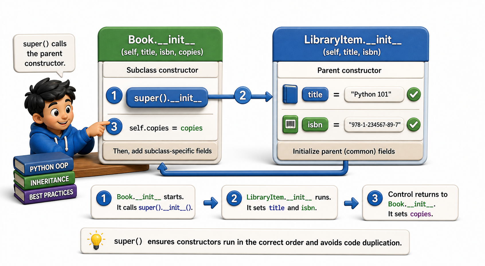

## Introduction

Dev noticed the problem from the last lesson immediately: every subclass (`Book`, `EBook`, `Audiobook`) is copying `self.title = title` and `self.isbn = isbn` from the parent class. If he ever needs to add a `language` attribute to every library item, he has to add it in `LibraryItem.__init__` and then add it to three other `__init__` methods as well. The duplication is back.

The solution is `super()`, which lets a child class delegate part of its `__init__` to the parent's `__init__`. This is one of the most important patterns in object-oriented Python, and understanding it correctly removes a large class of common bugs.



## super() Calls the Parent's Method

`super()` returns a proxy object that delegates method calls to the parent class. The most common use is in `__init__`, where the child calls `super().__init__()` to run the parent's initialization logic before adding its own.

```python
class LibraryItem:
    def __init__(self, title, isbn):
        self.title = title
        self.isbn = isbn

    def display_info(self):
        return f"{self.title} (ISBN: {self.isbn})"

class Book(LibraryItem):
    def __init__(self, title, isbn, copies):
        super().__init__(title, isbn)   # delegates to LibraryItem.__init__
        self.copies = copies            # adds only what Book needs

b = Book("Dune", "978-0441013593", 3)
print(b.title)          # Dune -- set by LibraryItem.__init__
print(b.copies)         # 3 -- set by Book.__init__
print(b.display_info()) # Dune (ISBN: 978-0441013593)
```

`super().__init__(title, isbn)` runs `LibraryItem.__init__` with `title` and `isbn`. After that returns, `self.copies = copies` adds the attribute unique to `Book`. Now `self.title` is set in exactly one place.

## All Three Subclasses, Fixed

With `super()`, each subclass delegates the common work upward:

```python
class EBook(LibraryItem):
    def __init__(self, title, isbn, file_size_mb):
        super().__init__(title, isbn)
        self.file_size_mb = file_size_mb

    def is_available(self):
        return True

class Audiobook(LibraryItem):
    def __init__(self, title, isbn, duration_hours):
        super().__init__(title, isbn)
        self.duration_hours = duration_hours

    def is_available(self):
        return True

# Demo:
obj = EBook("ebook_1", 2024, "example")
print(obj)
```

Now if Dev adds `self.language = "English"` to `LibraryItem.__init__`, all three subclasses automatically inherit it with no changes required. The parent is the single source of truth for shared initialization.

## super() Is Not Just for __init__

`super()` works for any method, not only `__init__`. A child class can override a method and still call the parent's version to extend rather than completely replace it.

```python
class LibraryItem:
    def display_info(self):
        return f"{self.title} (ISBN: {self.isbn})"

class Book(LibraryItem):
    def __init__(self, title, isbn, copies):
        super().__init__(title, isbn)
        self.copies = copies

    def display_info(self):
        base = super().display_info()      # get the parent's version
        return f"{base} | {self.copies} copies"

b = Book("Dune", "978-0441013593", 3)
print(b.display_info())   # Dune (ISBN: 978-0441013593) | 3 copies
```

The child's `display_info` starts with the parent's output and appends its own extra detail. This pattern, calling `super().method()` and extending the result, is how you build on existing behavior rather than duplicating it.

## The Constructor Chain in Multi-Level Inheritance

Inheritance can be more than one level deep. When `super()` is called, Python follows the Method Resolution Order (MRO) to find the next class in the chain, even when there are three or more levels.

```python
class Collectible(LibraryItem):
    def __init__(self, title, isbn, edition):
        super().__init__(title, isbn)
        self.edition = edition

class SignedEdition(Collectible):
    def __init__(self, title, isbn, edition, signer):
        super().__init__(title, isbn, edition)   # goes to Collectible.__init__
        self.signer = signer

s = SignedEdition("Dune", "978-0441013593", "First Edition", "Frank Herbert")
print(s.title)      # Dune -- set by LibraryItem.__init__
print(s.edition)    # First Edition -- set by Collectible.__init__
print(s.signer)     # Frank Herbert -- set by SignedEdition.__init__
```

Each level delegates upward with `super()`. The chain runs from the most-specific class to the most-general, ensuring every `__init__` along the way gets called exactly once.

## super() at a Glance

| Pattern | Code | What it does |
|---|---|---|
| Delegate initialization | `super().__init__(args)` | Runs parent's `__init__`, sets shared attributes |
| Extend a method | `result = super().method(); return result + extra` | Builds on parent's behavior |
| Multi-level chain | `super().__init__()` at each level | Each parent's init runs once, in order |

## Your Turn

```python
class Animal:
    def __init__(self, name, species):
        self.name = name
        self.species = species

    def describe(self):
        return f"{self.name} is a {self.species}"

class Pet(Animal):
    def __init__(self, name, species, owner):
        super().__init__(name, species)
        self.owner = owner

    def describe(self):
        base = super().describe()
        return f"{base}, owned by {self.owner}"

class TrainedPet(Pet):
    def __init__(self, name, species, owner, tricks):
        super().__init__(name, species, owner)
        self.tricks = tricks

    def describe(self):
        base = super().describe()
        return f"{base}, knows {len(self.tricks)} trick(s)"

# Demo:
obj = Animal("animal_1", "example")
print(obj)
```

Create a `TrainedPet` and call `describe()` on it. Trace through which `describe()` calls which, and in what order, to produce the final string. Then add a `language` attribute to `Animal.__init__` and confirm `TrainedPet` automatically inherits it without any changes to `Pet` or `TrainedPet`.

## Conclusion

`super()` delegates to the parent class's method without hardcoding the parent's name, making inheritance chains clean and maintainable. In `__init__`, it runs the parent's initialization before the child adds its own attributes. In other methods, it calls the parent's version and lets the child extend the result. The next lesson takes this further: what happens when a child class defines a method that already exists in the parent, replacing rather than extending it.
