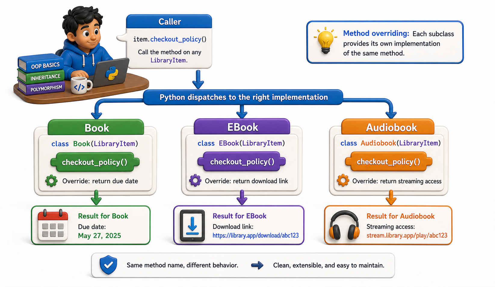

## Introduction

Dev's `LibraryItem` base class has a `checkout_policy()` method that returns a standard 21-day loan period. Physical books follow this rule. Ebooks do not need it at all since they are always available. Reference books can only be used in the library and cannot be checked out. Dev needs each item type to answer the question "what is the checkout policy for this item?" differently, but the calling code should not have to know which type it is talking to.

This is **method overriding**: a child class provides its own implementation of a method that already exists in the parent. It is the mechanism that makes the same method call behave differently depending on which class the object actually belongs to.



## Overriding a Method

When a child class defines a method with the same name as one in the parent, the child's version takes precedence. Python always calls the most specific version it can find, starting with the object's own class.

```python
class LibraryItem:
    def __init__(self, title, isbn):
        self.title = title
        self.isbn = isbn

    def checkout_policy(self):
        return "21-day loan"

class Book(LibraryItem):
    def __init__(self, title, isbn, copies):
        super().__init__(title, isbn)
        self.copies = copies

class EBook(LibraryItem):
    def __init__(self, title, isbn):
        super().__init__(title, isbn)

    def checkout_policy(self):
        return "No loan needed: always available"

class ReferenceBook(LibraryItem):
    def __init__(self, title, isbn):
        super().__init__(title, isbn)

    def checkout_policy(self):
        return "In-library use only: cannot be checked out"

b = Book("Dune", "978-0441013593", 3)
eb = EBook("Foundation", "978-0553293357")
rb = ReferenceBook("Oxford English Dictionary", "978-0199571123")

print(b.checkout_policy())    # 21-day loan -- uses parent's version
print(eb.checkout_policy())   # No loan needed: always available -- overridden
print(rb.checkout_policy())   # In-library use only: cannot be checked out -- overridden
```

`Book` does not define `checkout_policy()`, so it inherits the parent's 21-day version. `EBook` and `ReferenceBook` each override it with their own behavior.

## When to Override vs. When to Call super()

There are two distinct situations when a child needs to change a parent method. The first is when the child's behavior *completely replaces* the parent's: the parent's version is not needed at all, so the child simply defines a new body.

```python
class LibraryItem:
    def __init__(self, title, isbn):
        self.title = title
        self.isbn = isbn
    def checkout_policy(self):
        return "21-day loan"

class ReferenceBook(LibraryItem):
    def checkout_policy(self):
        return "In-library use only: cannot be checked out"
    # parent version discarded; we do not call super() here

# Demo:
obj = ReferenceBook("Oxford English Dictionary", "978-0199571123")
print(f"{obj.title}: {obj.checkout_policy()}")
```

The second is when the child *extends* the parent's behavior: the parent's version still does useful work, so the child calls `super()` to run it and then adds more.

```python
class LibraryItem:
    def __init__(self, title, isbn):
        self.title = title
        self.isbn = isbn
    def display_info(self):
        return f"{self.title} (ISBN: {self.isbn})"

class Book(LibraryItem):
    def __init__(self, title, isbn, copies):
        super().__init__(title, isbn)
        self.copies = copies
    def display_info(self):
        base = super().display_info()        # run parent's version first
        return f"{base} | {self.copies} copies available"

# Demo:
obj = Book("Dune", "978-0441013593", 3)
print(obj.display_info())
```

The rule of thumb: if the parent's behavior is *wrong* for this child, replace it entirely. If it is *incomplete* for this child, extend it with `super()`.

## Overriding __init__ Without Forgetting super()

The most common mistake with overriding is forgetting `super().__init__()` when overriding `__init__`. Without it, the parent's initialization does not run, and attributes the parent sets are missing.

```python
class LibraryItem:
    def __init__(self, title, isbn):
        self.title = title
        self.isbn = isbn

class Magazine(LibraryItem):
    def __init__(self, title, isbn, issue_number):
        # WRONG: forgot super().__init__
        # self.title and self.isbn never get set
        self.issue_number = issue_number

m = Magazine("Nature", "0028-0836", 52)
print(m.issue_number)    # 52 -- fine
try:
    print(m.title)           # raises AttributeError
except AttributeError as e:
    print(f"AttributeError: {e}")
```

```python
class LibraryItem:
    def __init__(self, title, isbn):
        self.title = title
        self.isbn = isbn

class Magazine(LibraryItem):
    def __init__(self, title, isbn, issue_number):
        super().__init__(title, isbn)    # correct: parent sets title and isbn
        self.issue_number = issue_number

m = Magazine("Nature", "0028-0836", 52)
print(m.title)          # Nature -- now correct
print(m.issue_number)   # 52
```

## A Complete Override Example With checkout_policy

Here is the full pattern applied consistently across all item types:

```python
class LibraryItem:
    def __init__(self, title, isbn):
        self.title = title
        self.isbn = isbn
    def checkout_policy(self):
        return "21-day loan"

class Book(LibraryItem):
    def __init__(self, title, isbn, copies):
        super().__init__(title, isbn)
        self.copies = copies

class EBook(LibraryItem):
    def checkout_policy(self):
        return "No loan needed: always available"

class ReferenceBook(LibraryItem):
    def checkout_policy(self):
        return "In-library use only: cannot be checked out"

class Magazine(LibraryItem):
    def __init__(self, title, isbn, issue_number):
        super().__init__(title, isbn)
        self.issue_number = issue_number

items = [
    Book("Dune", "978-0441013593", 3),
    EBook("Foundation", "978-0553293357"),
    ReferenceBook("Oxford Dictionary", "978-0199571123"),
    Magazine("Nature", "0028-0836", 52),
]

for item in items:
    print(f"{item.title}: {item.checkout_policy()}")

# Dune: 21-day loan
# Foundation: No loan needed: always available
# In-library use only: cannot be checked out
# Oxford Dictionary: 21-day loan  <- Magazine inherits the default
```

The loop calls `checkout_policy()` on each item without knowing or caring what type each one is. Each type's own version of the method runs. This is the beginning of polymorphism, covered formally in the next lesson.

## Method Overriding at a Glance

| Situation | What to do |
|---|---|
| Parent behavior is completely wrong for child | Override entirely; do not call `super()` |
| Parent behavior is useful but incomplete | Override and call `super()` to extend |
| Child does not need to change it | Do nothing; inherited version runs automatically |
| Overriding `__init__` | Always call `super().__init__()` first |

## Your Turn

```python
class Shape:
    def __init__(self, color):
        self.color = color

    def area(self):
        raise NotImplementedError("Subclasses must implement area()")

    def describe(self):
        return f"A {self.color} shape with area {self.area():.2f}"

class Circle(Shape):
    def __init__(self, color, radius):
        super().__init__(color)
        self.radius = radius

    def area(self):
        return 3.14159 * self.radius ** 2

class Rectangle(Shape):
    def __init__(self, color, width, height):
        super().__init__(color)
        self.width = width
        self.height = height

    def area(self):
        return self.width * self.height

# Demo:
c = Circle("red", 5)
r = Rectangle("blue", 4, 6)
print(c.describe())
print(r.describe())
```

Create a `Circle` and a `Rectangle` and call `describe()` on each. Notice that `describe()` is defined only in `Shape`, but it calls `self.area()`, which executes the correct version for each child. Then add a `Square(Rectangle)` that accepts only `side` in its `__init__` and passes `side, side` to `Rectangle.__init__`. Confirm that `describe()` still works on a `Square` without any changes to `Shape` or `Rectangle`.

## Conclusion

Method overriding lets a child class replace or extend a parent method. When the parent's behavior is completely wrong for the child, the child defines a new body with no call to `super()`. When the parent's behavior is useful but incomplete, the child calls `super().method()` and adds to the result. Always call `super().__init__()` when overriding `__init__`, or the parent's attributes will be missing. The next lesson builds on this to introduce polymorphism: what it means that the same method call behaves differently depending on the actual type of the object at runtime.
