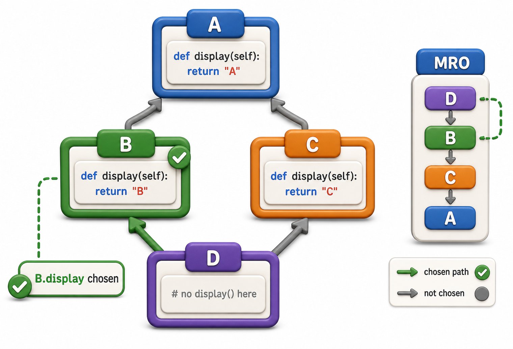

## Introduction

Dev needs an `AudioBook` that is simultaneously a `LibraryItem` (with a title and ISBN) and also a `DigitalMedia` object (with a file size and download capability). It is naturally both things at once. Python allows a class to inherit from more than one parent, and this is called **multiple inheritance**.

Multiple inheritance is powerful but introduces a question that simpler inheritance does not have: if both parent classes define the same method, which version does Python use? The answer depends on a rule called the **Method Resolution Order** (MRO), and understanding it prevents a whole category of subtle bugs.



## Multiple Inheritance Syntax

The syntax is straightforward: list both parent classes in the parentheses.

```python
class LibraryItem:
    def __init__(self, title, isbn):
        self.title = title
        self.isbn = isbn

    def display_info(self):
        return f"{self.title} (ISBN: {self.isbn})"

class DigitalMedia:
    def __init__(self, file_size_mb):
        self.file_size_mb = file_size_mb

    def download(self):
        return f"Downloading {self.file_size_mb} MB"

class AudioBook(LibraryItem, DigitalMedia):
    def __init__(self, title, isbn, file_size_mb, narrator):
        LibraryItem.__init__(self, title, isbn)
        DigitalMedia.__init__(self, file_size_mb)
        self.narrator = narrator

ab = AudioBook("Dune", "978-0441013593", 250.5, "Scott Brick")
print(ab.display_info())   # Dune (ISBN: 978-0441013593) -- from LibraryItem
print(ab.download())       # Downloading 250.5 MB -- from DigitalMedia
print(ab.narrator)         # Scott Brick
```

Here the two parents have no methods in common, so there is no conflict. The real complexity appears when both parents define the same method name.

## The Diamond Problem and the MRO

The classic conflict in multiple inheritance is called the **diamond problem**. Imagine this hierarchy:

```
     Base
    /    \
  Left   Right
    \    /
     Child
```

Both `Left` and `Right` inherit from `Base` and override a method. When `Child` calls that method, which version runs: `Left`'s or `Right`'s?

Python's answer is the **Method Resolution Order** (MRO): a deterministic, linearized ordering of the class hierarchy calculated using the **C3 linearization algorithm**. In simple terms, Python checks classes in the order: the class itself, then left-to-right through parents, following a rule that ensures no class appears before another class it inherits from.

```python
class Base:
    def describe(self):
        return "Base"

class Left(Base):
    def describe(self):
        return "Left"

class Right(Base):
    def describe(self):
        return "Right"

class Child(Left, Right):
    pass

c = Child()
print(c.describe())       # Left -- follows MRO: Child -> Left -> Right -> Base
print(Child.__mro__)      # (<class 'Child'>, <class 'Left'>, <class 'Right'>, <class 'Base'>, <class 'object'>)
```

Python found `describe` in `Left` and used it. The MRO tells you the exact order Python searches. You can inspect it any time with `ClassName.__mro__` or `ClassName.mro()`.

## super() Follows the MRO

When you use `super()` in multiple inheritance, Python does not call the direct parent. It calls the *next class in the MRO*. This is how `super()` stays correct in complex hierarchies: each class calls `super()`, Python picks the right next class, and every `__init__` in the chain runs exactly once.

```python
class Base:
    def __init__(self):
        print("Base.__init__")
        super().__init__()

class Left(Base):
    def __init__(self):
        print("Left.__init__")
        super().__init__()    # goes to Right, not Base

class Right(Base):
    def __init__(self):
        print("Right.__init__")
        super().__init__()    # goes to Base

class Child(Left, Right):
    def __init__(self):
        print("Child.__init__")
        super().__init__()    # goes to Left

Child()
# Child.__init__
# Left.__init__
# Right.__init__
# Base.__init__
```

Every `__init__` ran exactly once, in MRO order, because each one calls `super()`. If any level skipped `super().__init__()`, everything after it in the MRO would be silently skipped.

## When to Use Multiple Inheritance

Multiple inheritance is appropriate when an object genuinely has two independent, orthogonal roles: a `SearchableMixin`, a `LoggableMixin`, or a `SerializableMixin` that adds behavior orthogonally to a domain class. Mixins, classes that add specific capabilities without being primary base classes, are the most common and well-justified use of multiple inheritance.

```python
class LoggableMixin:
    def log(self, message):
        print(f"[{self.__class__.__name__}] {message}")

class Book(LibraryItem, LoggableMixin):
    def __init__(self, title, isbn, copies):
        super().__init__(title, isbn)
        self.copies = copies

    def check_out(self):
        if self.copies < 1:
            self.log("Checkout failed: no copies available")
            return False
        self.copies -= 1
        self.log(f"Checked out. Remaining: {self.copies}")
        return True

b = Book("Dune", "978-0441013593", 1)
b.check_out()   # [Book] Checked out. Remaining: 0
b.check_out()   # [Book] Checkout failed: no copies available
```

## Multiple Inheritance and MRO at a Glance

| Concept | What it means |
|---|---|
| Multiple inheritance | `class Child(A, B):` inherits from both |
| Diamond problem | Same method in two parents; which version runs? |
| MRO | Python's linearized search order; always deterministic |
| `__mro__` | Inspect the resolution order of any class |
| `super()` in MI | Follows the MRO, not just the direct parent |
| Mixins | Common, safe use of multiple inheritance for orthogonal capabilities |

## Your Turn

```python
class TimestampMixin:
    def created_at_label(self):
        return "Created: 2024-01-01"   # simplified

class TaggableMixin:
    def __init__(self):
        self.tags = []

    def add_tag(self, tag):
        self.tags.append(tag)

    def tag_list(self):
        return ", ".join(self.tags)

class Article(TimestampMixin, TaggableMixin):
    def __init__(self, title):
        super().__init__()   # triggers TaggableMixin.__init__ via MRO
        self.title = title

# Demo:
obj = TimestampMixin()
print(obj)
```

Create an `Article`, add two tags, and print `created_at_label()`, `tag_list()`, and `Article.__mro__`. Then explain in your own words why calling `super().__init__()` in `Article` rather than `TaggableMixin.__init__(self)` directly is the correct approach when using mixins.

## Conclusion

Multiple inheritance lets a class inherit from two or more parents. When method names collide, Python resolves the conflict using the Method Resolution Order (MRO), a deterministic linearization visible via `ClassName.__mro__`. Using `super()` at every level of a multiple-inheritance hierarchy ensures all `__init__` methods run exactly once. The cleanest and most common use of multiple inheritance is mixin classes, which add specific capabilities orthogonally to a main domain class. The next lesson asks a harder design question: when is inheritance the wrong tool, and when should you use composition instead?
