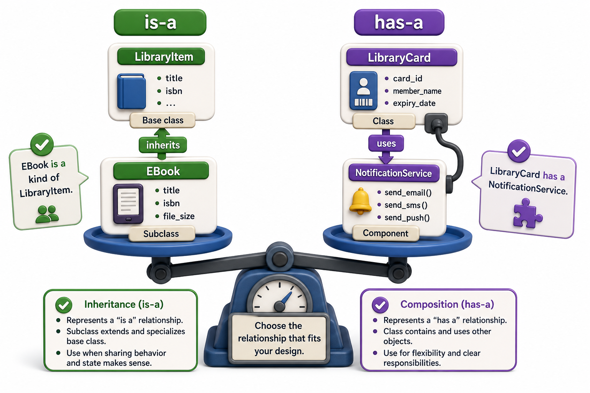

## Introduction

Dev is adding an inventory management feature. He wonders whether `Inventory` should *be* a `LibraryItem` (inheritance) or *have* a list of `LibraryItem` objects (composition). He reaches for inheritance instinctively, but his tech lead stops him. "Does an inventory *is-a* library item?" she asks. He realizes it is not. An inventory *has* library items. He is reaching for the wrong tool.

This lesson covers the most common design decision in object-oriented programming: whether two concepts should be connected by inheritance or by composition. Getting this choice right produces code that is easy to extend; getting it wrong produces class hierarchies that become rigid and fragile.



## The Two Relationships

**Inheritance** models the "is-a" relationship. A `Book` *is a* `LibraryItem`. An `EBook` *is a* `LibraryItem`. These relationships mean `Book` should share and extend the interface of `LibraryItem`, and code that works with `LibraryItem` objects should also work with `Book` objects.

**Composition** models the "has-a" relationship. A `Library` *has* `LibraryItem` objects. An `Inventory` *has* a list of items. A `Checkout` *has* a patron and a book. These relationships mean one object holds a reference to another as an attribute, delegating behavior to it without claiming to be that thing.

```python
# Inheritance: Book IS-A LibraryItem
class Book(LibraryItem):
    def __init__(self, title, isbn, copies):
        super().__init__(title, isbn)
        self.copies = copies

# Composition: Inventory HAS-A list of LibraryItems
class Inventory:
    def __init__(self):
        self._items = []     # contains LibraryItem objects, is not one

    def add(self, item):
        self._items.append(item)

    def count(self):
        return len(self._items)

    def available_items(self):
        return [item for item in self._items if item.is_available()]

# Demo:
obj = Book("book_1", 2024, "example")
print(obj)
```

## The Liskov Substitution Principle

A useful rule of thumb: if you inherit, anywhere the parent class is used, the child should be usable as a drop-in replacement. If that is not true, inheritance is the wrong relationship.

```python
def print_checkout_policy(item):   # works on any LibraryItem
    print(item.checkout_policy())

b = Book("Dune", "978-0441013593", 3)
print_checkout_policy(b)    # works -- Book is a LibraryItem
```

An `Inventory` cannot replace a `LibraryItem` in `print_checkout_policy`. An inventory is not a library item. If a subclass does not actually substitute for its parent in the way callers expect, it is a sign that inheritance was chosen for the wrong reason.

## When Inheritance Goes Wrong: "Fragile Base Class"

A class hierarchy that is too deep or too broad becomes brittle. When the parent class changes an internal detail, all children that depend on that detail break, sometimes in surprising ways. Composition avoids this: if `Inventory` holds items as a list rather than inheriting from a catalog class, the catalog class can change its internals without affecting `Inventory` at all.

```python
# Fragile hierarchy -- Inventory inherits from LibraryItem for no good reason
class Inventory(LibraryItem):
    def __init__(self, title, isbn, items):
        super().__init__(title, isbn)   # Inventory is not a library item
        self._items = items
    # Inherits checkout_policy() and display_info() which make no sense for inventory

# Cleaner: composition
class Inventory:
    def __init__(self):
        self._items = []

    def add(self, item):
        self._items.append(item)

    def total_available(self):
        return sum(1 for item in self._items if item.is_available())

# Demo:
obj = Inventory("inventory_1", 2024, "example")
print(obj)
```

The composed version is simpler, easier to test (you can create an `Inventory` with mock items), and unaffected by changes to `LibraryItem`.

## Composition and Delegation

Composition often pairs with delegation: the outer object passes method calls through to an inner object it holds, rather than inheriting those methods.

```python
class NotificationService:
    def send(self, contact, message):
        print(f"[NOTIFY] {contact}: {message}")

class ReservationManager:
    def __init__(self, notifier):
        self._notifier = notifier    # HAS-A NotificationService

    def notify_patron(self, patron_contact, book_title):
        self._notifier.send(patron_contact, f"'{book_title}' is now available.")
```

`ReservationManager` does not inherit from `NotificationService`. It holds one as an attribute and delegates notification calls to it. This also makes it easy to swap the notifier (email vs SMS) without changing `ReservationManager` at all, as seen in Unit 2.

## Composition vs. Inheritance at a Glance

| Question | Suggests |
|---|---|
| "Is A a subtype of B?" (`isinstance` should return True) | Inheritance |
| "Does A contain or use B?" | Composition |
| "Does the child substitute for the parent everywhere?" | Inheritance if yes; composition if no |
| "Could the inner object change without breaking the outer?" | Composition (independence) |
| "Are you inheriting to reuse code but not the interface?" | Composition (avoid this use of inheritance) |

## Your Turn

```python
class Engine:
    def start(self):
        return "Engine started"

    def stop(self):
        return "Engine stopped"

class Car:
    def __init__(self, make, model):
        self.make = make
        self.model = model
        self._engine = Engine()

    def drive(self):
        return self._engine.start() + " -- driving"

    def park(self):
        return self._engine.stop() + " -- parked"

# Demo:
obj = Engine("example", "example")
print(obj)
```

`Car` uses composition: it *has* an `Engine`. Consider what would happen if you had written `class Car(Engine):` instead: would `isinstance(my_car, Engine)` make semantic sense? What would callers be allowed to do to a `Car` object that they should not be able to do? Use this analysis to articulate in one sentence why composition is the right choice here.

## Conclusion

Inheritance models "is-a" relationships, where the child genuinely substitutes for the parent. Composition models "has-a" relationships, where one object holds and uses another without claiming to be that thing. The test is whether the child class should be a drop-in replacement for the parent anywhere the parent is used; if not, composition is almost always cleaner and more maintainable. The next lesson focuses on the dunder methods that make your objects integrate naturally into Python's syntax, building directly on the data-model introduction from Unit 1.
