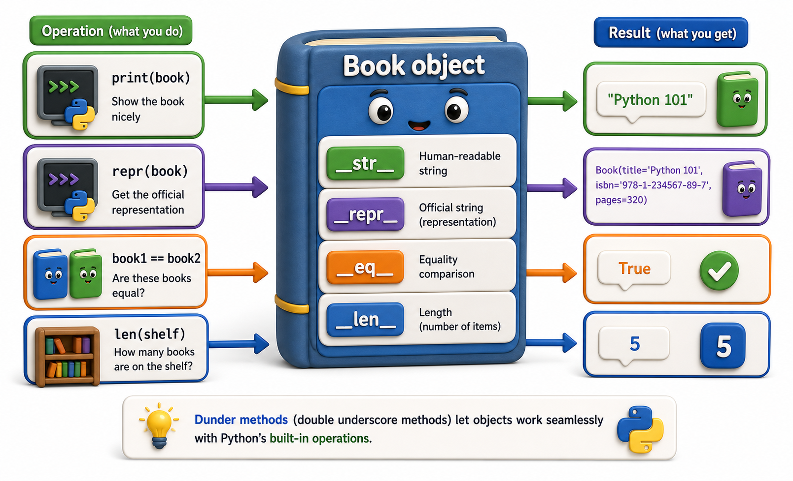

## Introduction

Dev has a working `Book` class, but using it in daily development keeps feeling slightly awkward. When he prints a book object, the output is `<__main__.Book object at 0x10a3f2340>`, which tells him nothing useful. When he compares two books with the same ISBN, Python says they are not equal because they are different objects in memory. When he tries to add book copies with `+`, Python throws an error.

These are not fundamental limitations of the language. They are gaps in the class's data model contract. The previous units defined the concept of dunder methods; this lesson implements the most useful ones on a real domain object and shows exactly how each one changes the way Python interacts with the class.



## __repr__ and __str__: Making Objects Readable

`__repr__` is the developer representation, shown in the REPL and `repr()`. It should be unambiguous and ideally reproducible as valid Python. `__str__` is the user-facing representation, used by `print()` and `str()`. If `__str__` is absent, `__repr__` is used as a fallback.

```python
class Book:
    def __init__(self, title, isbn, copies):
        self.title = title
        self.isbn = isbn
        self._copies = copies

    def __repr__(self):
        return f"Book(title={self.title!r}, isbn={self.isbn!r}, copies={self._copies})"

    def __str__(self):
        return f"{self.title} by (ISBN {self.isbn}), {self._copies} copy/copies available"

b = Book("Dune", "978-0441013593", 3)
print(repr(b))   # Book(title='Dune', isbn='978-0441013593', copies=3)
print(str(b))    # Dune by (ISBN 978-0441013593), 3 copy/copies available
print(b)         # Dune by (ISBN 978-0441013593), 3 copy/copies available
```

Always implement `__repr__` on any class you will use in interactive development. It makes debugging dramatically faster.

## __eq__: Making Objects Comparable

By default, `==` compares identity (whether two references point to the same object in memory). To make objects compare by their data instead, implement `__eq__`.

```python
class Book:
    def __init__(self, title, isbn, copies):
        self.title = title
        self.isbn = isbn
        self._copies = copies

    def __repr__(self):
        return f"Book({self.title!r}, {self.isbn!r})"

    def __eq__(self, other):
        if not isinstance(other, Book):
            return NotImplemented
        return self.isbn == other.isbn    # books are the same if same ISBN

b1 = Book("Dune", "978-0441013593", 3)
b2 = Book("Dune", "978-0441013593", 1)   # different copies, same ISBN

print(b1 == b2)    # True -- same ISBN
print(b1 is b2)    # False -- different objects in memory
```

Returning `NotImplemented` when the types do not match is the correct protocol: it tells Python to try the comparison from the other side before giving up.

Note: defining `__eq__` makes objects unhashable by default (Python removes the default `__hash__` method). If you want your objects to be usable in sets or as dictionary keys, also define `__hash__`:

```python
class Book:
    def __init__(self, title, isbn):
        self.title = title
        self.isbn = isbn

    def __eq__(self, other):
        if not isinstance(other, Book):
            return NotImplemented
        return self.isbn == other.isbn

    def __hash__(self):
        return hash(self.isbn)   # required when __eq__ is defined

    def __repr__(self):
        return f"Book({self.title!r}, {self.isbn!r})"

b1 = Book("Dune", "978-001")
b2 = Book("Dune", "978-001")   # same ISBN, different object

print(f"b1 == b2: {b1 == b2}")            # True
print(f"hash(b1) == hash(b2): {hash(b1) == hash(b2)}")  # True
print(f"In set: {len({b1, b2})} item(s)") # 1 -- deduped by hash+eq
```

## __len__: Giving an Object a Length

`__len__` makes `len(obj)` work and also determines truthiness: an object with `__len__` is falsy when its length is zero.

```python
class Shelf:
    def __init__(self):
        self._books = []

    def add(self, book):
        self._books.append(book)

    def __len__(self):
        return len(self._books)

    def __repr__(self):
        return f"Shelf({len(self._books)} books)"

shelf = Shelf()
print(len(shelf))   # 0
print(bool(shelf))  # False -- empty shelf is falsy

shelf.add(Book("Dune", "978-0441013593", 3))
print(len(shelf))   # 1
print(bool(shelf))  # True
```

## __add__: Supporting the + Operator

When it makes conceptual sense to add two objects together, `__add__` enables the `+` operator. For a `Book`, adding copies from two instances might represent merging stock:

```python
class Book:
    def __init__(self, title, isbn, copies):
        self.title = title
        self.isbn = isbn
        self._copies = copies

    def __add__(self, other):
        if not isinstance(other, Book) or self.isbn != other.isbn:
            return NotImplemented
        return Book(self.title, self.isbn, self._copies + other._copies)

    def __repr__(self):
        return f"Book({self.title!r}, copies={self._copies})"

b1 = Book("Dune", "978-0441013593", 2)
b2 = Book("Dune", "978-0441013593", 1)
combined = b1 + b2
print(combined)   # Book('Dune', copies=3)
```

Only implement `__add__` when addition is a meaningful, unsurprising operation for the type. For `Book`, merging copies is reasonable. For an `Invoice`, addition might be confusing.

## Dunder Methods at a Glance

| Method | Enables | Called by |
|---|---|---|
| `__repr__` | Developer-readable string | `repr()`, REPL, logging |
| `__str__` | User-readable string | `print()`, `str()` |
| `__eq__` | `==` comparison by value | `==` operator |
| `__hash__` | Use as dict key or set member | `hash()`, `set`, `dict` |
| `__len__` | `len()` and truthiness | `len()`, `if obj:` |
| `__add__` | `+` operator | `+` |

## Your Turn

```python
class Vector:
    def __init__(self, x, y):
        self.x = x
        self.y = y

    def __repr__(self):
        return f"Vector({self.x}, {self.y})"

    def __eq__(self, other):
        if not isinstance(other, Vector):
            return NotImplemented
        return self.x == other.x and self.y == other.y

    def __add__(self, other):
        if not isinstance(other, Vector):
            return NotImplemented
        return Vector(self.x + other.x, self.y + other.y)

# Demo:
obj = Vector("example", "example")
print(obj)
```

Add `__len__` to return the integer magnitude (use `int(...)` to keep the return type an integer) and `__bool__` to return `False` for the zero vector `Vector(0, 0)`. Test that `len(Vector(3, 4))` gives `5`, `bool(Vector(0, 0))` gives `False`, and `bool(Vector(1, 0))` gives `True`.

## Conclusion

Dunder methods let your objects integrate naturally into Python's syntax and built-ins. `__repr__` and `__str__` give objects readable representations. `__eq__` makes value-based equality work. `__len__` enables `len()` and truthiness. `__add__` supports the `+` operator. Each method is a specific slot in the data model contract that Python calls at a precise moment, and every one you implement makes your class feel more like a first-class Python type. The next lesson introduces `dataclasses`, which can generate `__repr__`, `__eq__`, and more automatically, eliminating boilerplate for classes that primarily hold data.
