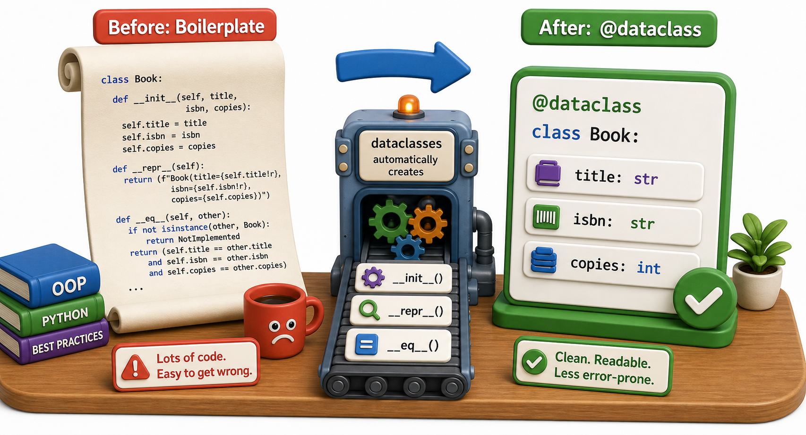

## Introduction

Dev notices something tedious about his `Book` and `LibraryItem` classes: almost every new attribute he adds requires touching three places: the `__init__` signature, the body of `__init__`, and `__repr__`. When the class holds five or six attributes, this boilerplate becomes oppressive. He finds himself writing the same `__init__` pattern for every new data class he creates.

Python 3.7 introduced `dataclasses` to solve exactly this problem. A `dataclass` is an ordinary Python class with `__init__`, `__repr__`, and `__eq__` generated automatically from field declarations. It does not add new behavior to Python; it removes repetitive boilerplate while keeping the class model completely familiar.



## The Basic dataclass

The `@dataclass` decorator reads your class's annotated attributes and generates `__init__`, `__repr__`, and `__eq__` for you.

```python
from dataclasses import dataclass

@dataclass
class Book:
    title: str
    isbn: str
    copies: int

b = Book("Dune", "978-0441013593", 3)
print(b)           # Book(title='Dune', isbn='978-0441013593', copies=3)
print(repr(b))     # Book(title='Dune', isbn='978-0441013593', copies=3)

b2 = Book("Dune", "978-0441013593", 3)
print(b == b2)     # True -- __eq__ compares all fields
```

The type annotations (`title: str`) are used by the dataclass decorator to know which fields to include. Python does not enforce these types at runtime unless you use a separate tool like `mypy`; the annotations are metadata that `@dataclass` reads to generate code.

## Default Values and Default Factories

Fields can have defaults, just as in a normal `__init__`:

```python
from dataclasses import dataclass, field

@dataclass
class Book:
    title: str
    isbn: str
    copies: int = 1
    tags: list = field(default_factory=list)   # mutable default: must use field()

b = Book("Dune", "978-0441013593")
print(b.copies)   # 1 -- default used
print(b.tags)     # []

b.tags.append("sci-fi")
b2 = Book("Foundation", "978-0553293357")
print(b2.tags)    # [] -- each instance gets its own list
```

The `field(default_factory=list)` is important: you cannot write `tags: list = []` directly in a dataclass (or any Python class) because the same list object would be shared across all instances. `default_factory` creates a fresh list for each new instance.

## Adding Methods to Dataclasses

A `@dataclass` is a normal class. You can add methods exactly as you would in any class:

```python
from dataclasses import dataclass

@dataclass
class Book:
    title: str
    isbn: str
    copies: int = 1

    def is_available(self):
        return self.copies > 0

    def check_out(self):
        if self.copies < 1:
            raise ValueError(f"No copies of '{self.title}' available")
        self.copies -= 1

b = Book("Dune", "978-0441013593", 2)
print(b.is_available())   # True
b.check_out()
b.check_out()
print(b.is_available())   # False
```

## Frozen Dataclasses: Immutable by Default

Adding `frozen=True` makes a dataclass immutable: its fields cannot be reassigned after creation, and Python generates `__hash__`, making instances usable as dictionary keys or set members.

```python
from dataclasses import dataclass

@dataclass(frozen=True)
class ISBN:
    value: str

    def __post_init__(self):
        if not self.value.startswith("978"):
            raise ValueError("ISBN must start with 978")

i = ISBN("978-0441013593")
print(i.value)      # 978-0441013593
i.value = "other"   # error! FrozenInstanceError: cannot assign to field 'value'

# Usable in a set because frozen dataclasses are hashable
seen = {ISBN("978-0441013593"), ISBN("978-0553293357")}
```

Frozen dataclasses are excellent for value objects: things that represent a value rather than an entity with changing state, like an ISBN, a coordinate, a date range, or a configuration snapshot.

## __post_init__: Running Code After auto-generated __init__

If you need to run validation or derived computation after all fields are set, `__post_init__` runs automatically at the end of the generated `__init__`:

```python
from dataclasses import dataclass

@dataclass
class Book:
    title: str
    isbn: str
    copies: int = 1

    def __post_init__(self):
        if self.copies < 0:
            raise ValueError(f"copies cannot be negative, got {self.copies}")
        self.title = self.title.strip()   # normalize whitespace

b = Book("  Dune  ", "978-0441013593", 3)
print(b.title)   # Dune -- stripped by __post_init__
```

## Dataclasses at a Glance

| Feature | How to use it |
|---|---|
| Auto `__init__`, `__repr__`, `__eq__` | `@dataclass` decorator |
| Default values | `field: type = value` |
| Mutable defaults (list, dict) | `field(default_factory=list)` |
| Immutable instances | `@dataclass(frozen=True)` |
| Post-creation logic | `def __post_init__(self):` |

## Your Turn

```python
from dataclasses import dataclass, field

@dataclass
class Patron:
    name: str
    card_number: str
    borrowed: list = field(default_factory=list)

    def borrow(self, book_title):
        self.borrowed.append(book_title)

    def return_book(self, book_title):
        if book_title not in self.borrowed:
            raise ValueError(f"'{book_title}' not borrowed by {self.name}")
        self.borrowed.remove(book_title)

# Demo:
obj = Patron()
print(obj)
```

Create two `Patron` objects, have each borrow different books, and confirm their `borrowed` lists are independent. Then print `repr()` of each patron. Finally convert `Patron` to `frozen=True`, observe what breaks, and explain why a patron needs to be mutable (state changes over time) while an `ISBN` is a better candidate for frozen.

## Conclusion

The `@dataclass` decorator generates `__init__`, `__repr__`, and `__eq__` from field annotations, removing the most repetitive boilerplate in data-holding classes while leaving you free to add methods, override generated methods, and add `__post_init__` validation. Frozen dataclasses add immutability and hashability, making them ideal for value objects. The final lesson of this unit covers three method varieties that Python supports on classes: instance methods (which you have been writing all along), class methods, and static methods.
