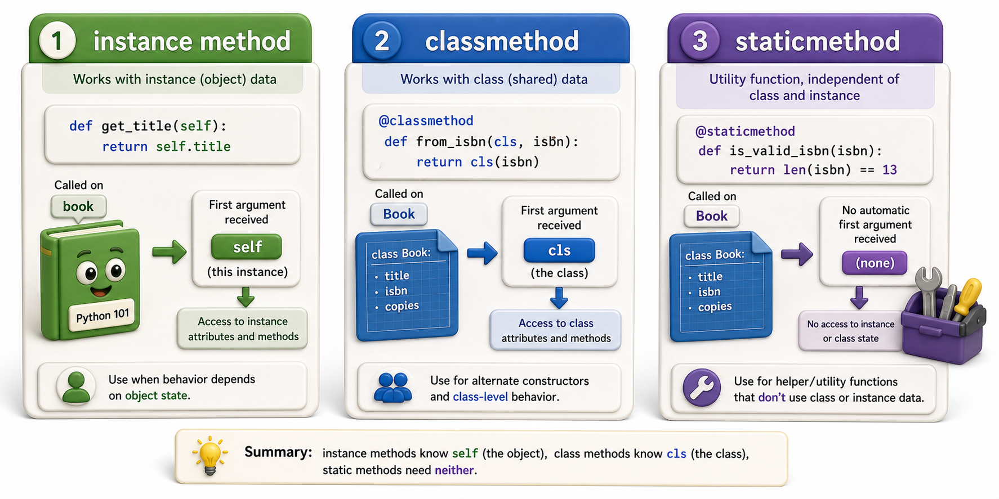

## Introduction

Dev's `Book` class needs a factory function that creates a `Book` from a dictionary (like the kind that comes back from a JSON API). He writes it as a regular function outside the class, but it feels disconnected: someone reading the code later has to guess that `book_from_dict()` is related to `Book`. He wants it to live inside the class, but it does not operate on an instance (`self`) because it creates new instances. He needs something between a method and a standalone function.

Python provides three kinds of callable objects you can define inside a class body. Understanding when to use each one is what separates well-organized class code from code that technically works but is confusing to read.



## Instance Methods: The Default

An **instance method** receives `self` as its first argument, giving it access to the specific object it was called on. Everything you have written so far in this unit falls into this category. Instance methods can read and modify the instance's attributes.

```python
class Book:
    def __init__(self, title, isbn, copies):
        self.title = title
        self.isbn = isbn
        self._copies = copies

    def check_out(self):        # instance method: operates on self
        if self._copies < 1:
            raise ValueError(f"No copies of '{self.title}' available")
        self._copies -= 1

    def copies_available(self):  # instance method: reads self
        return self._copies

b = Book("Dune", "978-0441013593", 3)
b.check_out()
print(b.copies_available())   # 2
```

When you call `b.check_out()`, Python passes `b` as `self` automatically.

## Class Methods: Receiving the Class, Not an Instance

A **class method** receives `cls` (the class itself) as its first argument rather than `self`. It is defined with the `@classmethod` decorator. Class methods have access to the class and all its class attributes, but not to any specific instance.

The most common use is as an **alternative constructor**: a factory method that creates instances from a different input format.

```python
class Book:
    def __init__(self, title, isbn, copies):
        self.title = title
        self.isbn = isbn
        self._copies = copies

    @classmethod
    def from_dict(cls, data):
        return cls(
            title=data["title"],
            isbn=data["isbn"],
            copies=data.get("copies", 1)
        )

    @classmethod
    def from_isbn(cls, isbn):
        return cls(title="Unknown", isbn=isbn, copies=0)

    def __repr__(self):
        return f"Book({self.title!r}, {self.isbn!r}, copies={self._copies})"

api_response = {"title": "Dune", "isbn": "978-0441013593", "copies": 3}
b = Book.from_dict(api_response)
print(b)   # Book('Dune', '978-0441013593', copies=3)

b2 = Book.from_isbn("978-0553293357")
print(b2)  # Book('Unknown', '978-0553293357', copies=0)
```

Using `cls(...)` rather than `Book(...)` inside the class method is important: it means the method works correctly if a subclass calls it, creating the correct subclass instance rather than always creating a `Book`.

## Static Methods: Utilities That Belong to the Class

A **static method** receives neither `self` nor `cls`. It has no access to the instance or the class at all. It is defined with `@staticmethod` and is essentially a regular function that lives inside the class namespace because it is conceptually related to the class.

```python
class Book:
    def __init__(self, title, isbn, copies):
        self.title = title
        self.isbn = isbn
        self._copies = copies

    @staticmethod
    def is_valid_isbn(isbn):
        return isinstance(isbn, str) and isbn.startswith("978")

    @classmethod
    def from_dict(cls, data):
        if not cls.is_valid_isbn(data.get("isbn", "")):
            raise ValueError(f"Invalid ISBN: {data.get('isbn')}")
        return cls(data["title"], data["isbn"], data.get("copies", 1))

    def __repr__(self):
        return f"Book({self.title!r})"

print(Book.is_valid_isbn("978-0441013593"))   # True
print(Book.is_valid_isbn("abc"))             # False
```

The rule for static methods: use one when the function is logically associated with the class, but it does not need to know what class it is called on or what object it was called from. If it needs neither `self` nor `cls`, it is a static method (or possibly just a module-level function).

## When to Use Each Kind

```python
# Instance method: the function needs to read or modify a specific object's state
def check_out(self):
    self._copies -= 1

# Class method: the function creates instances, counts instances, or
# works with class-level state
@classmethod
def from_dict(cls, data):
    return cls(data["title"], data["isbn"], data.get("copies", 1))

# Static method: the function is related to the class conceptually
# but does not need self or cls
@staticmethod
def is_valid_isbn(isbn):
    return isbn.startswith("978")

# Demo:
result = check_out()
print(f"check_out() ->", result)
result = from_dict([1, 2, 3])
print(f"from_dict([1, 2, 3]) ->", result)
```

## Class, Static, and Instance Methods at a Glance

| Kind | Decorator | First argument | Has access to |
|---|---|---|---|
| Instance method | (none) | `self` | Instance attributes and class |
| Class method | `@classmethod` | `cls` | Class and class attributes only |
| Static method | `@staticmethod` | (none) | Neither instance nor class |

## Your Turn

```python
from dataclasses import dataclass, field
from datetime import date

@dataclass
class Loan:
    patron_name: str
    book_isbn: str
    due_date: date
    returned: bool = False

    @classmethod
    def for_today(cls, patron_name, book_isbn, days=21):
        from datetime import timedelta
        due = date.today() + timedelta(days=days)
        return cls(patron_name, book_isbn, due)

    @staticmethod
    def is_overdue_by(due_date, today):
        return today > due_date

    def mark_returned(self):
        self.returned = True

# Demo:
obj = Loan()
print(obj)
```

Create a `Loan` using `Loan.for_today("Priya", "978-0441013593")`. Then use `Loan.is_overdue_by` with a date in the past to confirm the static method works as a standalone check. Finally, call `mark_returned()` on the loan and confirm `loan.returned` is `True`. Explain why `is_overdue_by` is a better fit for `@staticmethod` than `@classmethod`.

## Conclusion

Instance methods operate on a specific object via `self`. Class methods operate on the class itself via `cls` and are most useful as alternative constructors. Static methods are utility functions logically associated with the class but needing neither `self` nor `cls`. Choosing the right kind of method makes a class's intent clearer: instance methods change or inspect state, class methods create or configure at the class level, and static methods group related logic without coupling it to state. This completes Unit 3's coverage of inheritance, polymorphism, dunder methods, dataclasses, and method types. Unit 4 moves from class design to a different kind of elegance: making objects that Python can iterate over lazily, processing items one at a time without loading everything into memory at once.
