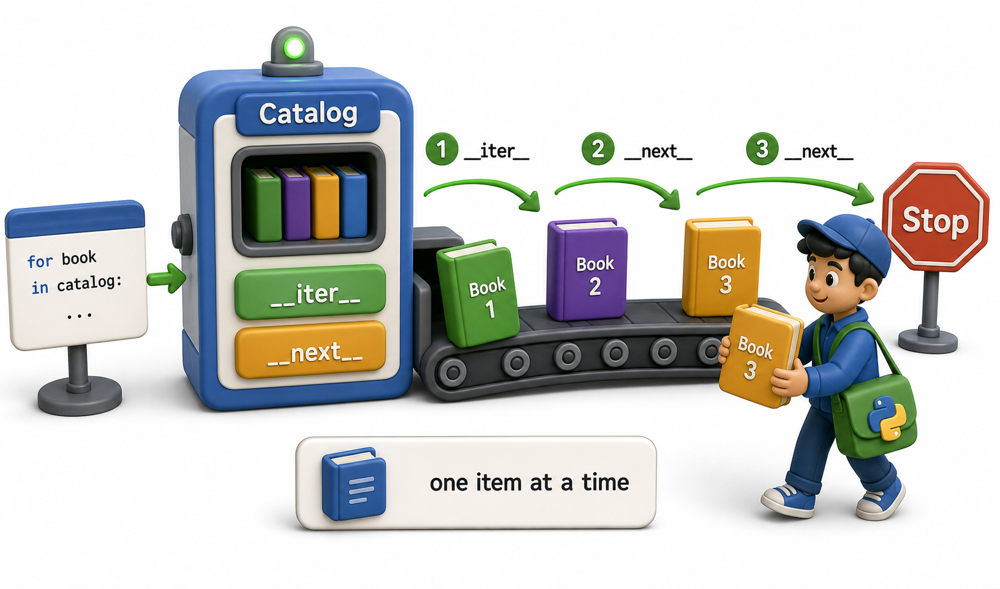

## Introduction

Leila joined the library network's data team last month. Her first big task: process a catalog import file with over a million book records and update the database. She writes a list comprehension that loads all million records into a Python list and immediately runs out of memory. Her script crashes.

Her senior colleague Nadia looks at the crash report and says: "You do not need all of them at once. You need one at a time." She introduces Leila to iterators, and over the next several lessons, Leila's import script goes from crashing to running comfortably on a machine with 4 GB of RAM.

This lesson starts at the foundation: what Python's iterator protocol actually is, and how the familiar `for` loop is secretly using it every time.



## How a for Loop Actually Works

When you write `for item in collection:`, Python does not simply index through a list. It calls two dunder methods: first `__iter__()` to get an **iterator object**, then `__next__()` on that iterator repeatedly to get items one at a time until a `StopIteration` exception is raised.

```python
numbers = [10, 20, 30]

# What the for loop does, step by step:
iterator = iter(numbers)         # calls numbers.__iter__()
print(next(iterator))            # calls iterator.__next__() -> 10
print(next(iterator))            # 20
print(next(iterator))            # 30
print(next(iterator))            # StopIteration!
```

The `for` loop catches `StopIteration` automatically and exits cleanly. The `iter()` and `next()` built-in functions are thin wrappers around `__iter__()` and `__next__()`. You can call them directly in your own code when you need finer control over iteration.

## The Two Parts of the Protocol

The iterator protocol involves two related but different concepts:

An **iterable** is any object that has an `__iter__` method. Lists, tuples, strings, dicts, sets, and files are all iterables. Calling `iter(some_iterable)` returns an **iterator**.

An **iterator** is an object that has both `__iter__` and `__next__`. It remembers where it is in the sequence and returns the next item each time `__next__` is called. Once exhausted, it raises `StopIteration` permanently.

```python
numbers = [1, 2, 3]    # a list is an iterable, not an iterator

it = iter(numbers)     # now it is an iterator
print(type(it))        # <class 'list_iterator'>

print(next(it))        # 1
print(next(it))        # 2

# A fresh iter() call resets:
it2 = iter(numbers)
print(next(it2))       # 1 -- starts from the beginning again
```

The list itself is not consumed by iteration. A fresh `iter()` call always gives you a new iterator starting from the beginning. This is an important difference from file objects, which are their own iterators and can only be read once without seeking back.

## Proving the Protocol with a File Object

Files are one of the clearest examples of how the protocol works: they implement both `__iter__` and `__next__`, making them usable directly in `for` loops without loading the whole file into memory.

```python
# Create a sample file to read
with open("sample.txt", "w") as f:
    f.write("Book A\nBook B\nBook C\n")

with open("sample.txt") as f:
    print(hasattr(f, "__iter__"))   # True -- file is an iterable
    print(hasattr(f, "__next__"))   # True -- file is also its own iterator
    for line in f:
        print(line.strip())
# Book A
# Book B
# Book C
```

Each `for` iteration calls `f.__next__()`, which reads one line from disk. No line is held in memory beyond the current iteration. This is exactly the pattern Leila needs for her million-record import.

## Separation: Iterables That Return Fresh Iterators

Most collections (lists, tuples, strings) are **iterables** that return a *new* iterator object each time `iter()` is called. This means you can iterate over a list multiple times without resetting anything manually.

A file, by contrast, is its own iterator: the same object is returned by `iter(f)`. Calling `iter(f)` twice gives you the same object at the same position, not a fresh start.

```python
words = ["alpha", "beta", "gamma"]

it1 = iter(words)
it2 = iter(words)   # completely independent

print(next(it1))    # alpha
print(next(it1))    # beta
print(next(it2))    # alpha -- fresh start, unaffected by it1
```

## The Iterator Protocol at a Glance

| Term | What it means | Example |
|---|---|---|
| Iterable | Has `__iter__`; returns an iterator | list, str, dict, set, file |
| Iterator | Has `__iter__` and `__next__`; remembers position | list_iterator, file |
| `iter(x)` | Calls `x.__iter__()`; returns an iterator | `iter([1,2,3])` |
| `next(it)` | Calls `it.__next__()`; returns next item | `next(iterator)` |
| `StopIteration` | Raised when the iterator is exhausted | `for` loops catch this automatically |

## Your Turn

```python
colors = ["red", "green", "blue"]
it = iter(colors)

print(next(it))
print(next(it))
print(next(it))
print(next(it))   # error!
```

Run this and observe the `StopIteration`. Then wrap the last `next(it)` in a `try`/`except StopIteration` block to handle it gracefully. Finally, call `iter(colors)` again and confirm you can iterate from the beginning, proving the original list is unaffected.

## Conclusion

Python's `for` loop is syntactic sugar over the iterator protocol: it calls `__iter__()` once to get an iterator, then `__next__()` repeatedly until `StopIteration` is raised. An iterable has `__iter__`. An iterator has both `__iter__` and `__next__` and remembers its position. The next lesson clarifies the distinction between iterables and iterators more precisely, then the lesson after that shows how to build a custom class that implements the full protocol from scratch.
