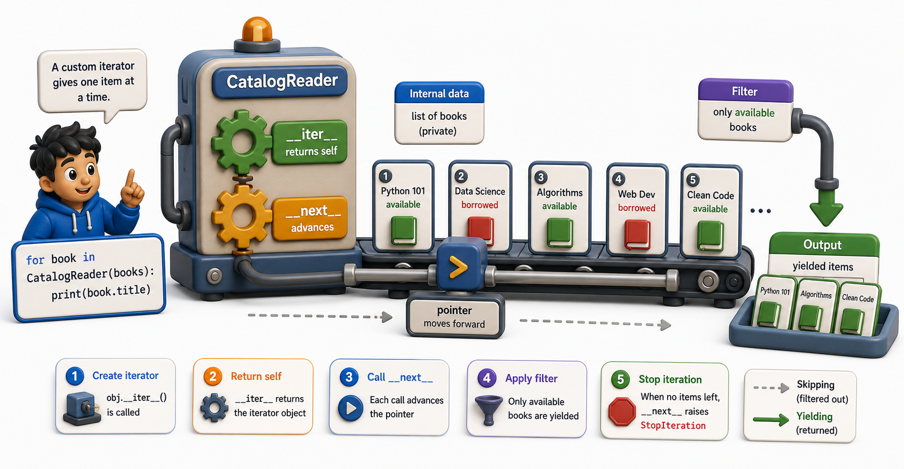

## Introduction

Leila wants to build a `CatalogReader` that iterates over a list of raw records and yields only the ones flagged as "approved" for import. She could filter with a list comprehension, but that loads all approved records into memory first. She wants each record to be processed and yielded one at a time, so the pipeline stays lean regardless of how many records the catalog contains.

The right tool is a class that implements `__iter__` and `__next__` directly. Building one makes the protocol concrete: there is no magic, just two methods and a `StopIteration`.



## The Minimal Iterator Class

An iterator class needs exactly two things: an `__iter__` method that returns `self`, and a `__next__` method that returns the next item or raises `StopIteration`.

```python
class CountDown:
    def __init__(self, start):
        self.current = start

    def __iter__(self):
        return self   # an iterator returns itself

    def __next__(self):
        if self.current <= 0:
            raise StopIteration
        value = self.current
        self.current -= 1
        return value

countdown = CountDown(3)
for n in countdown:
    print(n)
# 3
# 2
# 1
```

`__iter__` returns `self` because `CountDown` is its own iterator. `__next__` checks whether items remain, returns the next one, and raises `StopIteration` when done.

## A Realistic Example: CatalogReader

Leila's actual problem: iterate through a list of raw records and yield only the approved ones, one at a time.

```python
class CatalogReader:
    def __init__(self, records):
        self._records = records
        self._index = 0

    def __iter__(self):
        return self

    def __next__(self):
        while self._index < len(self._records):
            record = self._records[self._index]
            self._index += 1
            if record.get("approved"):
                return record
        raise StopIteration

raw_records = [
    {"title": "Dune", "approved": True},
    {"title": "Rough Draft", "approved": False},
    {"title": "Foundation", "approved": True},
    {"title": "Incomplete", "approved": False},
    {"title": "Shogun", "approved": True},
]

reader = CatalogReader(raw_records)
for book in reader:
    print(book["title"])
# Dune
# Foundation
# Shogun
```

The `while` loop in `__next__` skips unapproved records and returns the next approved one. The caller's `for` loop does not need to know filtering is happening; it just receives items one by one.

## The One-Pass Limitation

Because `CatalogReader` returns `self` from `__iter__`, it is its own iterator and is exhausted after one pass. Calling the `for` loop a second time produces nothing:

```python
reader = CatalogReader(raw_records)

for book in reader:
    print(book["title"])
# Dune, Foundation, Shogun

for book in reader:
    print(book["title"])
# (nothing -- iterator exhausted)
```

If you want multiple passes, you have two options: reset `_index` to zero in a method, or make `CatalogReader` an *iterable* rather than an iterator by returning a *new* iterator object from `__iter__`.

```python
class CatalogIterable:
    def __init__(self, records):
        self._records = records

    def __iter__(self):
        # Return a NEW iterator each time
        return CatalogReader(self._records)

catalog = CatalogIterable(raw_records)
for book in catalog:
    print(book["title"])   # Dune, Foundation, Shogun
for book in catalog:
    print(book["title"])   # Dune, Foundation, Shogun -- works again
```

This is the same pattern as a list: the list itself returns a fresh `list_iterator` each time. `CatalogIterable` returns a fresh `CatalogReader` each time.

## When a Custom Iterator Is Worth Writing

Custom iterator classes are most useful when:
- The next item requires computation or filtering, not just indexing
- The data source is external (a file, a database cursor, a network stream)
- You want to separate the *source* of data from the *logic* that processes it

For simpler cases, a generator function (the next lesson) is usually shorter and clearer. But understanding the class-based protocol shows that generators are not magic; they are a convenient syntax for the same two-method protocol.

## Custom Iterators at a Glance

| Requirement | Code |
|---|---|
| Implement `__iter__` | Return `self` (for an iterator) or a new iterator (for an iterable) |
| Implement `__next__` | Return next item or raise `StopIteration` |
| Track position | Use an instance attribute like `self._index` |
| Skip items | Use `while` or `if` inside `__next__` |

## Your Turn

```python
class EvenNumbers:
    def __init__(self, limit):
        self.current = 0
        self.limit = limit

    def __iter__(self):
        return self

    def __next__(self):
        if self.current > self.limit:
            raise StopIteration
        value = self.current
        self.current += 2
        return value

for n in EvenNumbers(10):
    print(n)   # 0, 2, 4, 6, 8, 10
```

Extend this so `EvenNumbers` also supports `len()` (implement `__len__` to return how many even numbers are in the range). Then modify the class so a second `for` loop over the same instance restarts from 0, by resetting `self.current` to 0 at the top of `__iter__` instead of returning `self` (making each `iter()` call produce a fresh traversal).

## Conclusion

A custom iterator class implements `__iter__` (returning `self`) and `__next__` (returning the next item or raising `StopIteration`). It is the cleanest way to produce items from a complex or filtered source one at a time. For cases where writing a class is more boilerplate than the problem warrants, the next lesson introduces generator functions, which achieve the same result with a fraction of the code using the `yield` keyword.
