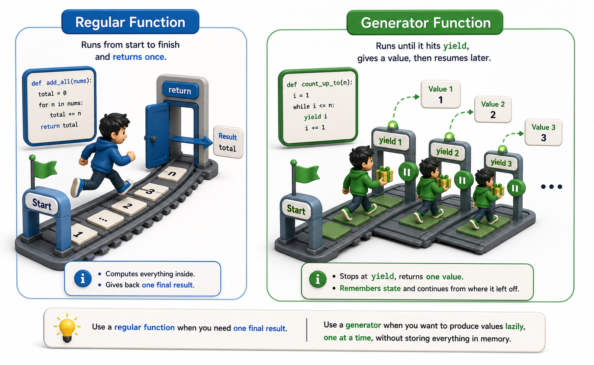

## Introduction

Leila's `CatalogReader` class works correctly, but writing eighteen lines to do what feels like a simple "give me approved records one at a time" operation seems excessive. She shows it to Nadia, who reads it and says: "That's correct, but Python gives you a much shorter way to write the same thing." She writes a generator function in five lines that does exactly what `CatalogReader` does, and Leila's first reaction is: "That looks like a bug. How does the function return more than once?"

The answer is `yield`, and understanding what it does transforms the way you think about functions that produce sequences.



## A Regular Function Returns Once

A normal function runs from top to bottom, returns a value, and then its local state is gone. Calling it again starts from scratch.

```python
def get_approved(records):
    results = []
    for r in records:
        if r["approved"]:
            results.append(r)
    return results    # returns once, discards state

# Demo:
result = get_approved([1, 2, 3])
print(f"get_approved([1, 2, 3]) ->", result)
```

This builds the entire list before the caller receives anything. For a million records, that is a million records in memory simultaneously.

## A Generator Function Yields Many Times

A **generator function** looks like a regular function but uses `yield` instead of `return`. When called, it does not run immediately. It returns a **generator object**. Advancing that generator (via `next()` or a `for` loop) resumes the function from where it last `yield`-ed, runs until the next `yield`, and pauses again with its local state fully preserved.

```python
def approved_records(records):
    for record in records:
        if record["approved"]:
            yield record   # pause here, return this value, resume later

records = [
    {"title": "Dune", "approved": True},
    {"title": "Rough Draft", "approved": False},
    {"title": "Foundation", "approved": True},
]

gen = approved_records(records)
print(type(gen))       # <class 'generator'>
print(next(gen))       # {"title": "Dune", "approved": True}
print(next(gen))       # {"title": "Foundation", "approved": True}
print(next(gen))       # StopIteration -- no more approved records
```

The function body ran in three pieces: up to the first `yield`, from there to the second `yield`, then to the end of the loop where it fell off the end and raised `StopIteration`. Between each piece, all local variables (`records`, `record`) were preserved exactly.

## Using a Generator in a for Loop

Because generators implement the iterator protocol (`__iter__` and `__next__`), they work seamlessly in `for` loops:

```python
records = [
    {"title": "Dune", "approved": True},
    {"title": "Rough Draft", "approved": False},
    {"title": "Foundation", "approved": True},
    {"title": "Shogun", "approved": True},
]

for book in approved_records(records):
    print(book["title"])
# Dune
# Foundation
# Shogun
```

The `for` loop calls `iter()` on the generator (which returns the generator itself) and then calls `next()` repeatedly. The function's execution is interleaved with the loop: one `yield` per iteration.

## Generators Are One-Pass Iterators

Like the custom iterator class from the previous lesson, a generator object is exhausted after one pass. Calling the generator *function* again produces a fresh generator.

```python
gen1 = approved_records(records)
gen2 = approved_records(records)   # fresh generator, independent state

print(next(gen1))   # Dune
print(next(gen2))   # Dune
print(next(gen1))   # Foundation -- gen1 advances independently
```

## yield vs return in the Same Function

A function can have both `yield` and `return`, but in a generator function `return` ends iteration immediately by raising `StopIteration`. The value after `return` is stored in the exception but not usually visible to the caller.

```python
def first_n_approved(records, n):
    count = 0
    for record in records:
        if record["approved"]:
            yield record
            count += 1
            if count >= n:
                return   # stops iteration early

# Demo:
result = first_n_approved([1, 2, 3], 5)
print(f"first_n_approved([1, 2, 3], 5) ->", result)
```

## Generators at a Glance

| Concept | What it means |
|---|---|
| Generator function | A function with at least one `yield` statement |
| Generator object | The iterator returned when a generator function is called |
| `yield value` | Pauses the function; returns `value`; resumes later |
| `return` in a generator | Ends the generator; raises `StopIteration` |
| One-pass | A generator object is exhausted after one traversal |

## Your Turn

```python
def fibonacci():
    a, b = 0, 1
    while True:         # infinite generator!
        yield a
        a, b = b, a + b

# Demo:
result = fibonacci()
print(f"fibonacci() ->", result)
```

This generator produces Fibonacci numbers indefinitely. Write a `for` loop that collects only the first 10 values into a list (use `enumerate` or a counter with `break`). Then explain why an infinite generator does not crash Python: the function is paused at `yield` between calls, so only one value is computed at a time.

## Conclusion

A generator function uses `yield` to pause execution and return a value, then resumes from where it left off when the next item is requested. The function's local state is fully preserved between yields. Generators implement the iterator protocol automatically, making them usable wherever an iterator is expected. They produce values on demand rather than all at once, which is exactly what Leila needs for her million-record catalog import. The next lesson introduces a concise syntax for producing generator objects in a single expression: generator expressions.
