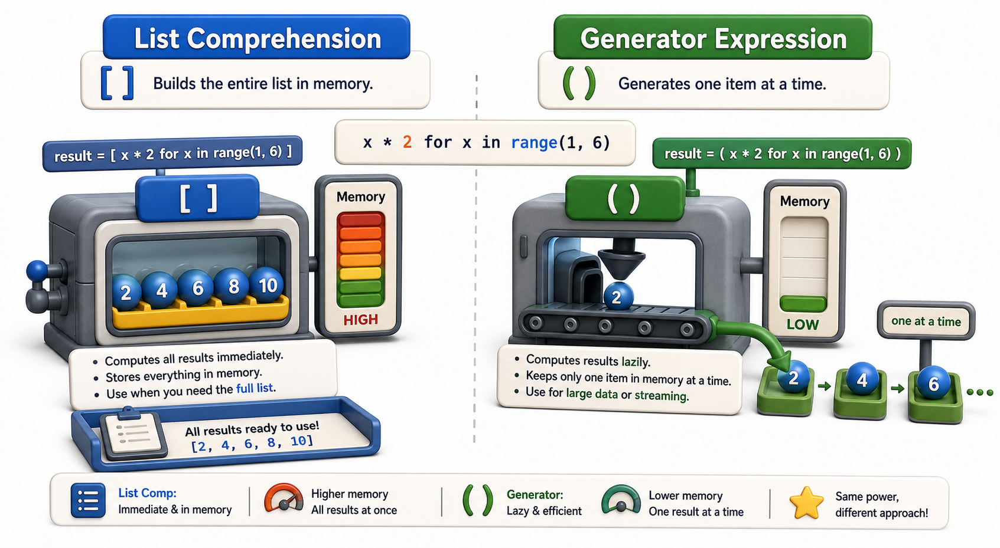

## Introduction

Leila is now comfortable writing generator functions. But she notices that many of the generators she writes are simple: filter a collection, or transform each item with a single expression. For these cases, writing a full `def` with a `yield` feels like using a sledgehammer to crack a nut. She asks Nadia if there is a shorter syntax.

There is. Generator expressions are to generators what list comprehensions are to lists: a compact, one-line way to describe a lazy sequence. The only visual difference from a list comprehension is the brackets: parentheses instead of square brackets.



## Generator Expression Syntax

A generator expression has the same structure as a list comprehension, but uses parentheses:

```python
# List comprehension: evaluates everything NOW, stores a list
squares_list = [x ** 2 for x in range(10)]
print(type(squares_list))   # <class 'list'>
print(squares_list)         # [0, 1, 4, 9, 16, 25, 36, 49, 64, 81]

# Generator expression: evaluates lazily, one item at a time
squares_gen = (x ** 2 for x in range(10))
print(type(squares_gen))    # <class 'generator'>
print(squares_gen)          # <generator object <genexpr> at 0x...>
```

The generator expression does not compute anything when it is created. It is a promise to compute values as they are requested.

## Using a Generator Expression

Any place that accepts an iterator accepts a generator expression:

```python
# In a for loop:
for sq in (x ** 2 for x in range(5)):
    print(sq)   # 0, 1, 4, 9, 16

# Passed directly to a function:
total = sum(x ** 2 for x in range(5))   # parentheses around the whole sum call
print(total)   # 30

# Filtered:
approved_titles = (r["title"] for r in records if r["approved"])
for title in approved_titles:
    print(title)
```

When a generator expression is the only argument to a function call, the outer parentheses of the call serve double duty and you do not need an extra pair: `sum(x ** 2 for x in range(5))` not `sum((x ** 2 for x in range(5)))`.

## Memory: The Key Difference

The difference between a list comprehension and a generator expression is not syntax; it is memory usage and when computation happens.

```python
import sys

# List comprehension: all 1 million numbers in memory at once
big_list = [x for x in range(1_000_000)]
print(sys.getsizeof(big_list))   # ~8 MB

# Generator expression: tiny object regardless of range
big_gen = (x for x in range(1_000_000))
print(sys.getsizeof(big_gen))    # ~112 bytes
```

The generator object contains only the code to produce the next value and the current state, not the values themselves. For Leila's million-record catalog, this is the difference between running fine and crashing.

## Chaining Generator Expressions

Generator expressions can be chained: one feeds another, creating a lazy pipeline where data flows through transformation and filtering steps one item at a time.

```python
records = [
    {"title": "Dune", "copies": 3, "approved": True},
    {"title": "Rough Draft", "copies": 0, "approved": False},
    {"title": "Foundation", "copies": 1, "approved": True},
    {"title": "Out of Stock", "copies": 0, "approved": True},
]

# Pipeline: approved, then available (copies > 0), then extract title
approved = (r for r in records if r["approved"])
available = (r for r in approved if r["copies"] > 0)
titles = (r["title"] for r in available)

for title in titles:
    print(title)
# Dune
# Foundation
```

Each generator in the chain produces items only when the next one requests them. Processing happens left to right through all three filters for one item before the next item is even looked at. No intermediate lists are created.

## When to Choose a Generator Expression vs. a List Comprehension

Use a **list comprehension** when you need to iterate over the result more than once, need to know the length, or need to index into specific positions. Use a **generator expression** when you process results once in a pipeline, the sequence could be very large, or you pass it directly to a function like `sum()`, `max()`, or `any()`.

```python
# Use a list if you need to reuse the result:
approved = [r for r in records if r["approved"]]
print(len(approved))          # needs a list
print(approved[0])            # indexing needs a list

# Use a generator if you consume it once:
print(sum(r["copies"] for r in records if r["approved"]))   # no list needed
```

## Generator Expressions at a Glance

| Feature | List comprehension `[...]` | Generator expression `(...)` |
|---|---|---|
| Evaluated | Immediately, all at once | Lazily, one item at a time |
| Memory | Proportional to the output size | Constant (just the generator state) |
| Reusable | Yes | No (exhausted after one pass) |
| Supports `len()` | Yes | No |
| Best for | Multiple iterations, indexing | Single-pass processing, large data |

## Your Turn

```python
records = [
    {"title": "Dune", "price": 15.99, "approved": True},
    {"title": "Draft", "price": 9.99, "approved": False},
    {"title": "Foundation", "price": 12.50, "approved": True},
    {"title": "Shogun", "price": 18.00, "approved": True},
]
print(records)
```

Without building any intermediate lists, use generator expressions to:
1. Print all approved titles with `for`.
2. Compute the total cost of approved books with `sum()`.
3. Find the most expensive approved book with `max()` using `max(..., key=lambda r: r["price"])`.

Each of these should be a single expression with a generator inside.

## Conclusion

Generator expressions use parentheses instead of square brackets to describe lazy sequences that compute values on demand. They are memory-efficient for large data, chainable into pipelines, and pass directly to built-in functions like `sum()` and `max()`. The trade-off: a generator is exhausted after one pass and does not support indexing or length queries. The next lesson looks at why lazy evaluation matters beyond convenience: the memory and time implications for large datasets.
