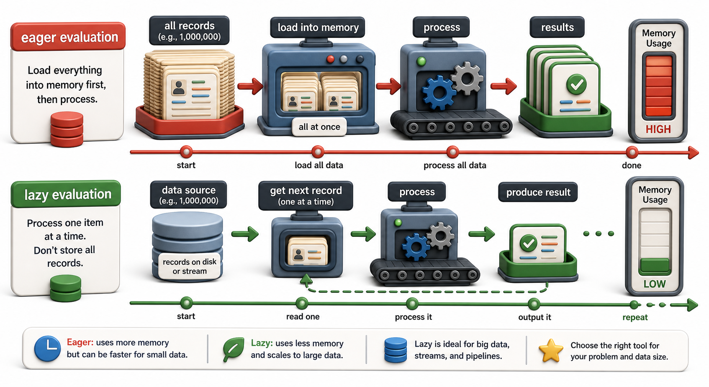

## Introduction

Leila's million-record import is now running on generators, and it uses a fraction of the memory it used before. But her colleague Arjun is skeptical. He says it must be slower because it is "doing more work." Leila realizes she cannot actually explain why he is wrong without understanding what lazy evaluation costs and what it saves.

This lesson addresses that question directly. Lazy evaluation is not "slower than eager." It is a different trade-off: you pay less upfront to avoid computing things you might never use, and you pay close to nothing in memory regardless of dataset size. Understanding when laziness helps and when it hurts is the practical skill this lesson builds.



## Eager vs. Lazy: A Concrete Comparison

**Eager evaluation** means computing all values immediately and storing them. A list comprehension is eager. `map()` in Python 2 was eager. You pay the full memory cost upfront, but you can revisit any value instantly afterward.

**Lazy evaluation** means computing values only when requested. Generator functions and expressions are lazy. You pay almost no memory, but once a value is used, it is gone unless you saved it elsewhere.

```python
import sys
import time

# Eager: builds the entire list first
start = time.time()
eager = [x * x for x in range(1_000_000)]
print(f"Eager list built in {time.time() - start:.3f}s")
print(f"Memory: {sys.getsizeof(eager):,} bytes")

# Lazy: builds nothing; only the generator object exists
start = time.time()
lazy = (x * x for x in range(1_000_000))
print(f"Lazy gen created in {time.time() - start:.5f}s")
print(f"Memory: {sys.getsizeof(lazy)} bytes")
```

The generator creation time is effectively zero because no computation happened. The list construction time and memory are proportional to the number of elements.

## Lazy Evaluation When You Do Not Need All Items

The starkest advantage of lazy evaluation appears when you stop early. If you need only the first matching item in a large sequence, eager evaluation computes all items even though you use only one.

```python
records = [{"isbn": str(i), "approved": i == 999_999} for i in range(1_000_000)]

# Eager: builds a filtered list of all 1,000,000 records, then takes the first
first_approved_eager = [r for r in records if r["approved"]][0]

# Lazy: stops as soon as the first approved record is found
first_approved_lazy = next(r for r in records if r["approved"])
print(first_approved_lazy)
```

For a dataset where only the last record matches, the eager version processes everything and stores most of it before giving you one result. The lazy version processes items one by one and stops immediately when it finds a match. With `next()`, you also get a clear `StopIteration` (or a default with `next(..., None)`) when nothing matches, rather than an `IndexError`.

## Processing a File Without Loading It

Files are iterators in Python, which means they support lazy line-by-line reading natively. This is particularly important for large log files or CSV exports:

```python
import io

def count_approved_in_file(file_obj):
    count = 0
    for line in file_obj:             # reads one line at a time
        if "approved=True" in line:
            count += 1
    return count

# Demo: io.StringIO stands in for a real file — same lazy line-by-line interface
sample_data = (
    "isbn=001,approved=True\n"
    "isbn=002,approved=False\n"
    "isbn=003,approved=True\n"
)
result = count_approved_in_file(io.StringIO(sample_data))
print(f"count_approved_in_file(io.StringIO(data)) -> {result}")
```

At no point does Python hold the entire file in memory. The operating system reads one buffer at a time, the file object yields one line at a time, and the counter accumulates. This scales to a file of any size.

## When Laziness Does Not Help (and May Hurt)

Lazy evaluation is not always the right choice. If you need to iterate the same sequence multiple times, you must either make it eager (a list) or call the generator function again for each pass.

```python
records = [
    {"isbn": "978-001", "approved": True},
    {"isbn": "978-002", "approved": False},
    {"isbn": "978-003", "approved": True},
]

def process(r): pass   # stub: would update DB in production

approved = (r for r in records if r["approved"])

# First pass: works
for r in approved:
    process(r)
print("First pass complete")

# Second pass: generator is exhausted, nothing happens
for r in approved:
    print("This never prints")
print("Second pass produced no output — generator was exhausted")
```

If you need random access (e.g., `gen[500]`), `len()`, or sorting, you also need a list. A generator cannot support these operations.

## Memory Efficiency at a Glance

| Scenario | Eager (list) | Lazy (generator) |
|---|---|---|
| Memory usage | Proportional to output size | Constant (generator state only) |
| First item only | Must build everything first | Stops immediately |
| Multiple iterations | Trivial (re-iterate the list) | Must re-call the generator function |
| Random access | Supported (`lst[i]`) | Not supported |
| Early stopping | Still builds full list first | Stops at first matching item |

## Your Turn

```python
import io

def read_large_catalog(file_obj):
    for line in file_obj:
        parts = line.strip().split(",")
        if len(parts) == 3:
            yield {"isbn": parts[0], "title": parts[1], "copies": int(parts[2])}

def low_stock(records, threshold=2):
    return (r for r in records if r["copies"] < threshold)

# Demo: io.StringIO simulates a large catalog file — same lazy interface
csv_data = io.StringIO(
    "978-001,Dune,1\n"
    "978-002,Foundation,5\n"
    "978-003,Neuromancer,0\n"
)
all_records = list(read_large_catalog(csv_data))
print(f"read_large_catalog -> {all_records}")
scarce = list(low_stock(all_records, threshold=2))
print(f"low_stock(records, threshold=2) -> {scarce}")
```

Create a small text file `catalog.csv` with a few rows of `isbn,title,copies` data, some with copies below 2 and some above. Call `read_large_catalog` and pipe it through `low_stock`, then consume the pipeline with `for`. Verify that at no point does Python hold a full list of records; you can confirm this by adding a `print(f"Yielding {r['title']}")` inside the generator and watching the interleaved output.

## Conclusion

Lazy evaluation defers computation until values are actually needed, which has three concrete benefits: memory is constant regardless of dataset size, early stopping costs nothing for unprocessed items, and pipelines of generators compose naturally without intermediate collections. The trade-off is single-pass use and no random access. The next lesson introduces `itertools`, Python's standard library module that provides ready-made lazy building blocks for common iteration patterns.
