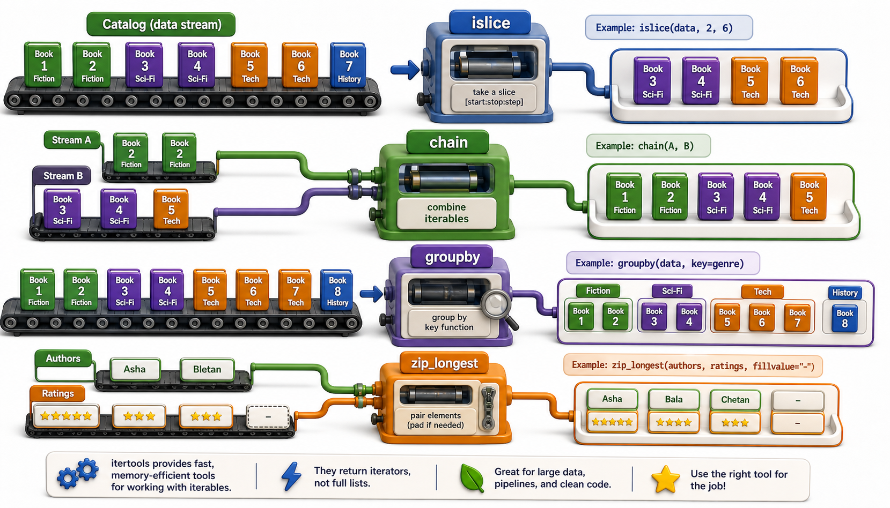

## Introduction

Leila's import pipeline is running efficiently, but she keeps writing the same small utility patterns: take the first N items from a generator, interleave two sequences, repeat a header row, group consecutive records with the same genre. Nadia shows her a module she has been unaware of: `itertools`. Python ships with it in the standard library, and it contains exactly the lazy building blocks she has been reinventing.

This lesson covers the most useful `itertools` functions, focusing on the ones that appear most often in real data pipelines. All of them work lazily, consuming input one item at a time rather than loading everything into memory.



## islice: Take a Slice of a Generator

Regular slicing (`my_list[2:5]`) does not work on generators. `itertools.islice` provides slicing for any iterator, lazily.

```python
import itertools

def all_books():
    catalog = ["Dune", "Foundation", "Shogun", "Neuromancer", "1984", "Brave New World"]
    for book in catalog:
        yield book

# Take books 2 through 4 (zero-indexed)
for title in itertools.islice(all_books(), 2, 5):
    print(title)
# Shogun
# Neuromancer
# 1984
```

`islice(iterable, stop)` or `islice(iterable, start, stop)` or `islice(iterable, start, stop, step)` mirrors the regular slice syntax. The generator is only advanced as far as needed; items after `stop` are never requested.

## chain: Combine Multiple Iterables as One

`itertools.chain` concatenates any number of iterables into one seamless sequence, without building a new list.

```python
import itertools

fiction = ["Dune", "Foundation"]
non_fiction = ["Sapiens", "A Brief History of Time"]
reference = ["Oxford English Dictionary"]

all_items = itertools.chain(fiction, non_fiction, reference)
for title in all_items:
    print(title)
# Dune, Foundation, Sapiens, A Brief History of Time, Oxford English Dictionary
```

This is especially useful when processing data from multiple sources (multiple files, multiple API pages) as if they were one stream:

```python
import itertools

def page_one():
    yield {"isbn": "001", "title": "Dune"}
    yield {"isbn": "002", "title": "Foundation"}

def page_two():
    yield {"isbn": "003", "title": "Shogun"}

for record in itertools.chain(page_one(), page_two()):
    print(record["title"])
```

## groupby: Cluster Consecutive Equal Items

`itertools.groupby` groups consecutive items that share a key. Note the word "consecutive": the input must be sorted by the grouping key first.

```python
import itertools

catalog = [
    {"title": "Dune", "genre": "sci-fi"},
    {"title": "Foundation", "genre": "sci-fi"},
    {"title": "Shogun", "genre": "historical"},
    {"title": "Sapiens", "genre": "non-fiction"},
    {"title": "Brief History", "genre": "non-fiction"},
]

# Sort by genre first (required)
catalog.sort(key=lambda r: r["genre"])

for genre, items in itertools.groupby(catalog, key=lambda r: r["genre"]):
    print(f"{genre}: {[item['title'] for item in items]}")
# historical: ['Shogun']
# non-fiction: ['Sapiens', 'Brief History']
# sci-fi: ['Dune', 'Foundation']
```

## zip_longest: Pair Two Sequences of Unequal Length

Python's built-in `zip` stops at the shortest sequence. `itertools.zip_longest` continues to the longest, filling missing values with a `fillvalue`.

```python
import itertools

isbns = ["978-001", "978-002", "978-003"]
titles = ["Dune", "Foundation"]    # one shorter than isbns

for isbn, title in itertools.zip_longest(isbns, titles, fillvalue="UNKNOWN"):
    print(isbn, title)
# 978-001 Dune
# 978-002 Foundation
# 978-003 UNKNOWN
```

## tee: Clone an Iterator

`itertools.tee(iterable, n)` creates n independent iterators from one source. After calling `tee`, you should not use the original iterator directly, only the returned copies.

```python
import itertools

def approved_records(records):
    for r in records:
        if r.get("approved"):
            yield r

records = [
    {"title": "Dune", "approved": True},
    {"title": "Foundation", "approved": True},
]

gen1, gen2 = itertools.tee(approved_records(records), 2)
# gen1 and gen2 are independent
print(next(gen1)["title"])   # Dune
print(next(gen2)["title"])   # Dune -- gen2 has its own cursor
```

`tee` buffers internally: items consumed from one copy are stored until the other copy requests them, so if the two copies diverge significantly, memory use grows. It is best used when both copies will be consumed at roughly the same rate.

## itertools Essentials at a Glance

| Function | What it does | Example use |
|---|---|---|
| `islice(it, stop)` | Take first N items lazily | Paginate a generator |
| `islice(it, start, stop)` | Slice a generator by position | Skip the header row |
| `chain(*iterables)` | Concatenate multiple iterables | Merge pages from an API |
| `groupby(it, key)` | Group consecutive items by key | Aggregate sorted records |
| `zip_longest(*its, fillvalue)` | Zip to the longest sequence | Pair unequal-length lists |
| `tee(it, n)` | Clone one iterator into n copies | Process one stream two ways |

## Your Turn

```python
import itertools

books_a = [{"title": "Dune", "year": 1965}, {"title": "Foundation", "year": 1951}]
books_b = [{"title": "Neuromancer", "year": 1984}]

combined = itertools.chain(books_a, books_b)
first_two = itertools.islice(combined, 2)

for book in first_two:
    print(book["title"])
```

Predict the output before running it. Then extend the exercise: add genre fields and use `groupby` (after sorting) to group the combined catalog by decade (1940s, 1950s, 1960s, 1980s). You will need a key function that computes `year // 10 * 10`.

## Conclusion

`itertools` provides a toolkit of lazy, composable building blocks: `islice` for slicing generators, `chain` for merging multiple iterables, `groupby` for clustering sorted sequences, `zip_longest` for pairing unequal lengths, and `tee` for cloning iterators. All are lazy and memory-efficient by design. The final lesson of this unit synthesizes everything into a practical guideline: when is a generator the right tool, and when should you use a list instead?
