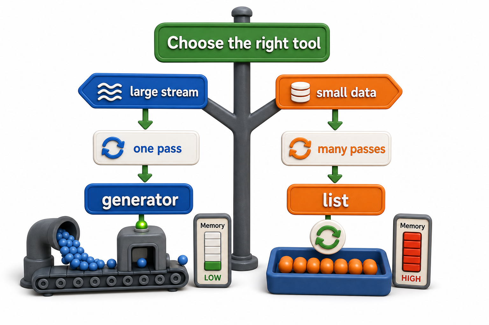

## Introduction

Leila's import pipeline is shipping. But Arjun, watching it go live, asks the question she has been expecting: "Should I use generators everywhere now? Every function that returns a list, should I convert it?" Leila pauses. She knows generators are powerful and memory-efficient, but she also knows her pipeline has two places where she had to call `list()` explicitly because she needed to count items and iterate twice. Generators are not always better. They are a specific tool for a specific situation.

This final lesson of the unit draws a practical line: when generators are clearly the right choice, when lists are, and how to recognize which situation you are in.



## When Generators Are the Right Choice

Generators excel in four situations:

**Processing large or unbounded data**: when your data source is a file, a network stream, a database cursor, or anything that might be too large to hold in memory, a generator is always correct. A `for line in file:` loop is a generator-based pattern that works for a 100-byte file and a 100-gigabyte file identically.

**Early termination**: when you expect to stop before reaching the end, a lazy generator is efficient regardless of how much data exists after the stopping point. `next(gen for gen in huge_dataset if condition)` reads nothing after the first match.

**Pipelining**: chaining a series of transformations and filters through multiple generators, as Leila did, avoids all intermediate collections. Data flows through the entire pipeline one item at a time.

**Infinite sequences**: generators can represent sequences that have no end: counting integers, generating Fibonacci numbers, producing heartbeat timestamps. Lists cannot hold an infinite sequence; generators can represent one trivially.

```python
def integers_from(n):
    while True:
        yield n
        n += 1

counter = integers_from(1000)
for _ in range(5):
    print(next(counter))   # 1000, 1001, 1002, 1003, 1004
```

## When Lists Are the Right Choice

Lists are better when:

**You need to iterate more than once.** A list supports multiple `for` loops, index access, and length queries. A generator is exhausted after one pass.

**You need to know the length.** `len()` requires a sequence that knows its size. Generators do not.

**You need random access.** `items[42]` requires indexing. Generators can only move forward.

**You need to modify the sequence.** Appending, removing, or sorting requires a mutable sequence.

**The dataset is small.** For a list of twenty items, the overhead of thinking about laziness is not justified. Clarity and simplicity matter more.

```python
# Use a list when you need to sort the results
approved = list(r for r in records if r["approved"])   # materialized
approved.sort(key=lambda r: r["title"])                # sorting requires a list

# Use a list when you need the count
total = len([r for r in records if r["approved"]])

# Use a generator when you only need one pass
print(sum(r["copies"] for r in records if r["approved"]))
```

## Converting Between Generators and Lists

The conversion between a generator and a list is always explicit and intentional: `list(gen)` materializes everything, and the `list()` call makes that trade-off visible in the code.

```python
catalog = [
    {"isbn": "978-001", "title": "Dune", "approved": True},
    {"isbn": "978-002", "title": "Foundation", "approved": False},
    {"isbn": "978-003", "title": "Neuromancer", "approved": True},
]

def approved_records(records):
    for r in records:
        if r["approved"]:
            yield r

def update_database(r): pass      # stub: would write to DB in production
def send_confirmation_email(r): pass  # stub: would send email in production

# Keep as generator if one pass is enough:
for r in approved_records(catalog):
    update_database(r)

# Materialize if you need to reuse:
approved = list(approved_records(catalog))
print(f"Found {len(approved)} approved records")
for r in approved:
    update_database(r)
for r in approved:
    send_confirmation_email(r)   # second pass — needs the list
print("Done: updated DB and sent emails for all approved records")
```

## Generators in the Complete Library System

In the context of the semester project, generators are the right tool for the data ingestion layer:

```python
import io

def read_csv(file_obj):
    next(file_obj)   # skip header
    for line in file_obj:
        parts = line.strip().split(",")
        yield {"isbn": parts[0], "title": parts[1], "copies": int(parts[2])}

def validated(records):
    for r in records:
        if len(r["isbn"]) >= 3 and r["copies"] >= 0:
            yield r

def imported_count(file_obj):
    count = 0
    for r in validated(read_csv(file_obj)):
        count += 1   # insert_into_db(r) in production
    return count

# Demo: io.StringIO stands in for the CSV file — same lazy generator interface
csv_data = io.StringIO(
    "isbn,title,copies\n"
    "978-001,Dune,3\n"
    "978-002,Foundation,1\n"
    "978-003,Neuromancer,0\n"
)
csv_data2 = io.StringIO(
    "isbn,title,copies\n"
    "978-001,Dune,3\n"
    "978-002,Foundation,1\n"
)
records = list(read_csv(csv_data))
print(f"read_csv(csv_data) -> {records}")
valid = list(validated(records))
print(f"validated(records) -> {valid}")
print(f"imported_count(csv_data2) -> {imported_count(csv_data2)}")
```

`read_csv` and `validated` are both generators. The `for` loop inside `imported_count` drives the pipeline, pulling records one at a time from disk through validation to the database call. At no point is more than one record in memory.

## When to Use Generators at a Glance

| Situation | Generator | List |
|---|---|---|
| Large or unbounded data | Correct | Risky (memory) |
| Single pass only | Correct | Also works, less efficient |
| Multiple passes | Must re-call the function | Correct |
| Random access (`seq[i]`) | Not supported | Correct |
| `len()` | Not supported | Correct |
| Early termination expected | Efficient (stops on first match) | Processes everything first |
| Sorting the results | Not directly supported | Correct |

## Your Turn

Consider this function:

```python
def load_all_patrons(db_cursor):
    db_cursor.execute("SELECT name, email FROM patrons")
    return db_cursor.fetchall()   # loads all rows into a list

# Demo: mock cursor stands in for a real database connection
class MockCursor:
    def execute(self, sql): pass
    def fetchall(self):
        return [("Alice", "alice@lib.com"), ("Bob", "bob@lib.com"), ("Yuna", "yuna@lib.com")]

cursor = MockCursor()
result = load_all_patrons(cursor)
print(f"load_all_patrons(cursor) -> {result}")
```

A database with 50,000 patrons returns 50,000 rows at once. Rewrite `load_all_patrons` as a generator that uses `fetchone()` in a loop to retrieve rows one at a time. Then explain in which scenario a caller would need `list(load_all_patrons(cursor))` even with your generator version, and why that is an acceptable and explicit trade-off rather than a bug.

## Conclusion

Generators are the right tool when data is large or unbounded, when you expect early termination, when you are building a pipeline of transformations, or when the sequence is infinite. Lists are the right tool when you need multiple passes, random access, length queries, or sorted output. The two are not in competition: a well-designed system uses generators where data flows and lists where data is examined, sorted, or revisited. Unit 5 moves from lazy iteration to a different kind of code reuse: decorators, which wrap functions to add behavior without modifying them.
