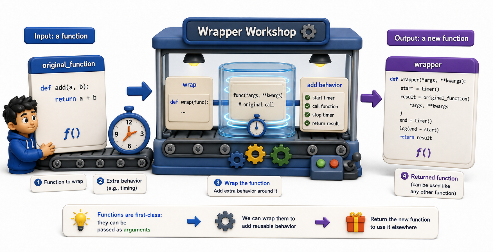

## Introduction

Kiran is looking at the timing problem from a new angle. She wants a function that takes *another function* as input, runs it, measures how long it takes, and returns the result. She has seen `map()` and `sorted()` take functions as arguments, so she knows Python supports this. Now she needs to write it herself.

This lesson bridges the gap between "functions can be passed around" and "functions can be wrapped." By the end, Kiran will have written something that looks almost exactly like a decorator, without yet using the `@` syntax.



## Higher-Order Functions

A **higher-order function** is any function that takes a function as an argument or returns a function as a result. Python has many built-in ones:

```python
books = [
    {"title": "Dune", "year": 1965},
    {"title": "Foundation", "year": 1951},
    {"title": "Neuromancer", "year": 1984},
]

# sorted() takes a key function
by_year = sorted(books, key=lambda b: b["year"])
print(by_year[0]["title"])   # Foundation -- oldest first

# filter() takes a predicate function
recent = list(filter(lambda b: b["year"] > 1960, books))
print([b["title"] for b in recent])   # ['Dune', 'Neuromancer']
```

Writing your own higher-order function works the same way: accept a function parameter, call it inside, and optionally return a function as the result.

## Accepting a Function, Running It, Returning the Result

The simplest higher-order function Kiran could write for timing:

```python
import time

def timed(fn, *args, **kwargs):
    start = time.time()
    result = fn(*args, **kwargs)
    elapsed = time.time() - start
    print(f"{fn.__name__} took {elapsed:.4f}s")
    return result

def load_catalog(size):
    time.sleep(0.1)   # simulate work
    return list(range(size))

result = timed(load_catalog, 100)
# load_catalog took 0.1001s
```

`timed` accepts the function `fn` and any arguments for it, calls `fn(*args, **kwargs)`, measures the wall-clock time, and returns the function's result. This works, but the calling syntax changes: callers must write `timed(load_catalog, 100)` instead of `load_catalog(100)`. The timing logic is now external to the function, but it has not been seamlessly added.

## Returning a New Function: The Wrapper Pattern

A more powerful pattern: instead of calling the function inside `timed`, return a new function that *itself* calls the original. The result is a new function that behaves like the original but also includes timing.

```python
import time

def add_timing(fn):
    def wrapper(*args, **kwargs):
        start = time.time()
        result = fn(*args, **kwargs)
        elapsed = time.time() - start
        print(f"{fn.__name__} took {elapsed:.4f}s")
        return result
    return wrapper

def load_catalog(size):
    time.sleep(0.1)
    return list(range(size))

timed_load = add_timing(load_catalog)   # timed_load IS a function
result = timed_load(100)                # called just like load_catalog
# load_catalog took 0.1001s
```

`add_timing` takes the original function, creates a `wrapper` closure that captures `fn`, and returns the wrapper. Callers can now call `timed_load(100)` exactly as they would call `load_catalog(100)`. The timing is invisible.

## Replacing the Original With the Wrapped Version

The final step is to replace the original name with the wrapped version, so every call to `load_catalog` automatically includes timing:

```python
load_catalog = add_timing(load_catalog)   # replace the original
result = load_catalog(100)                # now includes timing automatically
# load_catalog took 0.1001s
print(result)
```

This single line, `load_catalog = add_timing(load_catalog)`, is exactly what the `@add_timing` syntax does. The decorator syntax introduced in the next lesson is purely a shorthand for this pattern.

## *args and **kwargs: Why They Matter in Wrappers

The `wrapper` function uses `*args` and `**kwargs` to accept any arguments without knowing the signature of the wrapped function. This makes the wrapper generic: it works with functions that take no arguments, positional arguments, keyword arguments, or any combination.

```python
def add_timing(fn):
    def wrapper(*args, **kwargs):   # accepts anything
        start = time.time()
        result = fn(*args, **kwargs)  # passes everything through
        elapsed = time.time() - start
        print(f"{fn.__name__} took {elapsed:.4f}s")
        return result
    return wrapper
```

Without `*args` and `**kwargs`, you would have to write a separate timing function for every function signature. With them, one wrapper works universally.

## Functions as Arguments and Return Values at a Glance

| Pattern | What it does |
|---|---|
| Higher-order function | Takes a function as argument or returns one |
| Wrapper | An inner function that calls `fn(*args, **kwargs)` |
| `*args, **kwargs` | Makes a wrapper accept any function signature |
| Replacing the original | `fn = add_behavior(fn)` applies the wrapper permanently |

## Your Turn

```python
def add_logging(fn):
    def wrapper(*args, **kwargs):
        print(f"Calling {fn.__name__} with args={args} kwargs={kwargs}")
        result = fn(*args, **kwargs)
        print(f"{fn.__name__} returned {result!r}")
        return result
    return wrapper

def calculate_fine(days_overdue, daily_rate=0.50):
    return days_overdue * daily_rate

logged_fine = add_logging(calculate_fine)
logged_fine(5)
logged_fine(10, daily_rate=0.75)
```

Run this and read the output carefully. Then replace `logged_fine = add_logging(calculate_fine)` with `calculate_fine = add_logging(calculate_fine)` to permanently apply the wrapper, and confirm that `calculate_fine(5)` now logs automatically.

## Conclusion

Higher-order functions accept or return other functions. A wrapper is an inner function that calls the original, adding behavior before or after. `*args` and `**kwargs` make wrappers work with any function signature. Replacing a function with its wrapped version, `fn = add_wrapper(fn)`, is the exact pattern the `@decorator` syntax automates. The next lesson introduces that syntax.
