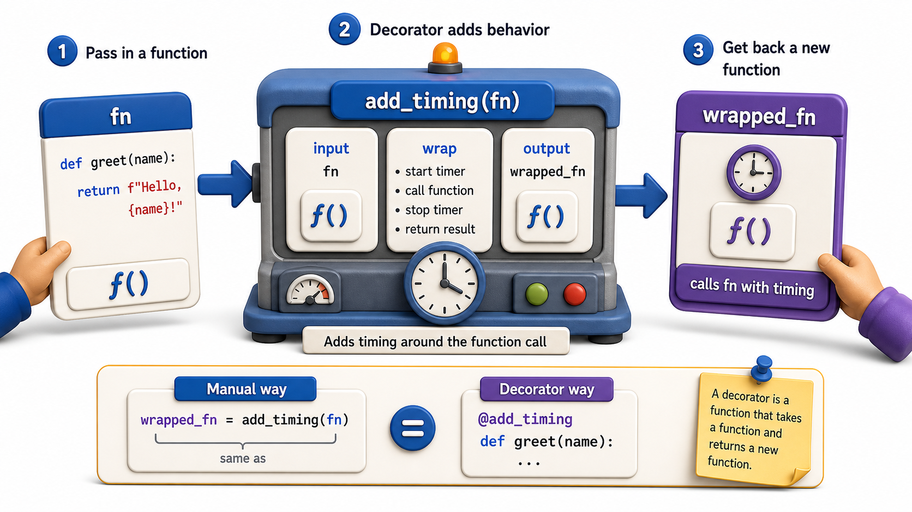

## Introduction

Kiran has `load_catalog = add_timing(load_catalog)` working. But applying it to twelve endpoint handlers means writing the same assignment pattern twelve times, which is not much better than the original copy-paste problem. She discovers that Python provides exactly the syntax she needs: the `@` decorator syntax, which applies the wrapper automatically at definition time, in one line, attached to the function itself.

This lesson introduces the `@` syntax, confirms it is exactly what she has already been doing, and applies it to build a real timing decorator.



## The @ Syntax Is Syntactic Sugar

The decorator syntax `@name` placed above a function definition is exactly equivalent to `fn = name(fn)` placed immediately after the definition. No new language feature is involved; it is a shorthand.

```python
# Without @ syntax:
def load_catalog(size):
    return list(range(size))
load_catalog = add_timing(load_catalog)

# With @ syntax (identical behavior):
@add_timing
def load_catalog(size):
    return list(range(size))

# Demo:
result = load_catalog(5)
print(f"load_catalog(5) ->", result)
result = load_catalog(5)
print(f"load_catalog(5) ->", result)
```

Python reads the `@add_timing` line, registers it, then when it processes the `def`, it immediately applies `add_timing` to the function object and rebinds the name `load_catalog` to the result. The function definition and the decoration happen at the same place in the source file.

## A Complete Simple Decorator

Here is the full decorator Kiran needs:

```python
import time

def add_timing(fn):
    def wrapper(*args, **kwargs):
        start = time.time()
        result = fn(*args, **kwargs)
        elapsed = time.time() - start
        print(f"{fn.__name__} ran in {elapsed:.4f}s")
        return result
    return wrapper

@add_timing
def load_catalog(size):
    time.sleep(0.05)
    return list(range(size))

@add_timing
def search_catalog(query, catalog):
    return [item for item in catalog if query in str(item)]

catalog = load_catalog(50)
# load_catalog ran in 0.0501s

results = search_catalog("1", catalog)
# search_catalog ran in 0.0000s
```

Both functions are timed without any changes to their bodies. Adding `@add_timing` to the remaining ten endpoint handlers takes ten characters, not ten blocks of boilerplate.

## Decorators Run at Definition Time, Not Call Time

An important detail: the decorator itself is called when the `def` statement is processed, which is at module import time, not when the decorated function is first called. The function object is passed to the decorator immediately, and the wrapper replaces it.

```python
def announce(fn):
    print(f"Decorating {fn.__name__}")    # runs at definition time
    def wrapper(*args, **kwargs):
        return fn(*args, **kwargs)
    return wrapper

@announce
def greet(name):
    return f"Hello, {name}"

# "Decorating greet" was already printed
print(greet("Kiran"))   # Hello, Kiran
```

This matters in practice: if you import a module that contains decorated functions, the decorator runs during the import, not during the first call. If a decorator has expensive setup, that cost is paid at import time.

## Decorators That Do Not Change the Return Value

Not every decorator needs to modify the return value. Some only add side effects: logging, timing, caching checks. The wrapper must still `return result` to not accidentally suppress the return value.

```python
def log_call(fn):
    def wrapper(*args, **kwargs):
        print(f"Calling {fn.__name__}")
        result = fn(*args, **kwargs)
        print(f"{fn.__name__} complete")
        return result    # essential: pass the result through
    return wrapper

@log_call
def add_book(title, isbn):
    return {"title": title, "isbn": isbn}

book = add_book("Dune", "978-0441013593")
# Calling add_book
# add_book complete
print(book)   # {'title': 'Dune', 'isbn': '978-0441013593'}
```

Forgetting `return result` in the wrapper causes the decorated function to silently return `None`, which is one of the most common bugs when first writing decorators.

## Writing a Simple Decorator at a Glance

| Step | Code |
|---|---|
| Define the outer function | `def my_decorator(fn):` |
| Define the wrapper | `def wrapper(*args, **kwargs):` |
| Call the original | `result = fn(*args, **kwargs)` |
| Return the result | `return result` |
| Return the wrapper | `return wrapper` |
| Apply with @ | `@my_decorator` above the `def` |

## Your Turn

Write a `validate_positive` decorator that raises a `ValueError` if any positional argument passed to the decorated function is negative:

```python
def validate_positive(fn):
    def wrapper(*args, **kwargs):
        for arg in args:
            if isinstance(arg, (int, float)) and arg < 0:
                raise ValueError(f"Negative argument not allowed: {arg}")
        return fn(*args, **kwargs)
    return wrapper

@validate_positive
def set_copies(isbn, count):
    print(f"Setting {isbn} to {count} copies")

set_copies("978-001", 3)     # works
set_copies("978-001", -1)    # error!
```

Test both calls. Then apply `@validate_positive` to a second function of your choice to confirm it works generically without any modification.

## Conclusion

The `@decorator` syntax is a concise way to write `fn = decorator(fn)`, applied at function-definition time. The decorator receives the original function, creates a wrapper that calls it and adds behavior, and returns the wrapper. Always return the result of `fn(*args, **kwargs)` from the wrapper, or the decorated function will silently return `None`. The next lesson covers the case where the decorator itself needs configuration: how to write decorators that accept arguments.
