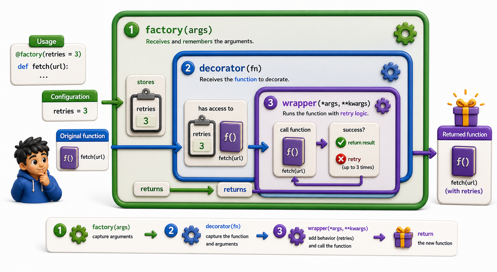

## Introduction

Kiran's timing decorator is working well. But now she wants a retry decorator: one that runs a function again if it raises an exception, up to a configurable maximum number of attempts. The number of attempts should be a parameter. She wants to write `@retry(max_attempts=3)` above a function, not a separate decorator for every retry count.

This requires a slightly different pattern: instead of a two-level function (decorator wraps function), she needs three levels: a function that takes the arguments, returns a decorator, which in turn wraps the function.



## The Three-Level Pattern

A decorator with arguments needs three levels of function nesting:

1. The **decorator factory** accepts the arguments (like `max_attempts=3`) and returns a decorator.
2. The **decorator** accepts the function and returns a wrapper.
3. The **wrapper** contains the actual behavior.

```python
def retry(max_attempts=3):          # level 1: factory
    def decorator(fn):              # level 2: decorator
        def wrapper(*args, **kwargs):  # level 3: wrapper
            last_error = None
            for attempt in range(1, max_attempts + 1):
                try:
                    return fn(*args, **kwargs)
                except Exception as error:
                    last_error = error
                    print(f"Attempt {attempt} failed: {error}")
            raise last_error
        return wrapper
    return decorator
```

When Python sees `@retry(max_attempts=3)`, it evaluates `retry(max_attempts=3)` first, which returns `decorator`. Then it applies `decorator` to the function. The result is exactly the same as a plain `@decorator`, just with the arguments captured in a closure at the first level.

## Applying a Decorator With Arguments

```python
@retry(max_attempts=3)
def fetch_book(isbn):
    import random
    if random.random() < 0.7:   # fails 70% of the time
        raise ConnectionError("Network unreachable")
    return {"isbn": isbn, "title": "Dune"}

try:
    book = fetch_book("978-0441013593")
    print(book)
except ConnectionError:
    print("All attempts failed")
```

The function is tried up to three times. Each failure is logged. On success, the result is returned normally.

## Common Mistake: Calling vs. Not Calling the Decorator Factory

The easiest way to confuse yourself with parameterized decorators is accidentally writing `@retry` instead of `@retry()`. Without the call, Python passes the function to `retry` directly as the first argument, but `retry` expects `max_attempts`, not a function.

```python
@retry          # WRONG: passes the function to retry as max_attempts
def fetch_book(isbn):
    pass
# TypeError: 'function' object cannot be interpreted as an integer

@retry()        # CORRECT: retry() returns the decorator, then the decorator wraps fn
def fetch_book(isbn):
    pass

# Demo:
result = fetch_book(5)
print(f"fetch_book(5) ->", result)
result = fetch_book(5)
print(f"fetch_book(5) ->", result)
```

If you want `@retry` to work *without* parentheses (using a default retry count), you need to detect whether the first argument is a function and handle both cases. This pattern exists but adds complexity; for clarity, always require parentheses with parameterized decorators.

## A Rate-Limiter Decorator With Arguments

```python
import time

def rate_limit(calls_per_second):
    min_interval = 1.0 / calls_per_second
    last_called = [0.0]   # list to allow mutation inside the closure

    def decorator(fn):
        def wrapper(*args, **kwargs):
            elapsed = time.time() - last_called[0]
            if elapsed < min_interval:
                time.sleep(min_interval - elapsed)
            last_called[0] = time.time()
            return fn(*args, **kwargs)
        return wrapper
    return decorator

@rate_limit(calls_per_second=2)
def call_api(endpoint):
    print(f"Calling {endpoint}")

call_api("/books")
call_api("/books")
call_api("/books")   # throttled: waits before the third call
```

`min_interval` is captured in the closure of `decorator`, and `last_called` is captured in the closure of `wrapper`. Each decorated function gets its own `last_called` counter.

## Decorators With Arguments at a Glance

| Level | Function | Receives | Returns |
|---|---|---|---|
| 1 (factory) | `def retry(max_attempts):` | Decorator arguments | A decorator |
| 2 (decorator) | `def decorator(fn):` | The function to wrap | A wrapper |
| 3 (wrapper) | `def wrapper(*args, **kwargs):` | Call arguments | The result |

## Your Turn

Write a `timeout_after(seconds)` decorator that prints a warning message if the wrapped function takes longer than `seconds` to run. (Use `time.time()` before and after; actually interrupting execution requires threading, so for this exercise just print the warning after the fact.)

```python
import time

def timeout_after(seconds):
    def decorator(fn):
        def wrapper(*args, **kwargs):
            start = time.time()
            result = fn(*args, **kwargs)
            elapsed = time.time() - start
            if elapsed > seconds:
                print(f"WARNING: {fn.__name__} took {elapsed:.2f}s (limit {seconds}s)")
            return result
        return wrapper
    return decorator

@timeout_after(0.1)
def slow_function():
    time.sleep(0.2)
    return "done"

print(slow_function())
```

Run this and confirm the warning appears. Then apply `@timeout_after(0.5)` to a second function that sleeps for 0.1 seconds and confirm no warning appears.

## Conclusion

Decorators with arguments use a three-level nesting: the factory receives arguments, the decorator receives the function, and the wrapper contains the behavior. The `@factory(args)` syntax evaluates `factory(args)` first to get a decorator, then applies the decorator to the function. The next lesson covers a subtle issue that affects all decorators: by default, wrapping a function hides its name, docstring, and signature. `functools.wraps` fixes this in one line.
