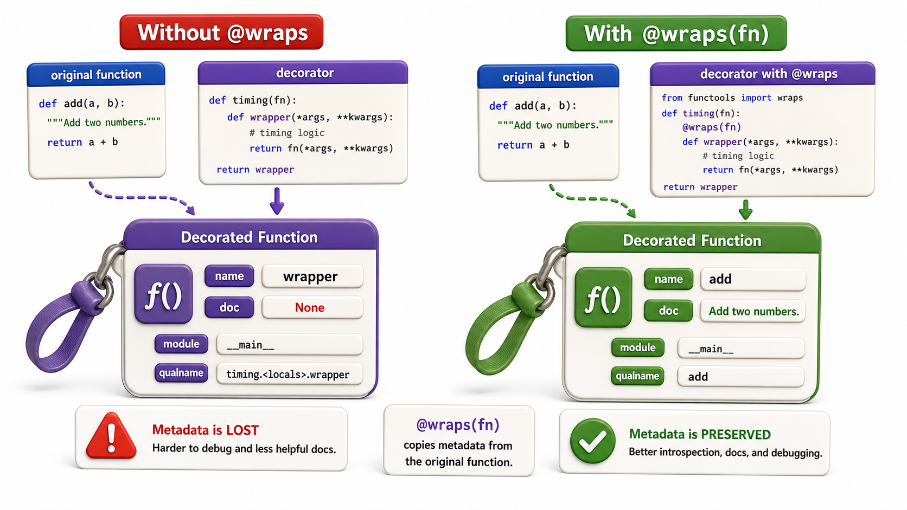

## Introduction

Kiran's timing decorator is in production. A new developer on the team opens the API documentation generation tool and sees something strange: every timed function is listed as `wrapper` in the docs, and every one has an empty docstring. The documentation generator reads `fn.__name__` and `fn.__doc__`, but after decoration, those attributes belong to `wrapper`, not to the original function.

This is a real and irritating problem. The fix is a single import and one additional line: `functools.wraps`.



## The Problem: Wrappers Hide the Original's Identity

When a decorator wraps a function, the name `fn` now points to `wrapper`. This means introspection tools, debuggers, and documentation generators see `wrapper` rather than the original function.

```python
def add_timing(fn):
    def wrapper(*args, **kwargs):
        import time
        start = time.time()
        result = fn(*args, **kwargs)
        print(f"Ran in {time.time() - start:.4f}s")
        return result
    return wrapper

@add_timing
def load_catalog(size):
    """Load books from the catalog."""
    return list(range(size))

print(load_catalog.__name__)   # wrapper -- wrong!
print(load_catalog.__doc__)    # None -- wrong!
```

The function's name, docstring, and signature are all from `wrapper`, not from `load_catalog`.

## The Fix: functools.wraps

`functools.wraps` is a decorator for your wrapper function. It copies the original function's `__name__`, `__qualname__`, `__doc__`, `__dict__`, `__module__`, and `__wrapped__` attributes onto the wrapper, making the wrapper look like the original to every tool that inspects it.

```python
import functools
import time

def add_timing(fn):
    @functools.wraps(fn)    # copy metadata from fn onto wrapper
    def wrapper(*args, **kwargs):
        start = time.time()
        result = fn(*args, **kwargs)
        print(f"{fn.__name__} ran in {time.time() - start:.4f}s")
        return result
    return wrapper

@add_timing
def load_catalog(size):
    """Load books from the catalog."""
    return list(range(size))

print(load_catalog.__name__)   # load_catalog -- correct
print(load_catalog.__doc__)    # Load books from the catalog. -- correct
print(load_catalog.__wrapped__)  # the original unwrapped function
```

The `__wrapped__` attribute is a bonus: it points to the original function, which lets tools like `inspect.signature` and testing frameworks reach through the decoration to the real function.

## Why This Matters Beyond Documentation

`functools.wraps` is not just cosmetic. Several important tools depend on the function name and signature:

```python
import inspect

@add_timing
def search(query, max_results=10):
    """Search the catalog for query."""
    return []

print(inspect.signature(search))   # (query, max_results=10) with @wraps
                                   # (*args, **kwargs) without @wraps
```

`inspect.signature` is used by FastAPI and other frameworks to generate API schemas from function signatures. Without `@wraps`, every decorated route would have the signature `(*args, **kwargs)`, breaking automatic schema generation.

## Applying @wraps in Parameterized Decorators

`@functools.wraps(fn)` goes on the wrapper function, regardless of how many levels of nesting the decorator has:

```python
import functools

def retry(max_attempts=3):
    def decorator(fn):
        @functools.wraps(fn)    # wraps the wrapper at the innermost level
        def wrapper(*args, **kwargs):
            for attempt in range(1, max_attempts + 1):
                try:
                    return fn(*args, **kwargs)
                except Exception as e:
                    if attempt == max_attempts:
                        raise
                    print(f"Attempt {attempt} failed: {e}")
        return wrapper
    return decorator

@retry(max_attempts=2)
def fetch_book(isbn):
    """Fetch a book by ISBN from the remote catalog."""
    raise ConnectionError("Simulated failure")

print(fetch_book.__name__)   # fetch_book
print(fetch_book.__doc__)    # Fetch a book by ISBN from the remote catalog.
```

## functools.wraps at a Glance

| Without `@wraps` | With `@wraps(fn)` |
|---|---|
| `fn.__name__` is `"wrapper"` | `fn.__name__` is the original function's name |
| `fn.__doc__` is `None` | `fn.__doc__` is the original docstring |
| `inspect.signature(fn)` is `(*args, **kwargs)` | Shows the original signature |
| `fn.__wrapped__` does not exist | Points to the original function |

## Your Turn

Take the `validate_positive` decorator from lesson 3 and add `@functools.wraps(fn)` to the wrapper. Before adding it, print `validate_positive.__name__` and `validate_positive.__doc__` (add a docstring to the decorated function). After adding `@wraps`, print them again and confirm they now reflect the original function's identity.

```python
import functools

def validate_positive(fn):
    @functools.wraps(fn)
    def wrapper(*args, **kwargs):
        for arg in args:
            if isinstance(arg, (int, float)) and arg < 0:
                raise ValueError(f"Negative argument: {arg}")
        return fn(*args, **kwargs)
    return wrapper

@validate_positive
def set_copies(isbn, count):
    """Set the number of copies for a given ISBN."""
    print(f"{isbn}: {count} copies")

print(set_copies.__name__)   # set_copies
print(set_copies.__doc__)    # Set the number of copies for a given ISBN.
```

## Conclusion

Every decorator should include `@functools.wraps(fn)` on the wrapper function. Without it, the wrapped function loses its name, docstring, and signature, breaking documentation generators, testing frameworks, and API schema tools. `@wraps` is not optional polish; it is part of writing a complete, correct decorator. The next lesson covers what happens when you stack multiple decorators on the same function: the order matters, and understanding it prevents surprising behavior.
