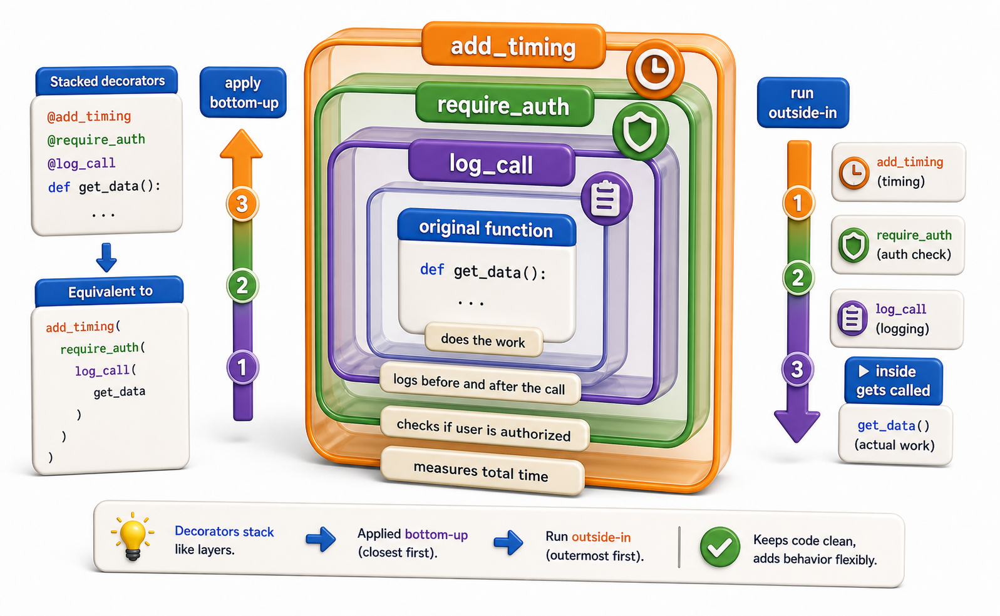

## Introduction

Kiran has three decorators: `@add_timing`, `@require_auth`, and `@log_call`. She wants to apply all three to one endpoint handler. She writes:

```python
@add_timing
@require_auth
@log_call
def get_book(isbn):
    return lookup(isbn)

# Demo:
result = get_book(5)
print(f"get_book(5) ->", result)
```

It works. But the next morning she reads a bug report: the timing is measuring not just the function, but also the auth check. She realizes she does not fully know in which order the decorators applied, and whether that order matches her intent. This lesson makes it precise.



## Decorators Apply Bottom-Up at Definition Time

When Python processes a stacked decorator block, it applies the decorators **from bottom to top**: the decorator closest to the `def` runs first, its result is passed to the next decorator above, and so on.

```python
def first(fn):
    print(f"Applying first to {fn.__name__}")
    def wrapper(*args, **kwargs):
        print("first: before")
        result = fn(*args, **kwargs)
        print("first: after")
        return result
    return wrapper

def second(fn):
    print(f"Applying second to {fn.__name__}")
    def wrapper(*args, **kwargs):
        print("second: before")
        result = fn(*args, **kwargs)
        print("second: after")
        return result
    return wrapper

@first
@second
def greet(name):
    print(f"Hello, {name}")
    return name
```

When Python processes this `def`:
1. `second(greet)` runs first (bottom-up), producing `second_wrapper`.
2. `first(second_wrapper)` runs next, producing `first_wrapper`.
3. `greet` now points to `first_wrapper`.

Calling `greet("Kiran")` produces:

```
first: before
second: before
Hello, Kiran
second: after
first: after
```

**Definition order (bottom-up) is reversed from execution order (top-down).** The outermost decorator in the stack runs first when the function is called.

## A Concrete Example: Auth, Then Log, Then Time

For Kiran's endpoint, the right design question is: what should happen when an unauthorized request arrives? If `@require_auth` is innermost (closest to `def`), it runs last, meaning timing and logging already ran before auth checked anything. If `@require_auth` is outermost (topmost in the source), it is the first thing called and can reject the request before the others run.

```python
import functools

def require_auth(fn):
    @functools.wraps(fn)
    def wrapper(*args, **kwargs):
        token = kwargs.get("token")
        if token != "valid-token":
            raise PermissionError("Unauthorized")
        return fn(*args, **kwargs)
    return wrapper

def add_timing(fn):
    @functools.wraps(fn)
    def wrapper(*args, **kwargs):
        import time
        start = time.time()
        result = fn(*args, **kwargs)
        print(f"{fn.__name__} ran in {time.time() - start:.4f}s")
        return result
    return wrapper

@add_timing         # outermost: runs first on call
@require_auth       # middle: runs second
def get_book(isbn, token=None):
    return {"isbn": isbn, "title": "Dune"}

# Call with valid token:
book = get_book("978-0441013593", token="valid-token")
# get_book ran in 0.0001s

# Call without token:
try:
    get_book("978-0441013593")
except PermissionError as e:
    print(e)    # Unauthorized -- add_timing still ran, but auth stopped it
```

If Kiran wants the timer to only measure code that passed auth, she would put `@add_timing` *below* `@require_auth` (closer to `def`):

```python
@require_auth       # outermost: rejects early before timing
@add_timing         # inner: only times what passed auth
def get_book(isbn, token=None):
    return {"isbn": isbn}

# Demo:
result = get_book(5, 5)
print(f"get_book(5, 5) ->", result)
```

## The Mental Model: Nested Boxes

The clearest mental model is nested boxes. The decorator closest to `def` is the innermost box. Each decorator above it wraps around the previous layer.

```python
@A
@B
@C
def fn():
    pass

# fn = A(B(C(fn)))
# Call chain: A.wrapper -> B.wrapper -> C.wrapper -> fn

# Demo:
result = fn()
print(f"fn() ->", result)
```

Reading `@A @B @C def fn` translates directly to `fn = A(B(C(fn)))`, which is the exact mathematical composition.

## Stacking Decorators at a Glance

| Rule | Detail |
|---|---|
| Application order | Bottom-up: decorator closest to `def` runs first |
| Execution order | Top-down: outermost decorator runs first on call |
| Equivalent expression | `@A @B @C def fn` = `fn = A(B(C(fn)))` |
| Practical effect | Outermost decorator controls entry and can short-circuit |
| Best practice | Use `@functools.wraps(fn)` at every level |

## Your Turn

```python
import functools

def logged(fn):
    @functools.wraps(fn)
    def wrapper(*args, **kwargs):
        print(f"LOG: {fn.__name__} called")
        return fn(*args, **kwargs)
    return wrapper

def timed(fn):
    @functools.wraps(fn)
    def wrapper(*args, **kwargs):
        import time
        start = time.time()
        result = fn(*args, **kwargs)
        print(f"TIME: {fn.__name__} = {time.time() - start:.4f}s")
        return result
    return wrapper

@logged
@timed
def process(n):
    return sum(range(n))
```

Run `process(1000000)` and read the output. Then swap the decorator order to `@timed @logged` and run again. Note the difference in which message appears first. Explain which order makes `@logged` measure only the function's own time (not the overhead of `@timed`).

## Conclusion

Stacking decorators applies them bottom-up at definition time, creating a nesting of wrappers where the topmost decorator is the outermost layer at call time. The order has real semantic consequences: an auth check placed outermost can short-circuit before timing or logging run, while an auth check placed innermost is passed over until after other decorators have already done their work. The next lesson introduces class decorators: decorating a class definition itself rather than a function.
