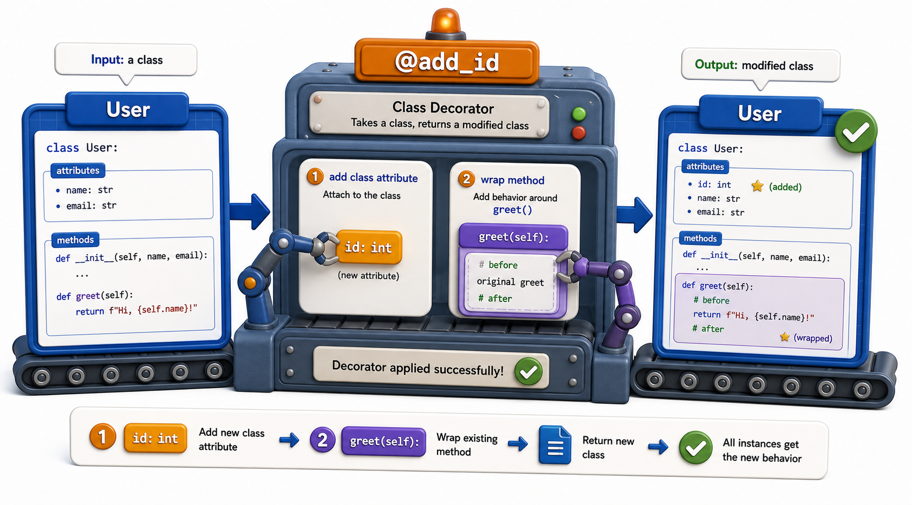

## Introduction

Kiran has been thinking of decorators as tools that apply to functions. But Python's `@` syntax works on any object that is callable and takes a single argument, which means it works on class definitions too. When she sees `@dataclass` from Unit 3 in a new light, she realizes she has been using a class decorator all along without knowing the term.

This lesson introduces class decorators: decorators that receive a class object and return a modified class (or a replacement class). It also shows how a class itself can act as a decorator for functions, by implementing `__call__`.



## Decorating a Class Definition

A class decorator receives the class object itself and returns a class. The simplest use is adding or modifying class attributes.

```python
def add_repr(cls):
    def __repr__(self):
        attrs = ", ".join(f"{k}={v!r}" for k, v in self.__dict__.items())
        return f"{cls.__name__}({attrs})"
    cls.__repr__ = __repr__
    return cls

@add_repr
class Book:
    def __init__(self, title, isbn):
        self.title = title
        self.isbn = isbn

b = Book("Dune", "978-0441013593")
print(b)   # Book(title='Dune', isbn='978-0441013593')
```

`add_repr` receives `Book`, adds a `__repr__` method to the class object, and returns the modified class. Every instance of `Book` now has a generated `__repr__`.

This is exactly what `@dataclass` does: it receives the class, inspects the field annotations, generates `__init__`, `__repr__`, and `__eq__`, adds them to the class, and returns the modified class.

## A Singleton Class Decorator

A more substantial use of class decorators: enforcing that only one instance of a class can ever exist (the Singleton pattern).

```python
def singleton(cls):
    instances = {}
    def get_instance(*args, **kwargs):
        if cls not in instances:
            instances[cls] = cls(*args, **kwargs)
        return instances[cls]
    return get_instance

@singleton
class DatabaseConnection:
    def __init__(self, url):
        self.url = url
        print(f"Connecting to {url}")

db1 = DatabaseConnection("sqlite:///library.db")
# Connecting to sqlite:///library.db

db2 = DatabaseConnection("sqlite:///library.db")
# (no second print -- same object returned)

print(db1 is db2)   # True
```

Note that `singleton` replaces the class with a function (`get_instance`). This means `isinstance(db1, DatabaseConnection)` would be `False` after the replacement. For a production singleton, a more careful implementation would preserve the class object. But this example shows the core idea: the decorator does not have to return the same class it received.

## Using a Class as a Function Decorator

A class with a `__call__` method can act as a decorator for functions. This is useful when the decorator needs to maintain state across calls, because class instances have natural attribute storage.

```python
import functools

class CallCounter:
    def __init__(self, fn):
        functools.update_wrapper(self, fn)
        self.fn = fn
        self.call_count = 0

    def __call__(self, *args, **kwargs):
        self.call_count += 1
        return self.fn(*args, **kwargs)

@CallCounter
def get_book(isbn):
    return {"isbn": isbn}

get_book("978-001")
get_book("978-002")
get_book("978-003")

print(get_book.call_count)   # 3
```

`@CallCounter` makes `get_book` an instance of `CallCounter`. Calling `get_book(...)` calls `get_book.__call__(...)`. The `call_count` attribute persists naturally on the instance. `functools.update_wrapper(self, fn)` serves the same role as `@functools.wraps(fn)` for class-based wrappers.

## When to Use Class Decorators

Function decorators (closures) are shorter and cover most cases. Class decorators are worth choosing when:
- The decorator needs significant state (a counter, a cache, a configuration object) that would clutter a closure.
- You want the decorated object to have attributes the caller can inspect or modify (like `get_book.call_count`).
- You are decorating a class definition itself to add methods, enforce constraints, or replace the class with a managed version.

## Class Decorators at a Glance

| Use | Pattern | Example |
|---|---|---|
| Decorate a class definition | `def decorator(cls): ...; return cls` | `@add_repr`, `@dataclass`, `@singleton` |
| Class as a function decorator | `class Decorator: def __call__(self, ...)` | `@CallCounter` |
| State in a function decorator | Use a closure with a mutable container | Simpler for light state |
| State in a class decorator | Use `self.attribute` | Cleaner for heavier state |

## Your Turn

Write a `@register` class decorator that keeps a registry of all decorated classes. Each class that receives `@register` is added to a module-level dictionary keyed by the class name.

```python
registry = {}

def register(cls):
    registry[cls.__name__] = cls
    return cls

@register
class Book:
    pass

@register
class EBook:
    pass

print(registry)
# {'Book': <class '__main__.Book'>, 'EBook': <class '__main__.EBook'>}
```

Then add a `@register` to a third class and confirm it appears in the registry without any manual insertion. This pattern is used by plugin systems, ORM field registration, and web framework route registration.

## Conclusion

Class decorators apply the `@` syntax to class definitions, receiving the class object and returning a modified or replacement class. The same mechanism underlies `@dataclass`. Classes with `__call__` can also act as function decorators, providing natural attribute storage for state. The final lesson of this unit collects the most widely-used real-world decorators into one place, showing timing, caching, and logging in production-grade form.
