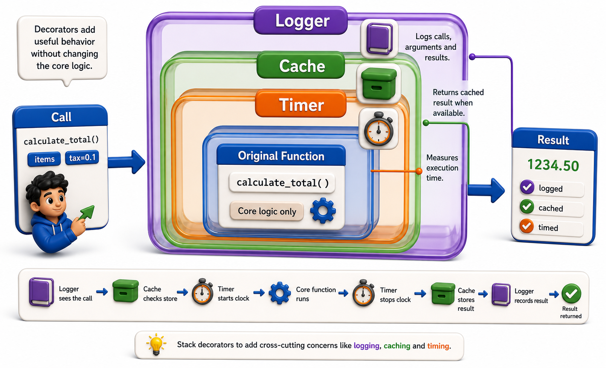

## Introduction

Kiran's unit is being deployed, and her team asks for three things: timing on every endpoint so they can identify slow calls, caching on expensive database lookups so the same query is not repeated hundreds of times a minute, and structured logging so they can trace what happened when something goes wrong. She has all the pieces from the previous lessons. This final lesson assembles them into production-quality versions of all three, the kind you would actually use in a real codebase.



## A Production-Grade Timing Decorator

The version from earlier lessons printed timing to stdout. A production timing decorator should go through `logging`, work with `functools.wraps`, and optionally accept a label.

```python
import time
import logging
import functools

logger = logging.getLogger(__name__)

def timed(fn=None, *, label=None):
    if fn is None:
        return functools.partial(timed, label=label)

    @functools.wraps(fn)
    def wrapper(*args, **kwargs):
        name = label or fn.__name__
        start = time.perf_counter()
        try:
            result = fn(*args, **kwargs)
            elapsed = time.perf_counter() - start
            logger.debug(f"{name} completed in {elapsed:.4f}s")
            return result
        except Exception:
            elapsed = time.perf_counter() - start
            logger.warning(f"{name} raised after {elapsed:.4f}s")
            raise
    return wrapper

logging.basicConfig(level=logging.DEBUG)

@timed
def load_catalog(size):
    return list(range(size))

@timed(label="search-op")
def search(query, catalog):
    return [x for x in catalog if query in str(x)]

catalog = load_catalog(1000)
results = search("5", catalog)

# Demo:
result = timed(5, "test", "example")
print(f"timed(5, "test", "example") ->", result)
result = load_catalog(5)
print(f"load_catalog(5) ->", result)
```

Two things to note: `time.perf_counter()` is more precise than `time.time()` for measuring elapsed CPU time; and logging the failure time on exception gives visibility into slow failures, not just slow successes.

## A Caching Decorator: functools.lru_cache

Python's standard library provides a battle-tested caching decorator. `@functools.lru_cache` memoizes a function's return values by argument, evicting the Least Recently Used entry when the cache hits its size limit.

```python
import functools

@functools.lru_cache(maxsize=128)
def lookup_book(isbn):
    print(f"  [DB query for {isbn}]")   # only runs on cache miss
    return {"isbn": isbn, "title": f"Book {isbn}"}

print(lookup_book("978-001"))   # [DB query for 978-001] -- cache miss
print(lookup_book("978-002"))   # [DB query for 978-002] -- cache miss
print(lookup_book("978-001"))   # (no query) -- cache hit
print(lookup_book("978-001"))   # (no query) -- cache hit

print(lookup_book.cache_info())
# CacheInfo(hits=2, misses=2, maxsize=128, currsize=2)
```

`lru_cache` requires the function's arguments to be hashable (no lists or dicts as arguments, since they cannot be used as dictionary keys). For mutable arguments, build a custom key and use a dictionary, or use `functools.cache` (Python 3.9+, equivalent to `lru_cache(maxsize=None)`).

## A Structured Logging Decorator

Beyond timing, a logging decorator can record the function name, arguments, result, and any exception, producing a structured trace that is searchable in a log aggregation system.

```python
import functools
import logging

def log_call(fn):
    @functools.wraps(fn)
    def wrapper(*args, **kwargs):
        logging.info(f"ENTER {fn.__name__} | args={args} kwargs={kwargs}")
        try:
            result = fn(*args, **kwargs)
            logging.info(f"EXIT  {fn.__name__} | result={result!r}")
            return result
        except Exception as exc:
            logging.error(f"ERROR {fn.__name__} | {type(exc).__name__}: {exc}")
            raise
    return wrapper

logging.basicConfig(level=logging.INFO)

@log_call
def reserve_book(isbn, patron_id):
    if not isbn.startswith("978"):
        raise ValueError(f"Invalid ISBN: {isbn}")
    return {"isbn": isbn, "patron": patron_id, "status": "reserved"}

reserve_book("978-0441013593", "P001")
reserve_book("invalid", "P002")   # error!

# Demo:
result = log_call(5)
print(f"log_call(5) ->", result)
result = reserve_book(5, 5)
print(f"reserve_book(5, 5) ->", result)
```

## Combining All Three

With `@functools.wraps` applied at every level, these decorators compose correctly:

```python
@timed
@log_call
@functools.lru_cache(maxsize=64)
def get_book_with_details(isbn):
    """Fetch book details by ISBN."""
    return {"isbn": isbn, "title": f"Book {isbn}"}

book = get_book_with_details("978-001")

# Demo:
result = get_book_with_details(5)
print(f"get_book_with_details(5) ->", result)
```

The `@lru_cache` is innermost (checks and populates the cache). `@log_call` wraps around it (logs each call, including cache hits). `@timed` is outermost (measures total time including logging overhead). The function's name and docstring are preserved throughout.

## Real-World Decorators at a Glance

| Decorator | Standard library | What it adds |
|---|---|---|
| Timing | Roll your own with `time.perf_counter` and `logging` | Elapsed time per call |
| Caching | `@functools.lru_cache(maxsize=N)` | Memoize by arguments |
| Logging | Roll your own with the `logging` module | ENTER/EXIT/ERROR trace |
| Retrying | Roll your own with a for-loop and try/except | Retry on exception |

## Your Turn

Apply all three production-quality decorators to a single function:

```python
@timed
@log_call
@functools.lru_cache(maxsize=32)
def load_patron(patron_id):
    """Fetch patron details by ID."""
    return {"id": patron_id, "name": f"Patron {patron_id}"}

load_patron("P001")
load_patron("P002")
load_patron("P001")   # should be a cache hit
print(load_patron.cache_info())
```

Confirm that the second call to `"P001"` does not log `ENTER` again (it is a cache hit; the wrapped function is not called). If your `@log_call` decorator logs the hit, discuss why: `@log_call` is outside `@lru_cache`, so it runs on every call regardless of the cache. Explain which order places `@log_call` inside the cache (so only misses log).

## Conclusion

Production decorators combine `functools.wraps` for identity preservation, the `logging` module for output, `time.perf_counter` for precision timing, and `functools.lru_cache` for memoization. Stacking them composes these capabilities without changing the decorated function itself. Unit 6 moves from wrapping functions to wrapping resource acquisition and release: context managers, which guarantee cleanup runs even when exceptions occur.
