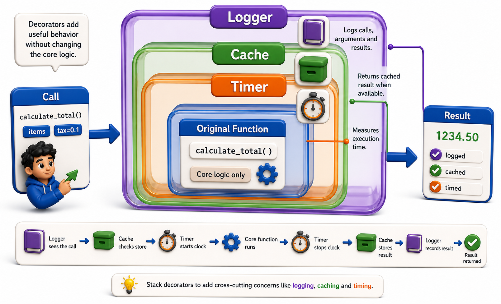
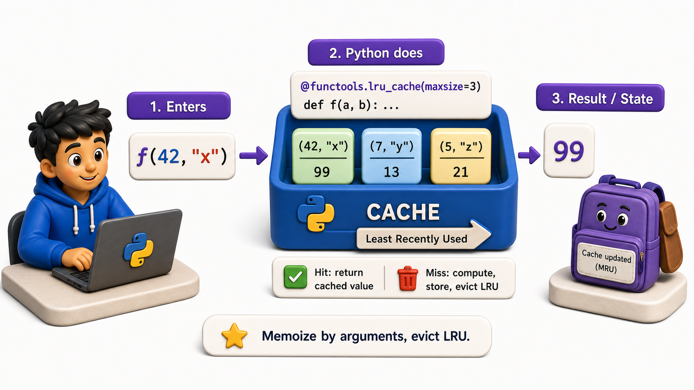
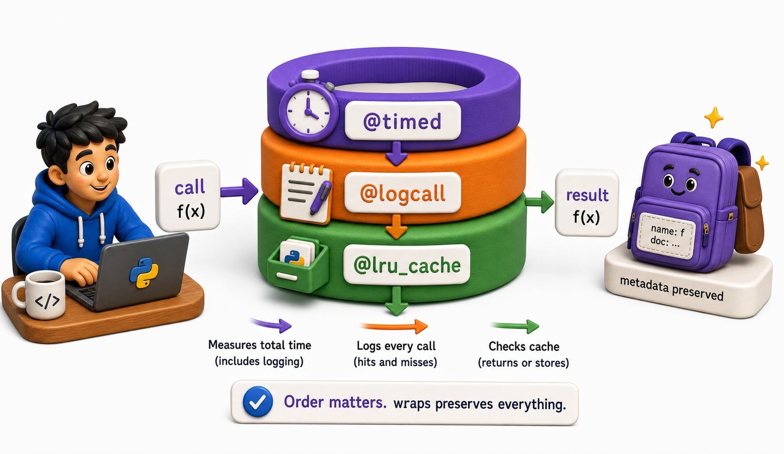

## Introduction

Kiran's unit is being deployed, and her team asks for three things: timing on every endpoint so they can identify slow calls, caching on expensive database lookups so the same query is not repeated hundreds of times a minute, and structured logging so they can trace what happened when something goes wrong. She has all the pieces from the previous lessons. This final lesson assembles them into production-quality versions of all three, the kind you would actually use in a real codebase.

**Definition:** Real-world `decorators` add reusable behaviour such as timing, caching, and logging around a function without changing the function's core logic.



## A Production-Grade Timing Decorator

The version from earlier lessons printed timing to stdout. A production timing decorator should go through `logging`, work with `functools.wraps`, and optionally accept a label.

```python
import time
import logging
import functools

logger = logging.getLogger(__name__)

def timed(fn=None, *, label=None):
    if fn is None:
        return functools.partial(timed, label=label)

    @functools.wraps(fn)
    def wrapper(*args, **kwargs):
        name = label or fn.__name__
        start = time.perf_counter()
        try:
            result = fn(*args, **kwargs)
            elapsed = time.perf_counter() - start
            logger.debug(f"{name} completed in {elapsed:.4f}s")
            return result
        except Exception:
            elapsed = time.perf_counter() - start
            logger.warning(f"{name} raised after {elapsed:.4f}s")
            raise
    return wrapper

logging.basicConfig(level=logging.DEBUG)

@timed
def load_catalog(size):
    return list(range(size))

@timed(label="search-op")
def search(query, catalog):
    return [x for x in catalog if query in str(x)]

catalog = load_catalog(1000)
results = search("5", catalog)

# Demo:
print(f"load_catalog(1000) -> list of {len(catalog)} items")
print(f"search('5', catalog) -> {len(results)} matches")
```

Two things to note: `time.perf_counter()` is more precise than `time.time()` for measuring elapsed CPU time; and logging the failure time on exception gives visibility into slow failures, not just slow successes.

## A Caching Decorator: functools.lru_cache



Python's standard library provides a battle-tested caching decorator. `@functools.lru_cache` memoizes a function's return values by argument, evicting the Least Recently Used entry when the cache hits its size limit.

```python
import functools

@functools.lru_cache(maxsize=128)
def lookup_book(isbn):
    print(f"  [DB query for {isbn}]")   # only runs on cache miss
    return {"isbn": isbn, "title": f"Book {isbn}"}

print(lookup_book("978-001"))   # [DB query for 978-001] -- cache miss
print(lookup_book("978-002"))   # [DB query for 978-002] -- cache miss
print(lookup_book("978-001"))   # (no query) -- cache hit
print(lookup_book("978-001"))   # (no query) -- cache hit

print(lookup_book.cache_info())
# CacheInfo(hits=2, misses=2, maxsize=128, currsize=2)
```

`lru_cache` requires the function's arguments to be hashable (no lists or dicts as arguments, since they cannot be used as dictionary keys). For mutable arguments, build a custom key and use a dictionary, or use `functools.cache` (Python 3.9+, equivalent to `lru_cache(maxsize=None)`).

## A Structured Logging Decorator

Beyond timing, a logging decorator can record the function name, arguments, result, and any exception, producing a structured trace that is searchable in a log aggregation system.

```python
import functools
import logging

def log_call(fn):
    @functools.wraps(fn)
    def wrapper(*args, **kwargs):
        logging.info(f"ENTER {fn.__name__} | args={args} kwargs={kwargs}")
        try:
            result = fn(*args, **kwargs)
            logging.info(f"EXIT  {fn.__name__} | result={result!r}")
            return result
        except Exception as exc:
            logging.error(f"ERROR {fn.__name__} | {type(exc).__name__}: {exc}")
            raise
    return wrapper

logging.basicConfig(level=logging.INFO)

@log_call
def reserve_book(isbn, patron_id):
    if not isbn.startswith("978"):
        raise ValueError(f"Invalid ISBN: {isbn}")
    return {"isbn": isbn, "patron": patron_id, "status": "reserved"}

reserve_book("978-0441013593", "P001")
try:
    reserve_book("invalid", "P002")   # error!
except ValueError as e:
    print(f"ValueError: {e}")
```

## Combining All Three



With `@functools.wraps` applied at every level, these decorators compose correctly:

```python
import time
import logging
import functools

logging.basicConfig(level=logging.DEBUG)

def timed(fn=None, *, label=None):
    if fn is None:
        return functools.partial(timed, label=label)

    @functools.wraps(fn)
    def wrapper(*args, **kwargs):
        name = label or fn.__name__
        start = time.perf_counter()
        try:
            result = fn(*args, **kwargs)
            elapsed = time.perf_counter() - start
            logging.debug(f"{name} completed in {elapsed:.4f}s")
            return result
        except Exception:
            elapsed = time.perf_counter() - start
            logging.warning(f"{name} raised after {elapsed:.4f}s")
            raise
    return wrapper

def log_call(fn):
    @functools.wraps(fn)
    def wrapper(*args, **kwargs):
        logging.info(f"ENTER {fn.__name__} | args={args} kwargs={kwargs}")
        try:
            result = fn(*args, **kwargs)
            logging.info(f"EXIT  {fn.__name__} | result={result!r}")
            return result
        except Exception as exc:
            logging.error(f"ERROR {fn.__name__} | {type(exc).__name__}: {exc}")
            raise
    return wrapper

@timed
@log_call
@functools.lru_cache(maxsize=64)
def get_book_with_details(isbn):
    """Fetch book details by ISBN."""
    return {"isbn": isbn, "title": f"Book {isbn}"}

book = get_book_with_details("978-001")

# Demo:
result = get_book_with_details(5)
print(f"get_book_with_details(5) ->", result)
```

The `@lru_cache` is innermost (checks and populates the cache). `@log_call` wraps around it (logs each call, including cache hits). `@timed` is outermost (measures total time including logging overhead). The function's name and docstring are preserved throughout.

## Real-World Decorators at a Glance

| Decorator | Standard library | What it adds |
|---|---|---|
| Timing | Roll your own with `time.perf_counter` and `logging` | Elapsed time per call |
| Caching | `@functools.lru_cache(maxsize=N)` | Memoize by arguments |
| Logging | Roll your own with the `logging` module | ENTER/EXIT/ERROR trace |
| Retrying | Roll your own with a for-loop and try/except | Retry on exception |

## From Example to Production

Realworld Decorators Timing Caching Logging becomes dependable only when its boundaries are as deliberate as its main example. A decorator changes a callable's contract, so the wrapper must be as carefully designed as the wrapped function. Preserve metadata with `functools.wraps`, forward arguments transparently, return the original result, and decide how exceptions should propagate. Keep configuration outside per-call work when possible. Tests should cover metadata, return values, exceptions, and stacked order, not only the extra logging or timing side effect.

## Common Mistakes and Engineering Checks

- Forgetting to return either the wrapper at decoration time or the wrapped result at call time.
- Losing names, docstrings, and signatures by omitting `functools.wraps`.
- Catching exceptions inside a generic decorator and silently changing failure behavior.

Before treating the implementation as complete, answer these checks:

- Is the original contract preserved?
- When does configuration execute?
- What happens when decorators are stacked?

## Check Your Understanding

Explain realworld decorators timing caching logging to a teammate without using framework vocabulary. Then change one success condition in the lesson's example into a failure: invalid input, unavailable resource, timeout, or worker exception. Predict the visible output and program state before running it. Finally, write one automated test that proves cleanup or rollback still happens. This exercise distinguishes code that demonstrates syntax from code that preserves a contract under pressure.
## Your Turn

Apply all three production-quality decorators to a single function:

```python
import time
import logging
import functools

logging.basicConfig(level=logging.DEBUG)

def timed(fn=None, *, label=None):
    if fn is None:
        return functools.partial(timed, label=label)

    @functools.wraps(fn)
    def wrapper(*args, **kwargs):
        name = label or fn.__name__
        start = time.perf_counter()
        try:
            result = fn(*args, **kwargs)
            elapsed = time.perf_counter() - start
            logging.debug(f"{name} completed in {elapsed:.4f}s")
            return result
        except Exception:
            elapsed = time.perf_counter() - start
            logging.warning(f"{name} raised after {elapsed:.4f}s")
            raise
    return wrapper

def log_call(fn):
    @functools.wraps(fn)
    def wrapper(*args, **kwargs):
        logging.info(f"ENTER {fn.__name__} | args={args} kwargs={kwargs}")
        try:
            result = fn(*args, **kwargs)
            logging.info(f"EXIT  {fn.__name__} | result={result!r}")
            return result
        except Exception as exc:
            logging.error(f"ERROR {fn.__name__} | {type(exc).__name__}: {exc}")
            raise
    return wrapper

@timed
@log_call
@functools.lru_cache(maxsize=32)
def load_patron(patron_id):
    """Fetch patron details by ID."""
    return {"id": patron_id, "name": f"Patron {patron_id}"}

load_patron("P001")
load_patron("P002")
load_patron("P001")   # logs ENTER again: @log_call sits outside @lru_cache
# cache_info() itself is only on the innermost function; @functools.wraps
# copies __wrapped__ but not cache_info, so reach it through the chain:
print(load_patron.__wrapped__.__wrapped__.cache_info())
```

Confirm that the second call to `"P001"` does not log `ENTER` again (it is a cache hit; the wrapped function is not called). If your `@log_call` decorator logs the hit, discuss why: `@log_call` is outside `@lru_cache`, so it runs on every call regardless of the cache. Explain which order places `@log_call` inside the cache (so only misses log).

## Conclusion

Production decorators combine `functools.wraps` for identity preservation, the `logging` module for output, `time.perf_counter` for precision timing, and `functools.lru_cache` for memoization. Stacking them composes these capabilities without changing the decorated function itself. Unit 6 moves from wrapping functions to wrapping resource acquisition and release: context managers, which guarantee cleanup runs even when exceptions occur.
