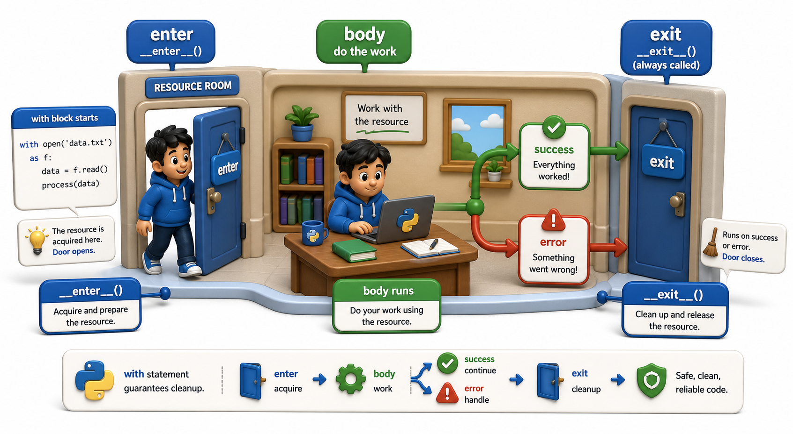

## Introduction

Tara's file-handling code from Semester 1 always used `with open(...)` without really understanding why. She just knew it was the correct way and that forgetting it could leave files open. Now she is writing database code and her connection is leaking: when her query raises an exception, the connection is never closed, and the test environment eventually runs out of connections.

Her tech lead tells her the fix is the same pattern as `with open(...)`, but for her database. The `with` statement is not limited to files. It is a general mechanism for managing *any* resource that needs guaranteed cleanup, and this unit explains exactly how it works and how to build your own.



## What the with Statement Guarantees

The `with` statement guarantees that a cleanup action runs, regardless of whether the body finishes normally, raises an exception, or even calls `return` inside a function. This guarantee is the entire reason `with open(...)` is preferred over manually calling `file.close()`.

```python
import io

catalog_data = "isbn,title\n978-001,Dune\n978-002,Foundation\n"

def process(content):
    lines = content.strip().split("\n")
    print(f"Processed {len(lines)} lines")

# Without with: close() may be skipped if process() raises
file = io.StringIO(catalog_data)
try:
    content = file.read()
    process(content)
    file.close()
    print(f"File closed manually (closed={file.closed})")
except Exception as e:
    print(f"Error: {e} -- file may still be open!")

# With with: close() ALWAYS runs, exception or not
with io.StringIO(catalog_data) as file:
    content = file.read()
    process(content)
print(f"After with block: file closed automatically (closed={file.closed})")
```

The `with` statement's guarantee is unconditional: teardown always runs, even on exceptions, even on `break`, even on `return`. The `try`/`finally` equivalent shows this clearly:

```python
import io

catalog_data = "isbn,title\n978-001,Dune\n978-002,Foundation\n"

file = io.StringIO(catalog_data)
try:
    content = file.read()
    print(f"Read: {len(content)} chars")
finally:
    file.close()   # guaranteed to run even if an exception occurs above
    print(f"Cleaned up: file.closed={file.closed}")
```

`with` is syntactic sugar for this `try`/`finally` pattern, but cleaner and harder to get wrong.

## The Two Pieces: Enter and Exit

The `with` statement works by calling two methods on the object it receives: one to set up the resource (called when the `with` block starts) and one to tear it down (called when the block ends, no matter how).

```python
import io

catalog_data = "isbn,title\n978-001,Dune\n978-002,Foundation\n"

with io.StringIO(catalog_data) as file:
    # file is the value returned by the "enter" step (__enter__)
    content = file.read()
    print(f"Inside with block: {content.strip()}")
# __exit__ runs here, unconditionally
print(f"After with block: closed={file.closed}")
```

The `as file` clause captures the value returned by the setup step. The teardown step is called automatically, with information about whether an exception occurred. The names of these steps are `__enter__` and `__exit__`, and the next lesson explains exactly what they do.

## Multiple Context Managers in One With

Python allows multiple context managers in a single `with` statement, separated by commas. All setup steps run in order; all teardown steps run in reverse order.

```python
import io

catalog_data = "isbn,title\n978-001,Dune\n978-002,Foundation\n"

with io.StringIO(catalog_data) as source, io.StringIO() as dest:
    for line in source:
        dest.write(line.upper())
    result = dest.getvalue()
# Both are closed here, even if an exception occurred mid-copy
print("Uppercased catalog:")
print(result)
```

This is equivalent to nested `with` statements but more concise.

## The as Clause Is Optional

When a context manager's setup step does not return a useful value, the `as` clause can be omitted:

```python
import threading

lock = threading.Lock()
shared_count = 0

def update_shared_state():
    global shared_count
    shared_count += 1

with lock:
    # lock is acquired on __enter__, released on __exit__
    update_shared_state()   # safe: only one thread at a time
    print(f"Inside with: lock.locked()={lock.locked()}")
# lock released here automatically
print(f"After with: lock.locked()={lock.locked()}, count={shared_count}")
```

## The with Statement at a Glance

| Concept | What it means |
|---|---|
| Setup step | Called automatically when the `with` block starts |
| Body | Code inside the `with` block |
| Teardown step | Called automatically when the block ends, exception or not |
| `as name` | Binds the value returned by the setup step |
| Multiple managers | `with A() as a, B() as b:` runs both, tears down in reverse |

## Your Turn

```python
import io

# Manual resource management -- fragile (close may be skipped on exception)
catalog = io.StringIO()
catalog.write("Book A\nBook B\n")
content = catalog.getvalue()
catalog.close()
print(f"Manual: wrote {len(content)} chars, closed={catalog.closed}")

# Context manager version -- close is always guaranteed
with io.StringIO() as catalog:
    catalog.write("Book A\nBook B\n")
    content = catalog.getvalue()
# closed here regardless of exceptions
print(f"With:   wrote {len(content)} chars, closed after block={catalog.closed}")
```

Read both versions. Now deliberately cause an exception in the `write` call (e.g., write a non-string type and observe the `TypeError`). Confirm that with the manual version, the file handle may not be flushed or closed; with the `with` version, the cleanup runs correctly. Then look at your own Semester 1 file-handling code and identify any places where you used manual `open`/`close` that could be replaced with `with`.

## Conclusion

The `with` statement guarantees setup and teardown, regardless of exceptions. It is equivalent to `try`/`finally` but cleaner and harder to misuse. It works for any object that implements the two-method protocol Python calls when the block starts and ends. The next lesson names and explains those two methods: `__enter__` and `__exit__`, which together form the context manager protocol.
