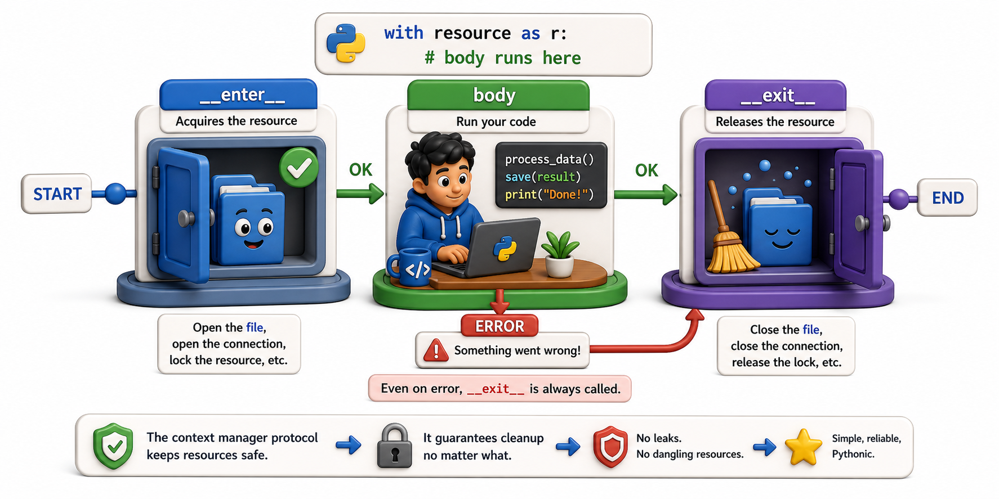

## Introduction

Tara now knows that `with open(...)` works because Python calls two methods on the file object. She wants to know exactly what those methods are, what arguments they receive, and what their return values mean, so she can write something that works the same way for her database connection.

This lesson answers those questions precisely. The context manager protocol is two methods: `__enter__` and `__exit__`. Once you know what each one receives and returns, building your own context manager is mechanical.



## __enter__: Setting Up the Resource

`__enter__(self)` is called when the `with` block starts. Its return value is what gets bound to the `as` variable.

```python
class SimpleResource:
    def __enter__(self):
        print("Setting up")
        return self   # this is what 'as resource' receives

    def __exit__(self, exc_type, exc_val, exc_tb):
        print("Tearing down")
        return False  # do not suppress exceptions

with SimpleResource() as resource:
    print("Inside the with block")
    print(f"resource is: {resource}")

# Output:
# Setting up
# Inside the with block
# resource is: <__main__.SimpleResource object at ...>
# Tearing down
```

`__enter__` can return anything: `self`, a completely different object (like a file object's `__enter__` returns the file itself), or `None` (if no value is needed).

## __exit__: Tearing Down and Handling Exceptions

`__exit__(self, exc_type, exc_val, exc_tb)` receives three arguments describing any exception that occurred inside the `with` block:

- `exc_type`: the exception class, or `None` if no exception occurred
- `exc_val`: the exception instance, or `None`
- `exc_tb`: the traceback object, or `None`

If the body completed without an exception, all three are `None`. If an exception occurred, all three carry information about it.

The return value of `__exit__` controls what happens to the exception:
- Return `False` (or `None`, or any falsy value): the exception propagates normally.
- Return `True`: the exception is suppressed (swallowed). Use this deliberately and rarely.

```python
class SimpleResource:
    def __enter__(self):
        print("Setting up")
        return self

    def __exit__(self, exc_type, exc_val, exc_tb):
        print(f"Tearing down | exception: {exc_type}")
        return False   # do not suppress

# No exception:
with SimpleResource():
    print("Normal exit")
# Setting up
# Normal exit
# Tearing down | exception: None

# With exception:
try:
    with SimpleResource():
        raise ValueError("Something went wrong")
except ValueError:
    print("Exception propagated as expected")
# Setting up
# Tearing down | exception: <class 'ValueError'>
# Exception propagated as expected
```

`__exit__` always runs. The `try`/`except` outside the `with` block catches the exception *after* `__exit__` has already been called.

## A Practical Protocol Demonstration: Timed Block

Here is a context manager that measures how long a code block takes:

```python
import time

class Timer:
    def __enter__(self):
        self._start = time.perf_counter()
        return self   # gives access to elapsed after the block

    def __exit__(self, exc_type, exc_val, exc_tb):
        self.elapsed = time.perf_counter() - self._start
        print(f"Elapsed: {self.elapsed:.4f}s")
        return False   # always let exceptions propagate

with Timer() as t:
    total = sum(range(1_000_000))

print(f"Total: {total}, took: {t.elapsed:.4f}s")
```

The `as t` clause makes `t` point to the `Timer` instance returned by `__enter__`. After the block, `t.elapsed` holds the measured time.

## What Makes a Valid Context Manager

An object is a valid context manager if it has both `__enter__` and `__exit__`. The `with` statement calls neither directly; it calls them through the protocol, which means any class implementing both methods works.

```python
class NullContext:
    """A context manager that does nothing -- useful for optional nesting."""
    def __enter__(self):
        return None
    def __exit__(self, *args):
        return False

# Demo:
obj = NullContext()
print(obj)
```

## The Context Manager Protocol at a Glance

| Method | When called | Arguments | Return value |
|---|---|---|---|
| `__enter__(self)` | When the `with` block starts | None | The value bound to `as` |
| `__exit__(self, exc_type, exc_val, exc_tb)` | When the block ends (any reason) | Exception info or three `None`s | `True` suppresses the exception; falsy propagates it |

## Your Turn

```python
class SafeWriter:
    def __init__(self, filename):
        self.filename = filename
        self.file = None

    def __enter__(self):
        self.file = open(self.filename, "w")
        return self.file

    def __exit__(self, exc_type, exc_val, exc_tb):
        if self.file:
            self.file.close()
            print(f"Closed {self.filename}")
        if exc_type is not None:
            print(f"An error occurred: {exc_val}")
        return False   # do not suppress
```

Test this with a successful write (`with SafeWriter("test.txt") as f: f.write("hello")`), then test with a forced exception inside the block. Confirm the file is closed and the message is printed even when an exception occurs.

## Conclusion

`__enter__` runs when the `with` block starts and returns the value bound to `as`. `__exit__` runs unconditionally when the block ends and receives exception information if one occurred. Returning `False` (the default) lets exceptions propagate; returning `True` suppresses them. The next lesson shows how to use these two methods to build a complete, practical context manager for Tara's database connection.
