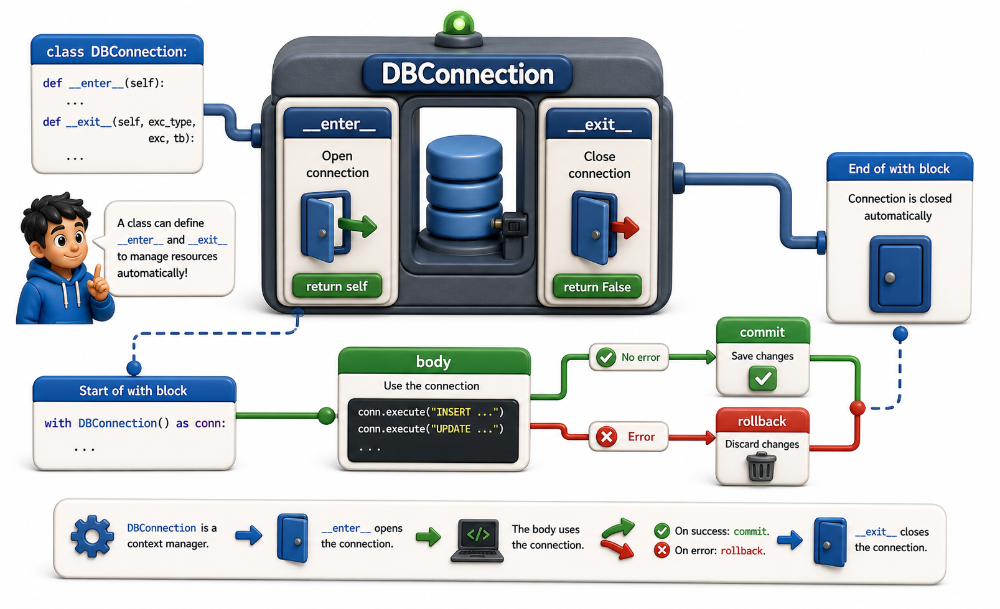

## Introduction

Tara is ready to fix the leaking database connection. She knows `__enter__` opens the connection and `__exit__` closes it. She needs to make sure the connection is closed even if a query raises an exception. And since she is working with a real database, she also needs `__exit__` to roll back any in-progress transaction when an exception occurs, rather than leaving it in a half-committed state.

This lesson builds the full class-based context manager she needs, handling both the success path and the exception path correctly.



## A Database Connection Context Manager

```python
import sqlite3

class ManagedConnection:
    def __init__(self, db_path):
        self.db_path = db_path
        self.connection = None

    def __enter__(self):
        self.connection = sqlite3.connect(self.db_path)
        return self.connection   # return the connection for use in the body

    def __exit__(self, exc_type, exc_val, exc_tb):
        if exc_type is not None:
            # an exception occurred: roll back to avoid partial writes
            self.connection.rollback()
            print(f"Rolled back due to: {exc_val}")
        else:
            # success: commit the transaction
            self.connection.commit()
        self.connection.close()
        return False   # always let the exception propagate

with ManagedConnection(":memory:") as conn:
    conn.execute("CREATE TABLE books (isbn TEXT, title TEXT)")
    conn.execute("INSERT INTO books VALUES ('978-001', 'Dune')")
# committed and closed -- normal exit

try:
    with ManagedConnection(":memory:") as conn:
        conn.execute("CREATE TABLE books (isbn TEXT, title TEXT)")
        conn.execute("INSERT INTO books VALUES ('978-001', 'Dune')")
        raise RuntimeError("Something went wrong mid-transaction")
except RuntimeError:
    pass   # rolled back and closed
```

The second block rolls back automatically. Without `ManagedConnection`, the connection would be left open and the half-completed transaction would need to be manually rolled back, or worse, left in an inconsistent state.

## Making the Connection Reusable With a Pattern

If the same connection is used across many operations, a context manager that closes the connection every time is too aggressive. A better pattern is a transaction manager that shares a long-lived connection but commits or rolls back individual transactions:

```python
class Transaction:
    def __init__(self, connection):
        self.connection = connection

    def __enter__(self):
        return self.connection.cursor()

    def __exit__(self, exc_type, exc_val, exc_tb):
        if exc_type is not None:
            self.connection.rollback()
        else:
            self.connection.commit()
        return False

conn = sqlite3.connect(":memory:")
conn.execute("CREATE TABLE books (isbn TEXT, title TEXT)")

with Transaction(conn) as cursor:
    cursor.execute("INSERT INTO books VALUES ('978-001', 'Dune')")

with Transaction(conn) as cursor:
    cursor.execute("INSERT INTO books VALUES ('978-002', 'Foundation')")

result = conn.execute("SELECT * FROM books").fetchall()
print(result)
# [('978-001', 'Dune'), ('978-002', 'Foundation')]
conn.close()
```

## Tracking State Across Enter and Exit

`__enter__` and `__exit__` share state through `self`. Any data stored on the instance in `__enter__` is accessible in `__exit__`. This is the clean solution to the problem that `try`/`finally` often forces: declaring variables outside the `try` block and using them inside `finally`.

```python
class OperationTimer:
    def __enter__(self):
        import time
        self._start = time.perf_counter()
        return self

    def __exit__(self, exc_type, exc_val, exc_tb):
        import time
        self.elapsed = time.perf_counter() - self._start
        if exc_type is not None:
            print(f"Failed after {self.elapsed:.4f}s: {exc_val}")
        else:
            print(f"Completed in {self.elapsed:.4f}s")
        return False

with OperationTimer() as timer:
    data = [x ** 2 for x in range(100_000)]

print(f"We have access to elapsed after the block: {timer.elapsed:.4f}s")
```

## Class-Based Context Manager at a Glance

| Step | Method | Typical actions |
|---|---|---|
| Setup | `__enter__` | Open file, acquire lock, start transaction, record time |
| Success path | `__exit__` with `exc_type is None` | Commit, flush, release cleanly |
| Failure path | `__exit__` with `exc_type` set | Rollback, log error, release anyway |
| Suppress exception | Return `True` from `__exit__` | Use deliberately and rarely |
| Propagate exception | Return `False` from `__exit__` | The usual behavior |

## Your Turn

Write a `TempDirectory` context manager that creates a temporary directory in `__enter__` (using the `tempfile` module: `tempfile.mkdtemp()`) and removes it with all its contents in `__exit__` (using `shutil.rmtree()`). Test it by creating a file inside the temporary directory during the `with` block, then confirming the directory and the file are both gone after the block exits.

```python
import tempfile
import shutil
import os

class TempDirectory:
    def __enter__(self):
        self.path = tempfile.mkdtemp()
        print(f"Created: {self.path}")
        return self.path

    def __exit__(self, exc_type, exc_val, exc_tb):
        shutil.rmtree(self.path)
        print(f"Removed: {self.path}")
        return False

with TempDirectory() as tmpdir:
    filepath = os.path.join(tmpdir, "test.txt")
    with open(filepath, "w") as f:
        f.write("temporary data")
    print(f"File exists: {os.path.exists(filepath)}")   # True

print(f"Dir exists after block: {os.path.exists(tmpdir)}")   # False
```

## Conclusion

A class-based context manager implements `__enter__` for setup and `__exit__` for teardown, with the exception arguments in `__exit__` allowing different behavior on success versus failure. State is shared between the two methods via `self`. This pattern is ideal when the setup involves multiple steps, the teardown is complex, or the manager needs to expose attributes (like `timer.elapsed`) after the block completes. The next lesson shows a shorter way to write simple context managers using `contextlib.contextmanager` and `yield`.
