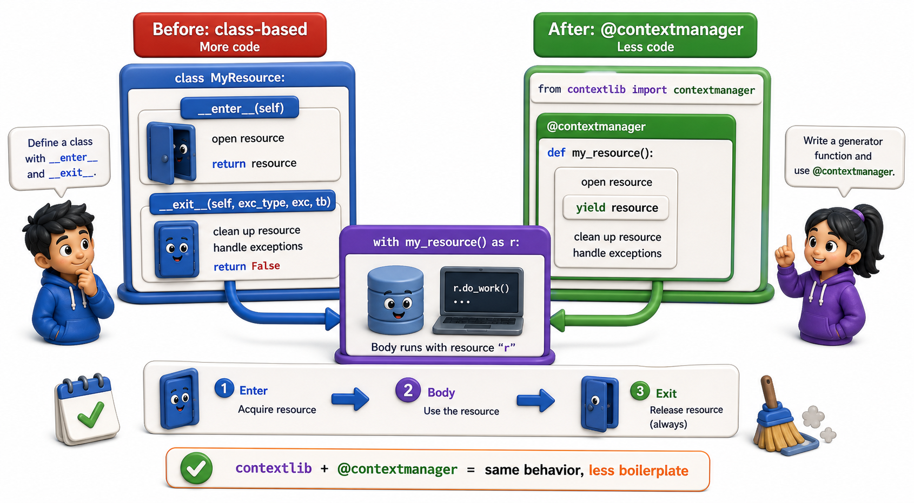

## Introduction

Tara has just written a full class-based context manager. It works perfectly, but she notices it is twelve lines of boilerplate for a straightforward open-then-close pattern. She wonders if Python has a shorter way to write context managers for cases where the setup and teardown fit naturally in a single function.

Python does. The `contextlib` module includes a decorator called `@contextmanager` that lets you write a context manager using a generator function with a single `yield`. No class required.



## @contextmanager: the Generator Shortcut

`@contextmanager` turns a generator function into a context manager. The code before `yield` runs as `__enter__`, the yielded value becomes the `as` target, and the code after `yield` runs as `__exit__`.

```python
from contextlib import contextmanager

@contextmanager
def managed_connection(db_path):
    import sqlite3
    conn = sqlite3.connect(db_path)
    try:
        yield conn        # "enter": conn is bound to the as-variable
    finally:
        conn.close()      # "exit": always runs

with managed_connection(":memory:") as conn:
    conn.execute("CREATE TABLE books (isbn TEXT, title TEXT)")
    print("Done")
# conn is closed here
```

The `try`/`finally` around `yield` is what makes the cleanup unconditional. If an exception is raised inside the `with` block, it is thrown *into* the generator at the `yield` point, the `finally` runs, and the exception propagates.

## Handling Exceptions in @contextmanager

When an exception occurs inside the `with` block, `@contextmanager` re-raises it at the `yield` point inside the generator. Wrapping `yield` in `try`/`except` lets you catch and respond to it, exactly like `__exit__`'s exception arguments.

```python
from contextlib import contextmanager
import sqlite3

@contextmanager
def transaction(conn):
    cursor = conn.cursor()
    try:
        yield cursor
        conn.commit()
    except Exception as exc:
        conn.rollback()
        print(f"Rolled back: {exc}")
        raise   # re-raise so the caller still sees the exception

conn = sqlite3.connect(":memory:")
conn.execute("CREATE TABLE books (isbn TEXT, title TEXT)")

with transaction(conn) as cursor:
    cursor.execute("INSERT INTO books VALUES ('978-001', 'Dune')")
# committed

try:
    with transaction(conn) as cursor:
        cursor.execute("INSERT INTO books VALUES ('978-002', 'Foundation')")
        raise RuntimeError("Simulated failure")
except RuntimeError:
    pass   # rolled back
```

## When to Use @contextmanager vs a Class

Both approaches implement the same protocol. The choice is stylistic:

```python
import io
# Class-based: good when setup is complex, multiple methods, or state
class ManagedFile:
    def __init__(self, path, mode):
        self.path = path
        self.mode = mode
        self.file = None

    def __enter__(self):
        self.file = open(self.path, self.mode)
        return self.file

    def __exit__(self, exc_type, exc_val, exc_tb):
        if self.file:
            self.file.close()
        return False

# Generator-based: good for simple setup/teardown pairs
@contextmanager
def managed_file(path, mode):
    f = open(path, mode)
    try:
        yield f
    finally:
        f.close()

# Demo: use io.StringIO — same @contextmanager pattern, no real file path needed
import io

@contextmanager
def managed_buffer(content):
    buf = io.StringIO(content)
    try:
        yield buf
    finally:
        buf.close()

with managed_buffer("isbn,title\n978-001,Dune\n978-002,Foundation\n") as f:
    first_line = f.readline().strip()
    print(f"Context entered, first line: {first_line!r}")
print("Context exited, buffer closed")
```

Use `@contextmanager` when the context manager is a single function with a clear before/after pattern. Use a class when the context manager needs multiple helper methods, stores complex state, or wraps a reusable object that already has a lifecycle.

## Other Useful contextlib Tools

`contextlib` provides several ready-made context managers:

```python
import io
import os
from contextlib import suppress, nullcontext, ExitStack

# suppress: silently ignore specific exceptions
with suppress(FileNotFoundError):
    os.remove("file_that_does_not_exist.txt")   # no error if file is absent
print("suppress: FileNotFoundError swallowed silently")

# nullcontext: a no-op wrapper for optional context management
def process_records(data, use_strict=False):
    ctx = nullcontext() if not use_strict else suppress(ValueError)
    with ctx:
        return sum(data)

print(f"process_records([1,2,3]): {process_records([1, 2, 3])}")

# ExitStack: dynamically compose context managers (using StringIO buffers here)
buffers = [io.StringIO(f"catalog_{i}.csv content") for i in range(3)]
with ExitStack() as stack:
    handles = [stack.enter_context(buf) for buf in buffers]
    print(f"ExitStack: {len(handles)} buffers open simultaneously")
    print(f"  buffer 0 content: {handles[0].read()!r}")
print("All buffers closed after ExitStack exit")
```

`suppress` is covered in more depth in the next lesson.

## contextlib at a Glance

| Tool | What it does |
|---|---|
| `@contextmanager` | Generator shortcut for writing context managers |
| `suppress(ExcType)` | Silently swallow specific exceptions |
| `nullcontext()` | A no-op context manager for optional wrapping |
| `ExitStack` | Dynamically register and compose context managers |

## Your Turn

Rewrite the `TempDirectory` class from the previous lesson as a `@contextmanager` function:

```python
from contextlib import contextmanager
import tempfile, shutil

@contextmanager
def temp_directory():
    path = tempfile.mkdtemp()
    print(f"Created: {path}")
    try:
        yield path
    finally:
        shutil.rmtree(path)
        print(f"Removed: {path}")

import os
with temp_directory() as tmpdir:
    filepath = os.path.join(tmpdir, "test.txt")
    with open(filepath, "w") as f:
        f.write("temporary data")
    print(f"File exists: {os.path.exists(filepath)}")

print(f"Dir exists after: {os.path.exists(tmpdir)}")
```

Run it and confirm the output matches the class-based version. Then add exception handling: inside the `with temp_directory()` block, raise an exception and confirm the directory is still removed.

## Conclusion

`@contextmanager` converts a generator function into a context manager: code before `yield` is setup, the yielded value is the `as` target, and code after `yield` (typically in a `finally`) is teardown. It is the preferred approach for straightforward resource-management patterns. The next lesson covers safe resource management in depth: the patterns that prevent leaks even in the presence of unexpected exceptions and nested resources.
