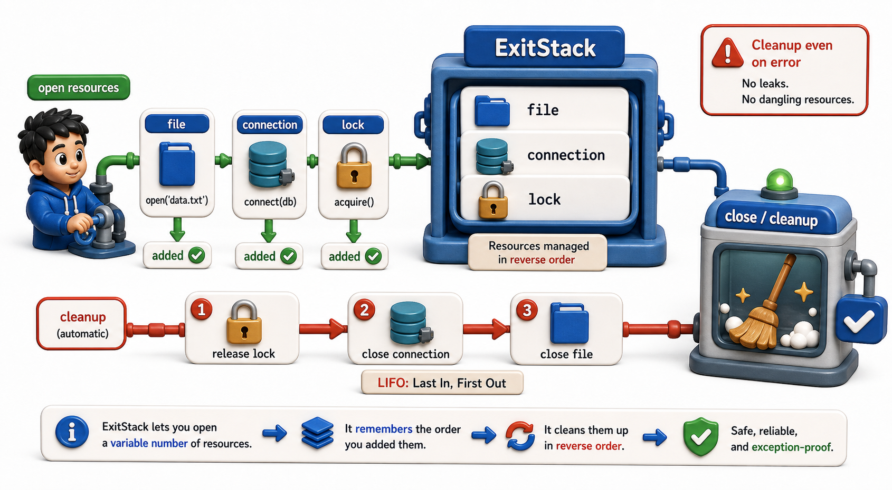

## Introduction

Tara's connection leak was simple: one connection, one leak. As she builds out the library management system, she starts encountering more complex situations: multiple database connections and log files open at the same time, helper functions that open resources and need to return them to the caller, and code that conditionally opens resources depending on configuration.

These situations all have one thing in common: they make resource management harder to get right by hand. This lesson covers the patterns that keep resources safe even when the code grows complicated.



## The Golden Rule: Open Resources Inside With Blocks

The safest resource management pattern is to never use a resource outside the `with` block that created it. If a function needs a file, the `with` statement and the usage should both be in the same scope.

```python
import io

def get_all_books():
    return [
        type("Book", (), {"isbn": "978-001", "title": "Dune"})(),
        type("Book", (), {"isbn": "978-002", "title": "Foundation"})(),
    ]

def export_catalog(output):
    """Export catalog to a file-like object."""
    for book in get_all_books():
        output.write(f"{book.isbn},{book.title}\n")

# Use StringIO instead of a real file -- same interface, no filesystem needed
buf = io.StringIO()
with buf:
    export_catalog(buf)
    result = buf.getvalue()
print("Exported catalog:")
print(result)
```

When a function returns an open resource to its caller, it shifts responsibility for closing onto the caller, which may forget. The `@contextmanager` pattern avoids this by keeping the lifetime of the resource inside the generator:

```python
import io
from contextlib import contextmanager

def get_all_books():
    return [
        type("Book", (), {"isbn": "978-001", "title": "Dune"})(),
        type("Book", (), {"isbn": "978-002", "title": "Foundation"})(),
    ]

@contextmanager
def catalog_writer():
    """Yields a writable buffer -- the caller cannot forget to close it."""
    buf = io.StringIO()
    try:
        yield buf   # caller gets the buffer, but cleanup is our responsibility
    finally:
        content = buf.getvalue()
        buf.close()
        print(f"Writer closed. Wrote {len(content.splitlines())} lines.")

# Caller cannot forget to close -- the with block handles it
with catalog_writer() as writer:
    for book in get_all_books():
        writer.write(f"{book.isbn},{book.title}\n")
```

## Handling Multiple Resources: ExitStack

Opening several resources at once with nested `with` statements works, but becomes hard to read and harder to make conditional:

```python
import io
import sqlite3

# Deeply nested -- hard to read and extend
src = io.StringIO("isbn,title\n978-001,Dune\n")
dst = io.StringIO()
conn = sqlite3.connect(":memory:")

with src:
    with dst:
        with conn:
            data = src.read()
            dst.write(data.upper())
            print("Nested with blocks: all resources managed, but deeply indented")
            print(f"Output: {dst.getvalue().strip()}")
```

`contextlib.ExitStack` solves this. It holds a stack of context managers and tears them all down in reverse order when the stack exits:

```python
import io
import sqlite3
from contextlib import ExitStack

def sync_catalog_to_buffer(books_data):
    """Use ExitStack to manage conn + output buffer together."""
    with ExitStack() as stack:
        conn = stack.enter_context(sqlite3.connect(":memory:"))
        out = stack.enter_context(io.StringIO())

        conn.execute("CREATE TABLE books (isbn TEXT, title TEXT)")
        conn.executemany("INSERT INTO books VALUES (?, ?)", books_data)

        for isbn, title in conn.execute("SELECT isbn, title FROM books"):
            out.write(f"{isbn},{title}\n")

        result = out.getvalue()
    # conn and out are both closed here, in reverse order
    return result

data = [("978-001", "Dune"), ("978-002", "Foundation")]
output = sync_catalog_to_buffer(data)
print("ExitStack synced catalog:")
print(output)
```

`ExitStack` is especially useful for opening a dynamic number of resources:

```python
import io
from contextlib import ExitStack

def merge_catalogs(catalog_contents):
    """Merge multiple catalog buffers into one -- dynamic number of resources."""
    with ExitStack() as stack:
        handles = [stack.enter_context(io.StringIO(c)) for c in catalog_contents]
        out = stack.enter_context(io.StringIO())
        for handle in handles:
            out.write(handle.read())
        merged = out.getvalue()
    return merged

catalogs = [
    "isbn,title\n978-001,Dune\n",
    "isbn,title\n978-002,Foundation\n978-003,Neuromancer\n",
]
result = merge_catalogs(catalogs)
print("Merged catalog:")
print(result)
```

## Cleanup When __enter__ Itself Can Fail

When multiple resources are opened one after the other and one of the later ones fails, the ones already opened must still be cleaned up. `ExitStack` handles this automatically: if `enter_context` raises on the third resource, the first two are still closed.

```python
import io
import sqlite3
from contextlib import ExitStack

# Safe: ExitStack registers each resource as it opens
# If any enter_context raises, previously registered resources are cleaned up
with ExitStack() as stack:
    conn = stack.enter_context(sqlite3.connect(":memory:"))
    log  = stack.enter_context(io.StringIO())
    conn.execute("CREATE TABLE books (isbn TEXT, title TEXT)")
    conn.execute("INSERT INTO books VALUES ('978-001', 'Dune')")
    rows = conn.execute("SELECT * FROM books").fetchall()
    for row in rows:
        log.write(f"Processed: {row}\n")
    print(log.getvalue())
print(f"After block: conn.in_transaction={conn.in_transaction}, log.closed={log.closed}")
```

## Using Locks Safely

Locks from the `threading` module are context managers. The `with` statement acquires the lock on entry and releases it on exit, even if an exception occurs. Without this, a function that raises while holding a lock would cause every other thread to wait forever.

```python
import threading

_catalog_lock = threading.Lock()
_catalog = []

def add_book(book):
    with _catalog_lock:
        _catalog.append(book)   # lock held only while appending
    # lock released here automatically, even if append raises

def get_all_books():
    with _catalog_lock:
        return list(_catalog)   # return a snapshot while holding the lock

add_book({"isbn": "978-001", "title": "Dune"})
add_book({"isbn": "978-002", "title": "Foundation"})

books = get_all_books()
print(f"Catalog ({len(books)} books):")
for b in books:
    print(f"  {b['isbn']}: {b['title']}")
```

## Resource Management at a Glance

| Scenario | Pattern |
|---|---|
| Single resource | `with open(path) as f:` |
| Resource returned to caller | `@contextmanager` that `yield`s it |
| Multiple resources | `ExitStack` with `enter_context` |
| Dynamic number of resources | `[stack.enter_context(open(p)) for p in paths]` |
| Thread lock | `with lock:` |

## Your Turn

Write a function `compare_catalogs(path_a, path_b)` that opens both files simultaneously using `ExitStack`, reads them, and returns whether they have the same content. Make sure both files are always closed, even if reading one of them raises an exception.

```python
import io
from contextlib import ExitStack

def compare_catalogs(content_a, content_b):
    """Compare two catalog buffers using ExitStack -- both always cleaned up."""
    with ExitStack() as stack:
        f_a = stack.enter_context(io.StringIO(content_a))
        f_b = stack.enter_context(io.StringIO(content_b))
        return f_a.read() == f_b.read()

catalog_a = "Book A\nBook B\n"
catalog_b = "Book A\nBook B\n"
catalog_c = "Book A\nBook C\n"

print(f"a == b: {compare_catalogs(catalog_a, catalog_b)}")   # True
print(f"a == c: {compare_catalogs(catalog_a, catalog_c)}")   # False
```

Now modify one catalog and confirm the result changes. Then remove one of the test files and observe that `ExitStack` still closes the first file cleanly even though the second `open` raises `FileNotFoundError`.

## Conclusion

The golden rule of resource management is: keep resource lifetimes inside `with` blocks. `ExitStack` removes the need for deeply nested `with` statements and handles dynamic lists of resources. It also guarantees cleanup when opening a later resource fails. The next lesson covers one more special power of context managers: suppressing exceptions selectively and guaranteeing that cleanup code runs even when the most extreme errors occur.
