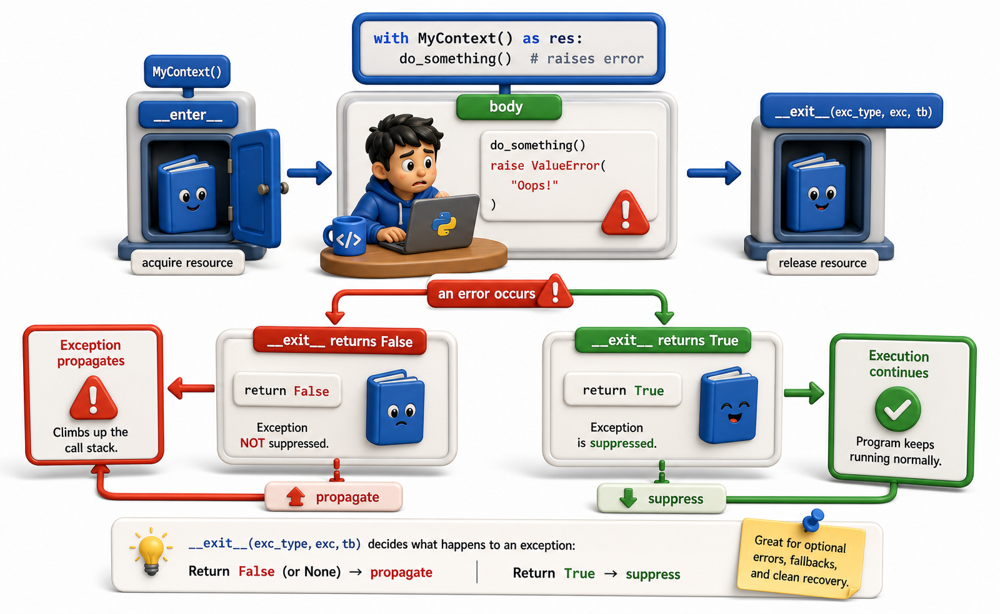

## Introduction

Tara's library system runs a background task that exports a daily catalog backup. If the backup fails because the output directory is not mounted, she wants to log the error and continue, rather than crashing the whole service. She knows that her context manager's `__exit__` returns `False`, which propagates exceptions. Now she needs to understand exactly how to suppress specific exceptions, when doing so is safe, and when it is dangerous.

This final lesson in the unit covers exception suppression, the `contextlib.suppress` shortcut, and the guarantee that cleanup code runs even in the worst cases.



## Suppressing an Exception in __exit__

When `__exit__` returns `True`, the exception is silently swallowed and the program continues after the `with` block as if nothing happened.

```python
class SuppressFileError:
    def __enter__(self):
        return self

    def __exit__(self, exc_type, exc_val, exc_tb):
        if exc_type is FileNotFoundError:
            print(f"Skipping missing file: {exc_val}")
            return True   # suppress this exception only
        return False       # propagate everything else

with SuppressFileError():
    with open("missing_catalog.txt") as f:
        print(f.read())

print("Continuing after the error")
# Output:
# Skipping missing file: [Errno 2] No such file or directory: 'missing_catalog.txt'
# Continuing after the error
```

Suppression is selective: only `FileNotFoundError` is absorbed. Any other exception propagates normally. This selectivity is essential -- a context manager that suppresses `Exception` broadly is almost always a mistake.

## contextlib.suppress: The Shortcut

`contextlib.suppress` is a built-in context manager that suppresses specific exception types without requiring you to write a class:

```python
from contextlib import suppress

# Demonstrate suppress by raising FileNotFoundError manually
class FakeFS:
    @staticmethod
    def remove(path):
        raise FileNotFoundError(f"[Errno 2] No such file: '{path}'")

# Without suppress: unhandled exception
try:
    FakeFS.remove("old_catalog.txt")
except FileNotFoundError as e:
    print(f"Without suppress: caught {e}")

# With suppress: exception silently absorbed, execution continues
with suppress(FileNotFoundError):
    FakeFS.remove("old_catalog.txt")
print("With suppress(FileNotFoundError): execution continues here normally")

# suppress can accept multiple exception types
with suppress(FileNotFoundError, PermissionError):
    FakeFS.remove("locked_file.txt")
print("With suppress(FileNotFoundError, PermissionError): also continues normally")
```

`suppress` is equivalent to writing `except ExcType: pass` but makes the intent explicit and removes the need for an extra `try`/`except` block when the only response to the error is "move on."

## When Suppression Is Appropriate

Exception suppression should be used sparingly and intentionally. Before suppressing, ask three questions:

1. Is this error condition expected and normal in the intended use of the code?
2. Is continuing after this error safe, with no inconsistent state left behind?
3. Am I suppressing only the specific exception type I expect, not a broad base class?

If all three answers are yes, suppression may be appropriate:

```python
from contextlib import suppress

def delete_file(path):
    raise FileNotFoundError(f"[Errno 2] No such file: '{path}'")

def process_catalog():
    raise ValueError("Column 'isbn' is missing from catalog")

# APPROPRIATE: deleting a temp file that may or may not exist is a normal operation
with suppress(FileNotFoundError):
    delete_file("temp_export.csv")
print("Appropriate: FileNotFoundError suppressed, service continues")

# INAPPROPRIATE: swallows real bugs silently
try:
    process_catalog()
except Exception:
    pass   # ValueError is hidden -- hard to debug!
print("Inappropriate: ValueError was silently swallowed -- bug is now invisible")
```

## Guaranteeing Cleanup in Edge Cases

Context managers guarantee cleanup in situations that `try`/`except`/`finally` often gets wrong:

```python
import io

# Does __exit__ run with an early return inside the body?
def load_catalog():
    buf = io.StringIO("isbn,title\n978-001,Dune\n")
    with buf:
        return buf.read()   # file is still closed, even with early return

content = load_catalog()
print(f"Loaded {len(content)} chars; buf closed={content is not None}")

# Does __exit__ run inside a generator?
def read_lines():
    buf = io.StringIO("Line 1\nLine 2\nLine 3\n")
    with buf:
        for line in buf:
            yield line.strip()
    # buf is closed when the generator is exhausted or garbage-collected

lines = list(read_lines())
print(f"Generator lines: {lines}")

# Does __exit__ run on an unexpected exception?
class Cleanup:
    def __enter__(self): return self
    def __exit__(self, exc_type, exc_val, exc_tb):
        print(f"Cleanup ran (exc_type={exc_type})")
        return True   # suppress the exception for demo purposes

with Cleanup():
    raise RuntimeError("Unexpected error")
print("Continuing after suppressed RuntimeError")
```

`__exit__` is called even when `SystemExit` or `KeyboardInterrupt` is raised, because these are `BaseException` subclasses and the `with` statement does not filter them out. This makes context managers more reliable than manual `try`/`finally` for critical cleanup.

## Combining: Log, Suppress, Clean Up

Here is the pattern Tara uses for her daily backup task:

```python
import io
from contextlib import contextmanager, suppress

log = []   # simple log list instead of logging module

@contextmanager
def safe_backup(path):
    log.append(f"INFO: Starting backup to {path}")
    try:
        yield io.StringIO()   # yield a buffer as the "backup file"
        log.append(f"INFO: Backup completed: {path}")
    except OSError as exc:
        log.append(f"ERROR: Backup failed: {exc}")
        raise   # re-raise so the scheduler knows it failed
    finally:
        log.append("DEBUG: Backup context exiting")

def export_catalog(writer):
    writer.write("isbn,title\n978-001,Dune\n")

def run_daily_backup():
    with suppress(OSError):          # backup failure is non-fatal for the service
        with safe_backup("backup.csv") as buf:
            export_catalog(buf)
            print(f"Backup content: {buf.getvalue().strip()}")

run_daily_backup()
for entry in log:
    print(entry)
```

The separation of concerns is clear: `safe_backup` handles logging, `suppress(OSError)` handles the "non-fatal failure" policy, and `export_catalog` handles the actual export.

## Suppressing Exceptions at a Glance

| Pattern | When to use |
|---|---|
| Return `True` from `__exit__` | Suppress exception in a class-based manager |
| `contextlib.suppress(ExcType)` | Suppress a specific exception in-place |
| `try`/`except` inside `@contextmanager` | Suppress/log and re-raise in a generator manager |
| Log then re-raise | Observe an exception without changing its propagation |

## Your Turn

Write a function `safe_remove_all(paths)` that attempts to delete each file in a list, suppresses `FileNotFoundError` for files that are already gone, logs a warning for `PermissionError`, and re-raises any other exception.

```python
from contextlib import suppress

def fake_remove(path, missing_files, permission_denied):
    """Simulate file removal with controlled errors."""
    if path in missing_files:
        raise FileNotFoundError(f"[Errno 2] No such file: '{path}'")
    if path in permission_denied:
        raise PermissionError(f"[Errno 13] Permission denied: '{path}'")
    print(f"  Removed: {path}")

def safe_remove_all(paths, missing_files=(), permission_denied=()):
    for path in paths:
        with suppress(FileNotFoundError):
            try:
                fake_remove(path, missing_files, permission_denied)
            except PermissionError as exc:
                print(f"  Warning: permission denied for '{path}' -- skipping")

# Demo
test_paths = ["a.txt", "missing.txt", "b.txt", "locked.txt"]
safe_remove_all(
    test_paths,
    missing_files={"missing.txt"},
    permission_denied={"locked.txt"},
)
```

## Conclusion

Returning `True` from `__exit__` suppresses an exception; `contextlib.suppress` provides a clean one-liner for specific types. Suppression is safe when the error condition is expected, continuation is safe, and the suppression is narrow. Context managers guarantee cleanup even on `return`, `yield`, `SystemExit`, and `KeyboardInterrupt`, making them more reliable than manual `try`/`finally` for critical cleanup. Unit 7 moves from resource management to Python's standard library, exploring the built-in modules that solve common problems so you do not have to write them yourself.
