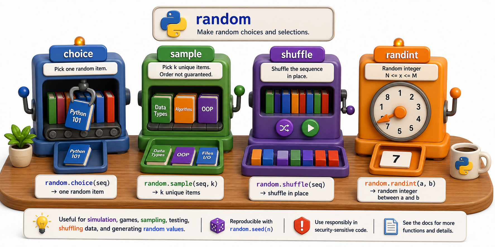

## Introduction

Nadia's book recommendation feature picks a random title from the catalog every morning and displays it on the library portal. Her original implementation used `random.random()` multiplied by the list length, rounded to an integer, used as an index. It worked most of the time but occasionally crashed with an index-out-of-range error when the float rounding was off by one.

Her mentor points her to `random.choice()`, which does this correctly in one line. The `random` module is the right place for all randomness in Python that does not involve security.



## Basic Random Choices

```python
import random

catalog = ["Dune", "Foundation", "Neuromancer", "The Left Hand of Darkness", "Ender's Game"]

# Pick one at random
recommendation = random.choice(catalog)
print(f"Today's recommendation: {recommendation}")

# Pick k unique items (no repeats)
top_three = random.sample(catalog, k=3)
print(f"Top three: {top_three}")

# Shuffle a list in place
random.shuffle(catalog)
print(f"Shuffled: {catalog}")
```

`random.choice` picks exactly one element. `random.sample` picks `k` elements without replacement -- the same item cannot appear twice. `random.shuffle` rearranges the list in place and returns `None`.

## Random Numbers

```python
import random

# Integer in an inclusive range [a, b]
dice = random.randint(1, 6)
print(f"Dice: {dice}")

# Float in the range [0.0, 1.0)
probability = random.random()
print(f"Probability: {probability:.4f}")

# Float in a custom range [a, b)
rating = random.uniform(1.0, 5.0)
print(f"Random rating: {rating:.2f}")
```

`random.randint(a, b)` is inclusive on both ends, which is different from Python's `range(a, b)` (exclusive end). This follows the natural language meaning of "a number between 1 and 6."

## Weighted Selection

Sometimes items should not have equal probability. `random.choices` (with an `s`) accepts a `weights` list:

```python
import random

genres = ["Fiction", "Non-Fiction", "Science Fiction", "Biography"]
weights = [40, 30, 20, 10]   # Fiction is 40% likely, Biography is 10%

picked = random.choices(genres, weights=weights, k=1)[0]
print(f"Weighted pick: {picked}")

# Over many trials, distribution should match the weights:
counts = {g: 0 for g in genres}
for _ in range(10_000):
    counts[random.choices(genres, weights=weights)[0]] += 1
print(counts)
```

Note: `random.choices` (plural, with weights) allows repeats; `random.sample` (without weights) does not allow repeats.

## Reproducibility with Seeds

The `random` module uses a pseudo-random number generator. The same seed always produces the same sequence. This is critical for reproducible tests, demos, and experiments:

```python
import random

random.seed(42)
print(random.choice(["A", "B", "C", "D"]))   # always the same result
print(random.randint(1, 100))                  # always the same result

# Without seed: different result each run
random.seed(None)   # restores non-deterministic behavior
print(random.choice(["A", "B", "C", "D"]))   # unpredictable
```

## Important: random Is Not Cryptographically Secure

`random` uses a predictable algorithm (Mersenne Twister). For security-sensitive uses -- generating passwords, tokens, session IDs -- use `secrets` instead (covered in the next lesson).

```python
# WRONG for security: predictable
import random
token = str(random.randint(100000, 999999))

# CORRECT for security: unpredictable
import secrets
token = secrets.token_hex(16)
print(token)
```

## The random Module at a Glance

| Function | What it does |
|---|---|
| `random.choice(seq)` | Pick one element at random |
| `random.sample(seq, k)` | Pick k unique elements (no repeats) |
| `random.shuffle(lst)` | Shuffle a list in place |
| `random.choices(seq, weights, k)` | Pick k elements with optional weights |
| `random.randint(a, b)` | Random integer in [a, b] (inclusive) |
| `random.random()` | Random float in [0.0, 1.0) |
| `random.uniform(a, b)` | Random float in [a, b) |
| `random.seed(n)` | Set seed for reproducibility |

## Your Turn

Write a function `morning_picks(catalog, n)` that returns `n` unique book recommendations for the day, in a random order. If the catalog has fewer than `n` books, return all books shuffled.

```python
import random

def morning_picks(catalog, n):
    if len(catalog) <= n:
        result = list(catalog)
        random.shuffle(result)
        return result
    return random.sample(catalog, k=n)

books = ["Dune", "Foundation", "Neuromancer", "1984", "Brave New World"]
print(morning_picks(books, 3))
print(morning_picks(books, 10))   # fewer than 10 books -- returns all 5
```

Then add a `seed` parameter so the function can produce the same output for testing.

## Conclusion

The `random` module covers all everyday randomness: picking, sampling, shuffling, and weighting. It is simple, well-tested, and built in. The critical caveat is that it is not secure: for tokens, passwords, and session IDs, the next lesson introduces `hashlib` and `secrets`, which provide cryptographic-strength randomness and hashing.
