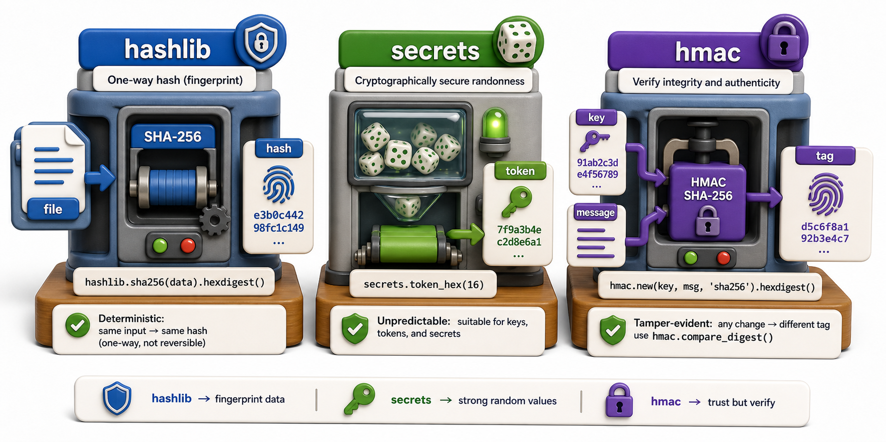

## Introduction

Nadia's library system needs a patron login feature. She wants to store passwords safely so that even if the database is stolen, the passwords cannot be recovered. She also needs to generate secure session tokens so that users stay logged in between requests without the token being guessable. Both of these require cryptographic tools, and Python's standard library includes them in `hashlib` and `secrets`.

This lesson covers hashing (turning data into a fixed-length fingerprint), secure random token generation, and HMAC (verifying that a message has not been tampered with).



## hashlib: Cryptographic Hashing

A hash function takes any data and produces a fixed-length digest. The same input always produces the same digest. Different inputs almost never produce the same digest. The digest cannot be reversed to recover the original input.

```python
import hashlib

# Hash a string
data = "patron_password"
digest = hashlib.sha256(data.encode()).hexdigest()
print(digest)
# e.g. 'ef92b778bafe771e89245b89ecbc08a44a4e166c06659911881f383d4473e94f'

# Always the same for the same input:
print(hashlib.sha256(b"patron_password").hexdigest() ==
      hashlib.sha256(b"patron_password").hexdigest())  # True

# Different input, completely different digest:
print(hashlib.sha256(b"patron_password").hexdigest() ==
      hashlib.sha256(b"patron_Password").hexdigest())  # False
```

Common algorithms available via `hashlib.algorithms_available`:

```python
import hashlib
print(hashlib.algorithms_guaranteed)
# frozenset({'md5', 'sha1', 'sha256', 'sha512', 'sha3_256', ...})
```

For passwords and security, use `sha256` or `sha3_256` at minimum. MD5 and SHA-1 are broken and should not be used for security.

## Hashing Files

Hashing is useful beyond passwords. You can hash a file to verify its integrity: if the hash after downloading matches the hash the sender published, the file is unmodified.

```python
import hashlib

def file_hash(path, algorithm="sha256"):
    h = hashlib.new(algorithm)
    with open(path, "rb") as f:
        for chunk in iter(lambda: f.read(65536), b""):
            h.update(chunk)   # read in chunks for large files
    return h.hexdigest()

digest = file_hash("catalog.csv")
print(f"SHA-256: {digest}")
```

Reading in chunks (65536 bytes at a time) avoids loading the entire file into memory, making this work for large files.

## secrets: Cryptographically Secure Tokens

For session tokens, password reset links, and API keys, use `secrets`. Unlike `random`, it uses the operating system's cryptographically secure random source (e.g., `/dev/urandom` on Linux).

```python
import secrets

# Hex token (32 bytes = 64 hex characters)
token = secrets.token_hex(32)
print(token)  # e.g. 'a1b2c3...' -- 64 chars, unpredictable

# URL-safe base64 token (32 bytes)
url_token = secrets.token_urlsafe(32)
print(url_token)  # e.g. 'aHR0c...' -- suitable for URLs

# Random integer in a range (use instead of random.randint for OTPs)
otp = secrets.randbelow(1_000_000)
print(f"OTP: {otp:06d}")

# Constant-time comparison (prevents timing attacks)
user_token = "..."
stored_token = "..."
if secrets.compare_digest(user_token, stored_token):
    grant_access()
```

`secrets.compare_digest` compares two strings in constant time, regardless of where they differ. Regular `==` short-circuits on the first mismatch, which can reveal the length and prefix of the correct token to a timing attacker.

## hmac: Message Authentication Codes

HMAC verifies that a message was created by someone who knows the secret key and has not been modified in transit. Webhooks and API request signing commonly use this pattern.

```python
import hmac
import hashlib

SECRET_KEY = b"library_webhook_secret"

def sign_message(message: bytes) -> str:
    return hmac.new(SECRET_KEY, message, hashlib.sha256).hexdigest()

def verify_message(message: bytes, signature: str) -> bool:
    expected = sign_message(message)
    return hmac.compare_digest(expected, signature)

payload = b'{"event": "book_returned", "isbn": "978-001"}'
sig = sign_message(payload)
print(f"Signature: {sig}")

# Verify on the receiving end:
print(verify_message(payload, sig))     # True
print(verify_message(b"tampered", sig)) # False
```

Never use `==` to compare HMAC signatures; always use `hmac.compare_digest` (or `secrets.compare_digest`) to prevent timing attacks.

## hashlib / secrets / hmac at a Glance

| Module | Use case |
|---|---|
| `hashlib.sha256(data).hexdigest()` | Hash passwords, file integrity checks |
| `secrets.token_hex(n)` | Secure session tokens |
| `secrets.token_urlsafe(n)` | Tokens safe for URLs |
| `secrets.compare_digest(a, b)` | Constant-time comparison of tokens |
| `hmac.new(key, msg, hash)` | Sign and verify messages |
| `hmac.compare_digest(a, b)` | Constant-time HMAC comparison |

## Your Turn

Write a `PatronSession` class that generates a secure session token on creation and verifies it:

```python
import secrets
import hashlib

class PatronSession:
    def __init__(self, patron_id: str):
        self.patron_id = patron_id
        self.token = secrets.token_urlsafe(32)
        self._token_hash = hashlib.sha256(self.token.encode()).hexdigest()

    def verify(self, presented_token: str) -> bool:
        presented_hash = hashlib.sha256(presented_token.encode()).hexdigest()
        return secrets.compare_digest(self._token_hash, presented_hash)

session = PatronSession("P001")
print(f"Token: {session.token}")
print(session.verify(session.token))    # True
print(session.verify("wrong_token"))    # False
```

Note why we hash the token before storing it: even if the session store is compromised, the raw token is not exposed.

## Conclusion

`hashlib` produces deterministic fingerprints from data. `secrets` generates unpredictable tokens for authentication. `hmac` signs and verifies messages to prevent tampering. All three are part of the standard library and cover the security fundamentals you need before reaching for a third-party cryptography library. The next lesson moves to time and dates with the `datetime` module.
