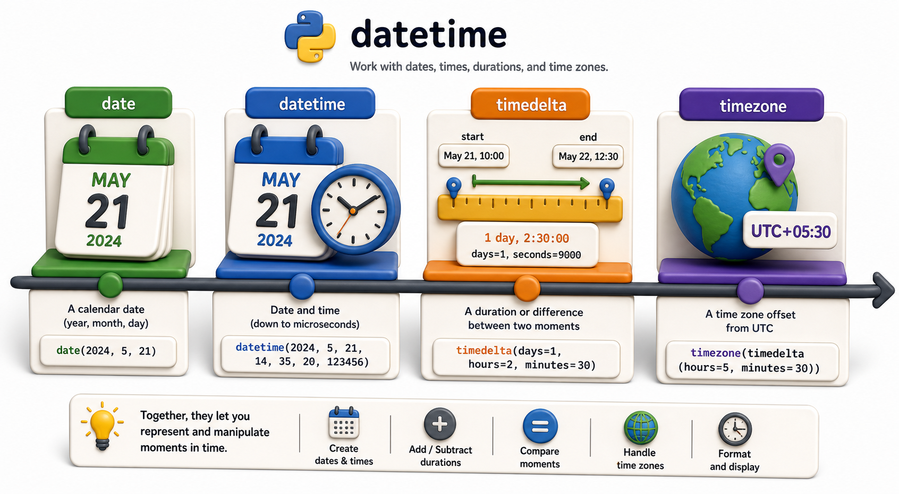

## Introduction

Nadia's library system tracks when books are borrowed and when they are due back. Her homegrown date arithmetic subtracted integers from day numbers and crashed on the first day of a month (subtracting 14 days from March 1 does not give February 15 by simple subtraction). Her manager pointed her to the `datetime` module, which handles all calendar arithmetic correctly, including leap years, month boundaries, and time zones.



## The Three Core Types

`datetime` gives you three types that cover almost every date/time need:

```python
from datetime import date, datetime, timedelta

# date: a calendar day (no time component)
today = date.today()
print(today)          # e.g. 2026-07-01
print(today.year, today.month, today.day)  # 2026 7 1

# datetime: a specific moment in time
now = datetime.now()
print(now)            # e.g. 2026-07-01 14:23:07.123456

# timedelta: a duration
two_weeks = timedelta(days=14)
print(today + two_weeks)  # 2026-07-15
```

## Date Arithmetic with timedelta

`timedelta` is the key to correct date arithmetic. Add it to a `date` or `datetime` to move forward or backward in time:

```python
from datetime import date, timedelta

borrow_date = date(2026, 6, 20)
loan_period = timedelta(days=21)
due_date = borrow_date + loan_period
print(f"Due: {due_date}")    # 2026-07-11

# Days overdue:
today = date(2026, 7, 15)
if today > due_date:
    overdue_days = (today - due_date).days
    print(f"Overdue by {overdue_days} days")   # 4 days
```

`date - date` produces a `timedelta`. Call `.days` on it to get the integer number of days.

## Parsing and Formatting Dates

Convert between strings and dates using `strptime` (parse) and `strftime` (format):

```python
from datetime import datetime

# Parse a string into a datetime
raw = "2026-07-01"
parsed = datetime.strptime(raw, "%Y-%m-%d")
print(parsed)   # 2026-07-01 00:00:00

# Parse a more complex string
raw2 = "01 Jul 2026 14:30"
parsed2 = datetime.strptime(raw2, "%d %b %Y %H:%M")
print(parsed2)  # 2026-07-01 14:30:00

# Format a datetime as a string
formatted = parsed2.strftime("%B %d, %Y at %I:%M %p")
print(formatted)   # July 01, 2026 at 02:30 PM
```

Common format codes:

| Code | Meaning | Example |
|---|---|---|
| `%Y` | 4-digit year | 2026 |
| `%m` | Month (01-12) | 07 |
| `%d` | Day (01-31) | 01 |
| `%H` | Hour 24h (00-23) | 14 |
| `%M` | Minute (00-59) | 30 |
| `%b` | Month name abbreviated | Jul |
| `%B` | Month name full | July |

## ISO 8601 Format

The ISO 8601 format (`YYYY-MM-DD`) is the safest for storing dates in files and databases:

```python
from datetime import date, datetime

today = date.today()
print(today.isoformat())            # '2026-07-01'

now = datetime.now()
print(now.isoformat())              # '2026-07-01T14:23:07.123456'
print(now.isoformat(sep=" "))       # '2026-07-01 14:23:07.123456'

# Parse ISO format:
parsed = date.fromisoformat("2026-07-01")
print(parsed)                       # 2026-07-01
```

`isoformat()` and `fromisoformat()` are the cleanest round-trip for dates that go into and come back from storage.

## Time Zones

By default, `datetime.now()` is "naive" -- it has no timezone information. For production systems that handle users in multiple time zones, use `datetime.now(tz=timezone.utc)` to get a timezone-aware datetime:

```python
from datetime import datetime, timezone, timedelta

# UTC now (timezone-aware)
now_utc = datetime.now(tz=timezone.utc)
print(now_utc)   # 2026-07-01 09:23:07.123456+00:00

# Convert to a fixed offset
ist = timezone(timedelta(hours=5, minutes=30))   # India Standard Time
now_ist = now_utc.astimezone(ist)
print(now_ist)   # 2026-07-01 14:53:07.123456+05:30
```

For full time zone database support (named zones like "America/New_York"), install the third-party `zoneinfo` module (built into Python 3.9+) or `pytz`.

## The datetime Module at a Glance

| Type / Method | What it does |
|---|---|
| `date.today()` | Today's date (no time) |
| `datetime.now()` | Current local date and time |
| `timedelta(days=N)` | Duration of N days |
| `date + timedelta` | Move a date forward/backward |
| `date - date` | Duration between two dates |
| `datetime.strptime(s, fmt)` | Parse a string to datetime |
| `datetime.strftime(fmt)` | Format a datetime to string |
| `date.isoformat()` | `'YYYY-MM-DD'` string |
| `datetime.now(tz=timezone.utc)` | Timezone-aware UTC now |

## Your Turn

Write a function `overdue_report(records)` that takes a list of borrow records (each with `isbn`, `patron_id`, `borrow_date` as an ISO string, and `loan_days`), computes the due date, and returns a list of overdue records with the number of days overdue.

```python
from datetime import date, timedelta

def overdue_report(records, today=None):
    today = today or date.today()
    overdue = []
    for record in records:
        borrow = date.fromisoformat(record["borrow_date"])
        due = borrow + timedelta(days=record["loan_days"])
        if today > due:
            overdue.append({**record, "days_overdue": (today - due).days})
    return overdue

records = [
    {"isbn": "978-001", "patron_id": "P01", "borrow_date": "2026-06-01", "loan_days": 21},
    {"isbn": "978-002", "patron_id": "P02", "borrow_date": "2026-06-20", "loan_days": 21},
]
print(overdue_report(records, today=date(2026, 7, 1)))
```

Pass `today` explicitly so the function is testable without depending on the current date.

## Conclusion

`datetime` provides three types: `date` for calendar days, `datetime` for exact moments, and `timedelta` for durations. Parsing uses `strptime`, formatting uses `strftime`, and ISO 8601 is the recommended storage format. Time-zone-aware datetimes prevent subtle bugs when users span multiple regions. The next lesson moves to `collections`, Python's toolkit for specialized data structures that go beyond basic lists and dictionaries.
