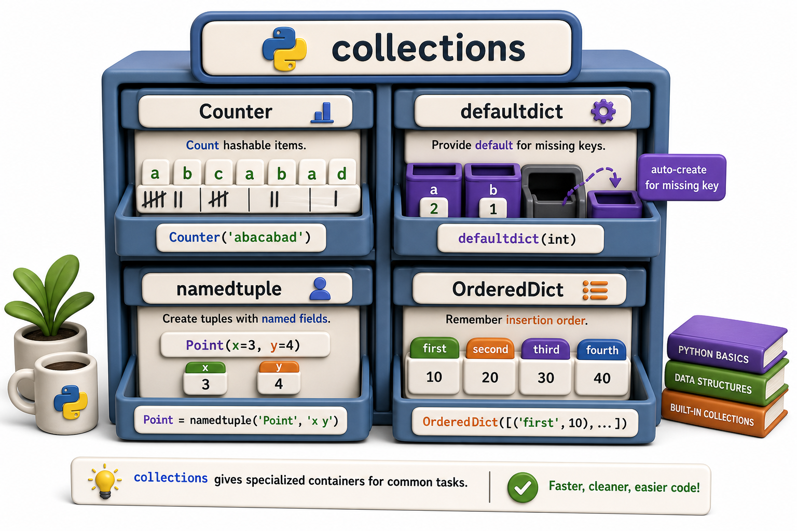

## Introduction

Nadia keeps writing the same boilerplate: a `{}` dictionary with a check for missing keys before incrementing, tuples with index-based access like `record[2]` that are impossible to read weeks later, and ordered groupings that lose their order when stored in a plain dict. Each time she types this code, she knows there must be a better way.

The `collections` module is the better way. It provides four data structures -- `Counter`, `defaultdict`, `namedtuple`, and `OrderedDict` -- that solve exactly these patterns with less code and more clarity.



## Counter: Count Occurrences

`Counter` takes an iterable and counts how many times each element appears. It is a subclass of `dict`, so every dict method works on it, plus it adds `most_common()`.

```python
from collections import Counter

genres = [
    "Fiction", "Non-Fiction", "Fiction", "Science Fiction",
    "Fiction", "Biography", "Science Fiction", "Fiction"
]

counts = Counter(genres)
print(counts)
# Counter({'Fiction': 4, 'Science Fiction': 2, 'Non-Fiction': 1, 'Biography': 1})

print(counts["Fiction"])      # 4
print(counts["Missing"])      # 0 (not KeyError)
print(counts.most_common(2))  # [('Fiction', 4), ('Science Fiction', 2)]

# Combine two Counters:
more = Counter(["Biography", "Biography", "Fiction"])
combined = counts + more
print(combined["Biography"])  # 3
```

`Counter` also works for individual strings:

```python
letter_freq = Counter("abracadabra")
print(letter_freq.most_common(3))   # [('a', 5), ('b', 2), ('r', 2)]
```

## defaultdict: Avoid Missing-Key Checks

`defaultdict` is a dict that calls a factory function to produce a default value for any missing key, instead of raising `KeyError`.

```python
from collections import defaultdict

# Group books by genre without checking if the key exists first:
books = [
    ("978-001", "Dune", "Science Fiction"),
    ("978-002", "Foundation", "Science Fiction"),
    ("978-003", "1984", "Fiction"),
    ("978-004", "Neuromancer", "Science Fiction"),
]

by_genre = defaultdict(list)   # default factory: list()
for isbn, title, genre in books:
    by_genre[genre].append(title)

print(dict(by_genre))
# {'Science Fiction': ['Dune', 'Foundation', 'Neuromancer'], 'Fiction': ['1984']}
```

Compare to the manual version:

```python
# Without defaultdict: verbose key-existence check every time
by_genre = {}
for isbn, title, genre in books:
    if genre not in by_genre:
        by_genre[genre] = []
    by_genre[genre].append(title)
print(by_genre)
```

`defaultdict(int)` (factory produces `0`) is the common pattern for counting:

```python
from collections import defaultdict

patron_borrows = defaultdict(int)
events = ["P001", "P002", "P001", "P001", "P003", "P002"]
for patron in events:
    patron_borrows[patron] += 1   # no KeyError if patron is new

print(dict(patron_borrows))  # {'P001': 3, 'P002': 2, 'P003': 1}
```

## namedtuple: Readable Tuples

`namedtuple` creates a tuple subclass with named fields. Instead of `record[0]` and `record[2]`, you write `record.isbn` and `record.title`.

```python
from collections import namedtuple

Book = namedtuple("Book", ["isbn", "title", "genre", "copies"])

b = Book("978-001", "Dune", "Science Fiction", 3)
print(b.isbn)     # '978-001'
print(b.title)    # 'Dune'
print(b[0])       # '978-001' -- still works as a tuple
print(b)          # Book(isbn='978-001', title='Dune', genre='Science Fiction', copies=3)

# Namedtuples are immutable and hashable -- can be used as dict keys
book_dict = {b: "available"}
```

For new code, the `@dataclass` from Unit 3 provides similar readability with mutability and type hints. `namedtuple` shines when you need something lightweight, immutable, and hashable.

## OrderedDict: Insertion-Order Guaranteed

Since Python 3.7, regular `dict` preserves insertion order. `OrderedDict` is now mainly useful for its `move_to_end()` method, which is helpful for implementing LRU caches:

```python
from collections import OrderedDict

cache = OrderedDict()
cache["978-001"] = {"title": "Dune"}
cache["978-002"] = {"title": "Foundation"}
cache["978-003"] = {"title": "Neuromancer"}

# Move most recently accessed to the end (LRU pattern)
cache.move_to_end("978-001")
print(list(cache.keys()))   # ['978-002', '978-003', '978-001']

# Evict the least recently used (from the front)
oldest_key = next(iter(cache))
del cache[oldest_key]
```

## deque: Fast Queue Operations

`collections.deque` (double-ended queue) is a list-like structure with O(1) append and pop from *both* ends, unlike a regular list where `pop(0)` is O(n).

```python
from collections import deque

wait_list = deque()
wait_list.append("Patron A")     # add to right
wait_list.append("Patron B")
wait_list.appendleft("Patron Z") # add to left (priority)

print(wait_list.popleft())  # 'Patron Z' -- O(1)
print(wait_list.popleft())  # 'Patron A' -- O(1)
```

## The collections Module at a Glance

| Class | Use case |
|---|---|
| `Counter(iterable)` | Count occurrences; `.most_common(n)` |
| `defaultdict(factory)` | Dict with auto-created default values |
| `namedtuple("N", fields)` | Readable, immutable, hashable tuple subclass |
| `OrderedDict` | Insertion-order dict with `.move_to_end()` |
| `deque` | O(1) append/pop at both ends |

## Your Turn

Write a `catalog_stats(books)` function that returns a summary dict with:
- `"genre_counts"`: a `Counter` of genres
- `"top_genre"`: the most common genre
- `"by_genre"`: a `defaultdict(list)` mapping genre to a list of titles

```python
from collections import Counter, defaultdict

def catalog_stats(books):
    genre_counts = Counter(b.genre for b in books)
    by_genre = defaultdict(list)
    for b in books:
        by_genre[b.genre].append(b.title)
    return {
        "genre_counts": genre_counts,
        "top_genre": genre_counts.most_common(1)[0][0],
        "by_genre": dict(by_genre),
    }

from collections import namedtuple
Book = namedtuple("Book", ["isbn", "title", "genre"])
catalog = [
    Book("978-001", "Dune", "Sci-Fi"),
    Book("978-002", "Foundation", "Sci-Fi"),
    Book("978-003", "1984", "Fiction"),
]
print(catalog_stats(catalog))
```

## Conclusion

`Counter` eliminates manual frequency counting. `defaultdict` eliminates missing-key boilerplate. `namedtuple` makes tuple fields readable. `deque` enables efficient queue operations. All four are built in, battle-tested, and immediately more expressive than their manual equivalents. The next lesson revisits `itertools`, applying it to the kind of data pipelines Nadia processes daily.
