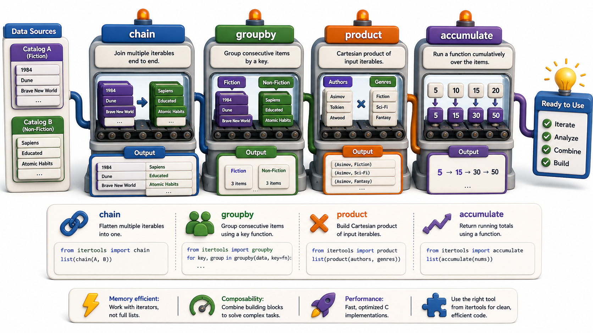

## Introduction

In Unit 4, Nadia learned `islice`, `chain`, `groupby`, and `zip_longest` as building blocks for lazy iteration. Now she is writing real data pipelines for the consortium: flattening multi-level catalog hierarchies, grouping overdue records by month, generating all possible genre pairs for a recommendation engine, and creating sliding windows over borrow histories. Each of these is a few lines with `itertools`, and a mess of nested loops without it.

This lesson goes deeper into `itertools`, covering the combinatoric functions and two additional patterns from the "infinite iterators" and "terminating iterators" categories that are most useful in data work.



## Recap: chain, islice, groupby

Before moving to new functions, a quick review of the essentials:

```python
import itertools

# chain: merge multiple iterables into one
all_books = list(itertools.chain(fiction_books, nonfiction_books, sci_fi_books))

# islice: take the first N from any iterable (including generators)
first_ten = list(itertools.islice(all_books, 10))

# groupby: group consecutive elements by key (requires sorting first)
records_sorted = sorted(overdue_records, key=lambda r: r["month"])
for month, group in itertools.groupby(records_sorted, key=lambda r: r["month"]):
    print(f"{month}: {list(group)}")
```

`groupby` only groups *consecutive* elements, so always sort by the grouping key first.

## product: Cartesian Product

`itertools.product` produces every combination of elements from two or more iterables. It is the nested-loop equivalent without the indentation:

```python
import itertools

genres = ["Fiction", "Non-Fiction", "Science Fiction"]
formats = ["Hardcover", "Paperback", "E-book"]

# Every genre-format pair:
for genre, fmt in itertools.product(genres, formats):
    print(f"{genre} / {fmt}")
# Fiction / Hardcover
# Fiction / Paperback
# Fiction / E-book
# Non-Fiction / Hardcover
# ...

# Without itertools -- equivalent but nested:
for genre in genres:
    for fmt in formats:
        print(f"{genre} / {fmt}")
```

`product` also accepts a `repeat` argument: `product("ABC", repeat=2)` produces `AA, AB, AC, BA, BB, ...`.

## combinations and combinations_with_replacement

`itertools.combinations` picks all unique ordered subsets of length k from an iterable, without repeating elements:

```python
import itertools

patrons = ["Alice", "Bob", "Carol", "Diana"]

# All pairs of patrons for a reading group:
pairs = list(itertools.combinations(patrons, 2))
print(pairs)
# [('Alice', 'Bob'), ('Alice', 'Carol'), ('Alice', 'Diana'),
#  ('Bob', 'Carol'), ('Bob', 'Diana'), ('Carol', 'Diana')]

# All pairs including same-person pairs:
pairs_with_rep = list(itertools.combinations_with_replacement(patrons, 2))
print(pairs_with_rep)
# [('Alice', 'Alice'), ('Alice', 'Bob'), ...]
```

## permutations: Ordered Arrangements

`itertools.permutations` produces all ordered arrangements of length k:

```python
import itertools

shelf_positions = ["A", "B", "C"]
arrangements = list(itertools.permutations(shelf_positions, 2))
print(arrangements)
# [('A', 'B'), ('A', 'C'), ('B', 'A'), ('B', 'C'), ('C', 'A'), ('C', 'B')]
```

`combinations` (order doesn't matter) vs `permutations` (order matters): `("Alice", "Bob")` and `("Bob", "Alice")` are the same combination but different permutations.

## accumulate: Running Totals

`itertools.accumulate` produces a running accumulated value. By default it sums, but any two-argument function works:

```python
import itertools
import operator

daily_borrows = [12, 8, 20, 15, 30, 7, 25]

# Running total:
running_total = list(itertools.accumulate(daily_borrows))
print(running_total)   # [12, 20, 40, 55, 85, 92, 117]

# Running maximum:
running_max = list(itertools.accumulate(daily_borrows, func=max))
print(running_max)     # [12, 12, 20, 20, 30, 30, 30]

# Running product:
running_product = list(itertools.accumulate([1, 2, 3, 4, 5], func=operator.mul))
print(running_product)  # [1, 2, 6, 24, 120]
```

## takewhile and dropwhile: Condition-Based Slicing

`takewhile` yields elements while the predicate is `True`, then stops. `dropwhile` skips elements while the predicate is `True`, then yields the rest:

```python
import itertools

daily_borrows = [12, 8, 20, 15, 30, 7, 25]

# Take while below threshold:
busy = list(itertools.takewhile(lambda x: x >= 10, daily_borrows))
print(busy)   # [12]   -- stops at 8 (first failure)

# Drop while below threshold, take the rest:
after_slow = list(itertools.dropwhile(lambda x: x < 20, daily_borrows))
print(after_slow)   # [20, 15, 30, 7, 25]   -- first item >= 20 and everything after
```

## itertools Advanced at a Glance

| Function | What it produces |
|---|---|
| `product(a, b)` | Every combination of one element from a and one from b |
| `combinations(seq, k)` | All unique unordered subsets of size k |
| `permutations(seq, k)` | All ordered arrangements of size k |
| `accumulate(seq, func)` | Running accumulated values |
| `takewhile(pred, seq)` | Elements while predicate holds |
| `dropwhile(pred, seq)` | Elements after predicate first fails |

## Your Turn

Given a catalog of books and a list of patron IDs, use `itertools.product` to generate all `(patron, book)` pairs for a recommendation engine, then use `islice` to return only the first 10 pairs:

```python
import itertools

patrons = ["P001", "P002", "P003"]
books = ["978-001", "978-002", "978-003", "978-004"]

first_ten = list(itertools.islice(itertools.product(patrons, books), 10))
for patron, book in first_ten:
    print(f"{patron} -> {book}")
```

Then use `accumulate` to compute the running total of books borrowed over a 7-day period, and identify the first day the total exceeded 50.

## Conclusion

`itertools` provides lazy, composable iteration tools that eliminate nested loops and intermediate lists. `product`, `combinations`, and `permutations` handle combinatorial problems. `accumulate` builds running aggregations. `takewhile` and `dropwhile` provide condition-based slicing. The next lesson looks at `os`, `sys`, and `pathlib` for file system operations.
