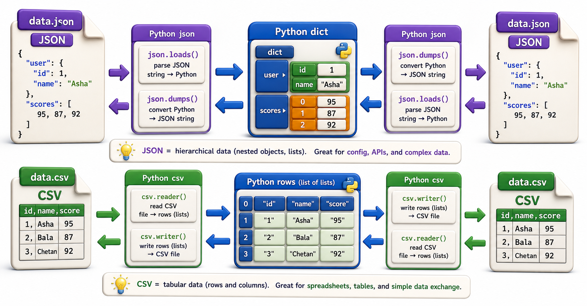

## Introduction

Nadia's library system communicates with three external services: a catalog API that speaks JSON, a legacy report generator that only reads CSV, and a partner consortium that sends both. Every piece of data that enters or leaves her system passes through one of these two formats. She has been reading JSON with string splitting and `split(",")` for CSV -- both of which break silently on edge cases like embedded commas and nested objects.

This lesson covers `json` and `csv` properly: not just how to read and write them, but how to handle the edge cases that break naive implementations.



## json: Reading and Writing JSON

The `json` module converts between Python objects and JSON strings (or files). There are four functions to know:

```python
import json

# Python dict -> JSON string
data = {"isbn": "978-001", "title": "Dune", "copies": 3, "available": True}
json_string = json.dumps(data)
print(json_string)
# '{"isbn": "978-001", "title": "Dune", "copies": 3, "available": true}'

# JSON string -> Python dict
parsed = json.loads(json_string)
print(parsed["title"])   # 'Dune'
print(type(parsed))      # <class 'dict'>

# Write to a file
with open("catalog.json", "w") as f:
    json.dump(data, f, indent=2)

# Read from a file
with open("catalog.json", "r") as f:
    loaded = json.load(f)
print(loaded)
```

`dumps`/`loads` work with strings. `dump`/`load` work with file objects. The `indent=2` argument to `dump`/`dumps` produces readable pretty-printed JSON.

## JSON Type Mapping

Python and JSON types map to each other, but not always one-to-one:

| Python | JSON |
|---|---|
| `dict` | object (`{}`) |
| `list`, `tuple` | array (`[]`) |
| `str` | string |
| `int`, `float` | number |
| `True` / `False` | `true` / `false` |
| `None` | `null` |
| `datetime` | no native equivalent |

Dates have no JSON type. The standard practice is to store them as ISO 8601 strings:

```python
from datetime import date
import json

record = {
    "isbn": "978-001",
    "borrow_date": date(2026, 7, 1).isoformat()  # '2026-07-01'
}
json_str = json.dumps(record)
parsed = json.loads(json_str)
borrow_date = date.fromisoformat(parsed["borrow_date"])
print(borrow_date)
```

## json.JSONDecodeError

Malformed JSON raises `json.JSONDecodeError`. Always handle it when parsing JSON from external sources:

```python
import json

def parse_catalog(raw: str) -> dict | None:
    try:
        return json.loads(raw)
    except json.JSONDecodeError as exc:
        print(f"Invalid JSON: {exc}")
        return None
```

## csv: Reading and Writing CSV

CSV looks simple but has tricky edge cases: fields that contain commas must be quoted, quoted fields can contain newlines, and different systems use different line endings. The `csv` module handles all of this correctly.

```python
import csv

# Writing CSV
rows = [
    ["isbn", "title", "genre", "copies"],
    ["978-001", "Dune", "Science Fiction", "3"],
    ["978-002", "The, Great Gatsby", "Fiction", "5"],  # comma inside a field
]

with open("catalog.csv", "w", newline="") as f:
    writer = csv.writer(f)
    writer.writerows(rows)
# The comma inside "The, Great Gatsby" is correctly quoted in the file

# Reading CSV
with open("catalog.csv", "r", newline="") as f:
    reader = csv.reader(f)
    for row in reader:
        print(row)
# ['isbn', 'title', 'genre', 'copies']
# ['978-001', 'Dune', 'Science Fiction', '3']
# ['978-002', 'The, Great Gatsby', 'Fiction', '5']
```

Always open CSV files with `newline=""`. If you do not, the `csv` module may miscount newlines inside quoted fields.

## DictReader and DictWriter

`csv.DictReader` treats the first row as column names and returns each subsequent row as a `dict`, making column access readable:

```python
import csv

# DictWriter: write with column names
fieldnames = ["isbn", "title", "copies"]
with open("catalog.csv", "w", newline="") as f:
    writer = csv.DictWriter(f, fieldnames=fieldnames)
    writer.writeheader()
    writer.writerow({"isbn": "978-001", "title": "Dune", "copies": 3})
    writer.writerow({"isbn": "978-002", "title": "Foundation", "copies": 2})

# DictReader: read as dicts
with open("catalog.csv", "r", newline="") as f:
    reader = csv.DictReader(f)
    for row in reader:
        print(f"{row['isbn']}: {row['title']} ({row['copies']} copies)")
```

`DictReader` is almost always preferable to `reader` because it makes the column being accessed explicit in the code.

## Choosing json vs csv

| Consideration | JSON | CSV |
|---|---|---|
| Nested data | Supported natively | Not supported |
| Data types | Preserved (int, bool, null) | Everything is a string |
| Readability | Good for nested structures | Good for tabular data |
| Interop with spreadsheets | Poor | Excellent |
| Streaming large files | Requires `ijson` or manual chunks | Line-by-line with `csv.reader` |

## The json / csv Modules at a Glance

| Function | What it does |
|---|---|
| `json.dumps(obj)` | Python object to JSON string |
| `json.loads(string)` | JSON string to Python object |
| `json.dump(obj, file)` | Python object to JSON file |
| `json.load(file)` | JSON file to Python object |
| `csv.reader(file)` | Read rows as lists |
| `csv.writer(file)` | Write rows as lists |
| `csv.DictReader(file)` | Read rows as dicts (first row = headers) |
| `csv.DictWriter(file, fieldnames)` | Write rows as dicts |

## Your Turn

Write two functions: `export_catalog_json` and `export_catalog_csv`, both accepting a list of book dicts and a file path. Then write `load_catalog(path)` that detects the file extension and calls the correct reader.

```python
import json, csv
from pathlib import Path

def export_catalog_json(books, path):
    Path(path).write_text(json.dumps(books, indent=2))

def export_catalog_csv(books, path):
    if not books:
        return
    with open(path, "w", newline="") as f:
        writer = csv.DictWriter(f, fieldnames=books[0].keys())
        writer.writeheader()
        writer.writerows(books)

def load_catalog(path):
    p = Path(path)
    if p.suffix == ".json":
        return json.loads(p.read_text())
    elif p.suffix == ".csv":
        with open(p, newline="") as f:
            return list(csv.DictReader(f))
    raise ValueError(f"Unsupported format: {p.suffix}")

books = [{"isbn": "978-001", "title": "Dune"}, {"isbn": "978-002", "title": "Foundation"}]
export_catalog_json(books, "catalog.json")
export_catalog_csv(books, "catalog.csv")
print(load_catalog("catalog.json"))
print(load_catalog("catalog.csv"))
```

## Conclusion

`json` and `csv` are Python's built-in formats for structured data exchange. `json` handles nested objects and preserves types. `csv` handles flat tabular data and integrates with spreadsheet tools. Both have edge cases that are handled correctly by the standard library and incorrectly by naive string manipulation. This concludes Unit 7. The next unit moves from using Python's standard library to ensuring its correct use: writing tests with `pytest`.
